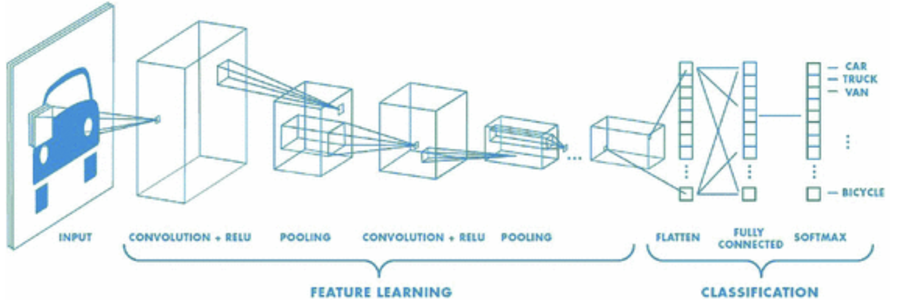

# Convolutional Neural Nets

You can think of CNNs (and Deep Learning in general) as a ML algorithm where:

- The **feature extraction is done directly by the model**
- You do not have to extract feature manually according to some intuition
- Feature extraction in DL is **optimized for the task at hand**. It is not an independent step
- much more generalizable on images

---

- **channels** = depth of an image
- **filters** = operation on an image
    - has many **kernels**
    - with **padding**
    - with **strides**
- **pooling** layers = reduce image size

**FILTERS**:

- Each filter is designed to extract specific information from the input
- Therefore the more filters, the more information
- *But*, the more weights to learn (and possible overfitting)

**KERNEL SIZE**:

- The kernel size corresponds to the magnifying glass you see the image through
- So this is related to the inputs you have
- 2 by 2 pixel kernels do not see anything relevant on 1200 * 800 images

# Images

- vector: array with dim = 1
- matrix: array with dim = 2
- tensor: array with dim = 3
- array: numpy obj
- tensor: tensorflow obj

## Preprocessing

### Resizing

- inputs should have the same size
    - choice of image resolution is very important
- useless to have images larger than 256 pixels (h or w)
    - state-of-the-art: (224, 224, 3)
    - too many params

### Intensity Normalization

- neural networks converge faster if the inputs are *somewhat* normalized (typically around -1 and 1)
- you have to do the same with the image pixels whose values are between 0 and 255 (for each color) initially.
- you can simply divide all your image dataset by 255

### Data Augmentation

- process of creating additional data based on your initial dataset
- mirror, crop, rotate, trans color, textures, blur, halo, deformations

# Network Architecture

- (5,5) → (25,)

```python
from tensorflow.keras.layers import Reshape

model = Sequential()
model.add(Reshape((5*5*1,), input_shape=(5,5,1)))
model.add(Dense(100, activation='relu'))
model.add(Dense(10, activation='softmax'))
```

### Reasons to not Flatten Image

1. generates too many params with lg images

    ```python
    from tensorflow.keras.models import Sequential
    from tensorflow.keras.layers import Dense, Reshape

    model = Sequential()
    model.add(Reshape((225*225*3,), input_shape=(225,225,3))) # Flattening of a 225*225 image with 3 colors
    model.add(Dense(100, activation='relu'))
    model.add(Dense(50, activation='relu'))
    model.add(Dense(1, activation='sigmoid'))

    model.summary()
    #>>> Total params: 15,192,701
    ```

2. invariance by translation: info remains the same

## Convolutions

- feature detector you move across an object
- corresponds to a math operation where a subpart of the image is convoluted with a kernel
1. element-wise dot-multiplication (not matrix mult.)
2. convolve (slide) kernel on different parts of the image to get the output
    1. kernels: ways to extract info from images
        1. identity
        2. edge detection
        3. sharpen
        4. box blur (normalization)

### Images with colors

- convolution and kernel applied to each channel and then summed (plus bias)
- filter: combination of kernels
    - composed of as many kernels as there are channels in the input

### One Convolution Layer

- apply many filters to the same input (image) → many filters = convolutional layer
    - similar to neurons applied to same input
- input of 3 channels → filters (i.e. 3 kernels) → convolution → output of 6 channels
    - 6 filters * 3 kernels per filters = 18 kernels

### Kernel Weights

- optimizer determines them

```python
model = models.Sequential()

model.add(layers.Conv2D(6, **kernel_size**=(3, 3), activation='relu', **input_shape**=(225, 225, 3)))
model.add(layers.Conv2D(4, **kernel_size**=(3), activation='relu')) # kernel_size = 3 <==> (3, 3)
model.add(layers.Flatten())
model.add(layers.Dense(1, activation='sigmoid'))

model.summary()
```

# Convolution Hyperparameters

## Strides

- kernel moving by a fixed number of pixels in each direction

```python
# Default stride = 1
model = Sequential()
model.add(layers.Conv2D(16, (2,2), strides=(1,1), input_shape=(225, 225, 3), activation="relu"))
model.summary()

# Stride = 2
model = Sequential()
model.add(layers.Conv2D(16, (2,2), strides=(2,2), input_shape=(225, 225, 3), activation="relu"))
model.summary()
```

## Padding

- add border of 1 empty pixel on each edge → takes the borders into account better

```python
# padding='valid' : no-padding, the output is smaller than the input
model = Sequential()
model.add(layers.Conv2D(16, (2,2), input_shape=(225, 225, 3), padding='valid', activation="relu"))
model.summary()

# padding='same' : padded with enough empty pixels to get an output of the same size as the input

model = Sequential()
model.add(layers.Conv2D(16, (2,2), input_shape=(225, 225, 3), padding='same', activation="relu"))
model.summary()
```

## Pooling

- after a convolution, reduce the size of the output
- throws away info intelligently

### Max-pooling

- selects max intensity value of pixels in a subsection of image
- similar to kernel, not conv. operation, just max of pixel values
- zero params

```python
model.add(layers.MaxPool2D(pool_size=(2,2)))
```

### Average-pooling

- averages subsection’s pixel values

```python
model.add(layers.AveragePooling2D(pool_size=(2, 2)))
```

```python
# Complete model
model = Sequential()
model.add(layers.Conv2D(16, (2,2), input_shape=(225, 225, 3), activation="relu"))
model.add(layers.MaxPool2D(pool_size=(2,2)))
model.add(layers.Conv2D(16, (2,2), activation="relu"))
model.add(layers.MaxPool2D(pool_size=(2,2)))

model.add(layers.Flatten())
model.add(layers.Dense(6, activation='relu'))
model.add(layers.Dense(1, activation='sigmoid'))

model.summary()
#>> Total params: **291,661**
```

- versus params in dense model:

```python
# Compare the number of parameters with this dense model!

model2 = models.Sequential()
model2.add(layers.Flatten(input_shape=(225, 225, 3)))
model2.add(layers.Dense(16, activation='relu'))
model2.add(layers.Dense(16, activation='relu'))
model2.add(layers.Dense(6, activation='relu'))
model2.add(layers.Dense(1, activation='sigmoid'))

model2.summary()
#>> Total params: **2,430,397**
```

# Digits Recognition

- LeNet - benchmark deep learning

```python
# Let's load the famous MNIST dataset
from tensorflow.keras.datasets import mnist
(X_train, y_train), (X_test, y_test) = mnist.load_data()
X_train = X_train / 255.
X_test = X_test / 255.

print(X_train.shape)
plt.subplot(1,2,1)
plt.imshow(X_train[0], cmap="gray");
plt.subplot(1,2,2)
plt.imshow(X_train[1], cmap="gray");
```

```python
# Reshape the X to explicitly add a single "color" channel
X_train = X_train.reshape(len(X_train), 28, 28, 1)
X_test = X_test.reshape(len(X_test), 28, 28, 1)
X_train.shape
```

### CNN Version 1: Minimal Network

```python
model = Sequential()
model.add(layers.Conv2D(16, (4,4), input_shape=(28, 28, 1), activation="relu"))
model.add(layers.Flatten())
model.add(layers.Dense(10, activation='softmax'))
```

### CNN Version 2: Common Tricks

```python
model = Sequential()
model.add(layers.Conv2D(16, (3,3), input_shape=(28, 28, 1), padding='same', activation="relu"))
model.add(layers.MaxPool2D(pool_size=(2,2)))
model.add(layers.Conv2D(32, (2,2), padding='same', activation="relu"))
model.add(layers.MaxPool2D(pool_size=(2,2)))
model.add(layers.Flatten())
model.add(layers.Dense(50, activation='relu')) # intermediate layer
model.add(layers.Dense(10, activation='softmax'))
model.summary()
```

```python
model.compile(loss='categorical_crossentropy',
              optimizer='adam',
              metrics=['accuracy'])

model.fit(X_train, y_cat_train,
          epochs=1,  # Use early stopping in practice
          batch_size=32,
          verbose=1)
#>> accuracy: 0.09393
```

```python
# We now evaluate on the test data
print(model.evaluate(X_test, y_cat_test, verbose=0))
#>> [0.06951173394918442, 0.979200005531311]
```

### CNN Version III:

```python
# - Integrate Preprocessing Layers
# - Add Regularization

# Reload raw data
(X_train_raw, y_train_raw), (X_test_raw, y_test_raw) = mnist.load_data()

model_pipe = Sequential([
    layers.Reshape((28, 28, 1), input_shape=(28,28)),
    layers.experimental.preprocessing.Rescaling(scale=1./255.),
    layers.Conv2D(16, (3,3), padding='same', activation="relu"),
    layers.MaxPool2D(pool_size=(2,2)),
    layers.Conv2D(32, (2,2), padding='same', activation="relu"),
    layers.MaxPool2D(pool_size=(2,2)),
    layers.Flatten(),
    layers.Dense(50, activation='relu'),
    layers.Dropout(0.3),
    layers.Dense(10, activation='softmax')
])

model_pipe.compile(loss='sparse_categorical_crossentropy', # No need to OHE target
              optimizer='adam',
              metrics=['accuracy'])

model_pipe.fit(X_train_raw, y_train_raw,
          epochs=1,  # Use early stopping in practice
          batch_size=32,
          verbose=1)

## We can now evaluate the model on the test data
print(model_pipe.evaluate(X_test_raw, y_test_raw, verbose=0))
#>> [0.06373266875743866, 0.9807000160217285]
```

## Insights

- inspect the images as they pass through each layer
    - what matters from the ‘eyes’ of the model?
    - conv2d & maxpool2d : images get smaller, more abstract
    - “activation map”

```python
# Let's focus on the first convolutional layer
layer_1 = model.layers[0]
layer_1
```

```python
# You can access its 16 kernels. Let's print the last one
plt.imshow(layer_1.weights[0][:,:,:,15], cmap='gray');
```

```python
# We can also compute the output of the first layer (called it's activation)
# By calling it with a "batch" of images (let's take 10)
batch = X_train[0:10]
activation_1 = layer_1(batch)
activation_1.shape
```

```python
# Let's display all 16 channels' outputs of the first layer, applied to the first image only

fig, axs = plt.subplots(4,4, figsize=(15,6))
for i in range(4):
    for j in range(4):
        feature_map = activation_1[0,:,:,4*i+j]
        axs[i,j].imshow(feature_map, cmap='gray')
```

# Typical Architecture & Pre-trained Nets

- AlexNet
- VGG-16
- [https://towardsdatascience.com/illustrated-10-cnn-architectures-95d78ace614d](https://towardsdatascience.com/illustrated-10-cnn-architectures-95d78ace614d)

## Transfer Learning



- keep all representations from convolutions and only retrain protected layer at the end
    - load the same CNN, remove the last layer(s) and replace it (them) by the one(s) suited to your problem, and then learn the weights of these last layers.

# Google Colab

[https://colab.research.google.com/](https://colab.research.google.com/)

- Load local notebooks
- Mount Google Drive
- Activate **GPU runtime**
- Use freely for 10 hours in a row before it shuts down

# Challenges

### 1

```python
import numpy as np
import matplotlib.pyplot as plt
from tensorflow.keras import datasets
from tensorflow.keras.backend import expand_dims
from tensorflow.keras.utils import to_categorical
from tensorflow.keras import layers, models
from tensorflow.keras.callbacks import EarlyStopping
```

```python
(X_train, y_train), (X_test, y_test) = datasets.mnist.load_data(path="mnist.npz")
(X_train.shape, y_train.shape), (X_test.shape, y_test.shape)
```

```python
X_train = X_train / 255.
X_test = X_test / 255.
X_train = expand_dims(X_train, -1)
X_test = expand_dims(X_test, -1)
```

```python
y_train_cat = to_categorical(y_train, num_classes=10)
y_test_cat = to_categorical(y_test, num_classes=10)
```

```python
def initialize_model():

    model = models.Sequential()

    ### First Convolution & MaxPooling
    model.add(layers.Conv2D(8, (4,4), input_shape=(28, 28, 1), activation='relu', padding='same'))
    model.add(layers.MaxPool2D(pool_size=(2,2)))

    ### Second Convolution & MaxPooling
    model.add(layers.Conv2D(16, (3,3), activation='relu', padding='same'))
    model.add(layers.MaxPool2D(pool_size=(2,2)))

    ### Flattening
    model.add(layers.Flatten())

    ### One Fully Connected layer - "Fully Connected" is equivalent to saying "Dense"
    model.add(layers.Dense(10, activation='relu'))

    ### Last layer - Classification Layer with 10 outputs corresponding to 10 digits
    model.add(layers.Dense(10, activation='softmax'))

    ### Model compilation
    model.compile(loss='categorical_crossentropy',
                  optimizer='adam',
                  metrics=['accuracy'])

    return model
```

```python
model = initialize_model()
model.summary()
```

```python
model = initialize_model()

es = EarlyStopping(patience=5)

model.fit(X_train, y_train_cat,
          epochs=5,
          batch_size=32,
          validation_split=0.3,
          verbose=1,
          callbacks=[es])
```

```python
model.evaluate(X_test, y_test_cat)
```

### 2

```python
def draw_triangle():
    dx = np.random.uniform(0.1, 0.3)
    dy = np.random.uniform(0.1, 0.3)
    noise_x = np.random.uniform(0.0, 0.1)
    noise_y = np.random.uniform(0.0, 0.1)

    x = np.random.uniform(0, 1-dx-noise_x)
    y = np.random.uniform(0, 1-dy)
    X = np.array([[x,y], [x+dx+noise_x,y], [x+dx/2, y+dy+noise_y]])

    t1 = plt.Polygon(X, color='black')
    plt.gca().add_patch(t1)

def draw_circle():
    r = np.random.uniform(0.1, 0.25)
    x = np.random.uniform(0+r, 1-r)
    y = np.random.uniform(0+r, 1-r)

    circle1 = plt.Circle((x, y), r, color='black')
    plt.gcf().gca().add_artist(circle1)

def create_image(form, path):
    plt.figure(figsize=(1, 1))
    if form == 'circle':
        draw_circle()
    elif form == 'triangle':
        draw_triangle()
    plt.axis('off')
    plt.savefig(path, dpi=80, bbox_inches='tight')
    plt.close()


def create_images(path):
    nb_circles = 100
    nb_triangles = 100

    for i in range(nb_circles):
        c_path = os.path.join(path, 'circles', f'circle_{i}.png')
        create_image('circle', c_path)

    for i in range(nb_triangles):
        t_path = os.path.join(path, 'triangles', f'triangle_{i}.png')
        create_image('triangle', t_path)
```

```python
def compute_convolution(input_image, kernel):
    # Parameters
    kernel = np.array(kernel)
    kernel_height, kernel_width = kernel.shape

    img = np.squeeze(input_image) # Removes dimensions of size 1
    img_height, img_width = img.shape

    output_image = []

    for x in range(img_height - kernel_height + 1):
        arr = []

        for y in range(img_width - kernel_width + 1):

            a = np.multiply(img[x: x + kernel_height, y: y + kernel_width],
                            kernel)
            arr.append(a.sum())

        output_image.append(arr)

    return output_image
```

```python
identity_kernel = [
    [0, 0, 0],
    [0, 1, 0],
    [0, 0, 0]
]
```

```python
output_image = compute_convolution(X[3], identity_kernel)
plt.subplot(1,2,1)
plt.imshow(X[3], cmap='gray')
plt.subplot(1,2,2)
plt.imshow(output_image, cmap='gray')
```

---

```python
def plot_convolution(img, kernel, activation=False):
    ''' The following printing function ease the visualization'''

    img = np.squeeze(img)
    output_img = compute_convolution(img, kernel)
    if activation:
        output_img = np.maximum(output_img, 0)

    plt.figure(figsize=(10, 5))

    ax1 = plt.subplot2grid((3,3),(0,0), rowspan=3)
    ax1.imshow(img, cmap='gray')
    ax1.title.set_text('Input image')

    ax2 = plt.subplot2grid((3,3),(1, 1))
    ax2.imshow(kernel, cmap='gray')
    ax2.title.set_text('Kernel')

    ax3 = plt.subplot2grid((3,3),(0, 2), rowspan=3)
    ax3.imshow(output_img, cmap='gray')
    ax3.title.set_text('Output image')

    for ax in [ax1, ax2, ax3]:
        ax.axes.get_xaxis().set_visible(False)
        ax.axes.get_yaxis().set_visible(False)

    plt.show()
```

```python
kernel_1 = [
    [1, 1, 1],
    [0, 0, 0],
    [-1, -1, -1]
]
```

```python
plot_convolution(X[4], kernel_1)
plot_convolution(X[4], kernel_1, activation=True)
```

---

```python
def initialize_model():

    model = models.Sequential()

    model.add(layers.Conv2D(16, (4,4), input_shape=(76, 78, 1), activation='relu'))
    model.add(layers.MaxPool2D(pool_size=(2,2)))
    model.add(layers.Conv2D(32, (3,3), activation='relu'))
    model.add(layers.MaxPool2D(pool_size=(2,2)))
    model.add(layers.Conv2D(64, (3,3), activation='relu'))
    model.add(layers.MaxPool2D(pool_size=(2,2)))
    model.add(layers.Conv2D(64, (2,2), activation='relu'))
    model.add(layers.MaxPool2D(pool_size=(2,2)))

    model.add(layers.Flatten())

    model.add(layers.Dense(10, activation='relu'))
    model.add(layers.Dense(1, activation='sigmoid'))

    # COMPILE
    model.compile(loss='binary_crossentropy',
                  optimizer='adam',
                  metrics=['accuracy'])

    return model
```

```python
model = initialize_model()

es = EarlyStopping(patience=5)

history = model.fit(X_train, y_train,
          validation_split=0.3,
          epochs=150,
          batch_size=16,
          callbacks=[es],
          verbose=0)
```

```python
model.evaluate(X_test, y_test)
```

```python
for i in range(0,16):
    plot_convolution(X[4], first_convolutional_layer.weights[0][:,:,0,i], activation=True)
```

```python
from tensorflow.keras import Model

activation_models = [Model(inputs=model.input, outputs=output) for output in layers_outputs]
activations = [m.predict(X) for m in activation_models]

layers_outputs = [layer.output for layer in model.layers] # same as above
activation_model = Model(inputs=model.input, outputs=layers_outputs) # model with many outputs !
activations = activation_model.predict(X) # 11 predictions at once!
```

```python
# Selecting a random triangle
image_number = np.random.choice(np.where(y == 1)[0])

for layer_number in [0,2,4,6]:

    print(f"--- Observing the effect of the convolutional layer number {layer_number}... ---")
    print("")

    temp_number_kernels = model.layers[layer_number].weights[0].shape[-1]
    print(f"{temp_number_kernels} kernels were applied and here are all the activations of this Conv2D Layer:")

    fig, axes = plt.subplots(int(temp_number_kernels/4),4, figsize=(20,7))


    for ax, kernel_number in zip(axes.flat,range(temp_number_kernels)):
        activation = activations[layer_number][image_number][:, :, kernel_number]
        ax.imshow(activation, cmap="gray")

    plt.show()
```

```python
# Selecting a random circle
image_number = np.random.choice(np.where(y == 0)[0])

for layer_number in [0,2,4,6]:

    print(f"--- Observing the effect of the convolutional layer number {layer_number}... ---")
    print("")

    temp_number_kernels = model.layers[layer_number].weights[0].shape[-1]
    print(f"{temp_number_kernels} kernels were applied and here are all the activations of this Conv2D Layer:")

    fig, axes = plt.subplots(int(temp_number_kernels/4),4, figsize=(20,7))


    for ax, kernel_number in zip(axes.flat,range(temp_number_kernels)):
        activation = activations[layer_number][image_number][:, :, kernel_number]
        ax.imshow(activation, cmap="gray")

    plt.show()
```

### 3 - in google colab

```python
from tensorflow.keras.datasets import cifar10
import numpy as np

(images_train, labels_train), (images_test, labels_test) = cifar10.load_data()

labels = ['airplane',
          'automobile',
          'bird',
          'cat',
          'deer',
          'dog',
          'frog',
          'horse',
          'ship',
          'truck']

print(images_train.shape, images_test.shape)
unique, counts = np.unique(labels_train, return_counts=True)
dict(zip(unique, counts))
```

```python
# Considering only 1/10th of the 50_000 images
reduction_factor = 10

# Choosing the random indices of small train set and small test set
idx_train =  np.random.choice(len(images_train), round(len(images_train)/reduction_factor))
idx_test =  np.random.choice(len(images_test), round(len(images_test)/reduction_factor))

# Collecting the two subsamples images_train_small and images_test_small from images_train and images_test
images_train_small = images_train[idx_train]
images_test_small = images_test[idx_test]
# and their corresponding labels
labels_train_small = labels_train[idx_train]
labels_test_small = labels_test[idx_test]

print("------------------ Before -----------------")
print(images_train.shape, images_test.shape)

print("")

print("--- After applying the reduction factor ---")
print(images_train_small.shape, images_test_small.shape)

print("")
print("-"*43)

unique, counts = np.unique(labels_train_small, return_counts=True)
dict(zip(unique, counts))
```

```python
### Normalizing pixels' intensities
X_train = images_train / 255.
X_train_small = images_train_small / 255.
X_test = images_test / 255.
X_test_small = images_test_small / 255.

### Encoding the labels
from tensorflow.keras.utils import to_categorical
y_train = to_categorical(labels_train, 10)
y_train_small = to_categorical(labels_train_small, 10)
y_test = to_categorical(labels_test, 10)
y_test_small = to_categorical(labels_test_small, 10)
```

```python
from tensorflow.keras import layers, models, callbacks, optimizers
from sklearn.metrics import mean_absolute_error as mae
import pandas as pd
```

```python
def initialize_model():
    '''instanciate and return the CNN architecture of your choice with less than 150,000 params'''

    model = models.Sequential()

    model.add(layers.Conv2D(16, (3,3), input_shape=(32, 32, 3), padding='same', activation="relu"))
    model.add(layers.MaxPool2D(pool_size=(2,2)))
    model.add(layers.Conv2D(32, (2,2), padding='same', activation="relu"))
    model.add(layers.MaxPool2D(pool_size=(2,2)))
    model.add(layers.Conv2D(64, (2,2), padding='same', activation="relu"))
    model.add(layers.MaxPool2D(pool_size=(2,2)))

    model.add(layers.Flatten())

    model.add(layers.Dense(50, activation='relu'))
    model.add(layers.Dropout(0.3))
    model.add(layers.Dense(10, activation='softmax'))

    return model
```

```python
def compile_model(model):
    '''return a compiled model suited for the CIFAR-10 task'''

    opt = optimizers.Adam(learning_rate=0.001)

    model.compile(loss='categorical_crossentropy',
              optimizer=opt,
              metrics=['accuracy'])
    return model
```

```python
model = initialize_model()
model = compile_model(model)
es = callbacks.EarlyStopping(patience=10)

history = model.fit(X_train, y_train,
                    validation_split=0.3,
                    batch_size=64,
                    epochs=100,
                    verbose=1,
                    callbacks=[es]
                    )
```

```python
def plot_history(history, title='', axs=None, exp_name=""):
    if axs is not None:
        ax1, ax2 = axs
    else:
        f, (ax1, ax2) = plt.subplots(1, 2, figsize=(12, 4))

    if len(exp_name) > 0 and exp_name[0] != '_':
        exp_name = '_' + exp_name
    ax1.plot(history.history['loss'], label = 'train' + exp_name)
    ax1.plot(history.history['val_loss'], label = 'val' + exp_name)
    ax1.set_ylim(0., 2.2)
    ax1.set_title('loss')
    ax1.legend()

    ax2.plot(history.history['accuracy'], label='train accuracy'  + exp_name)
    ax2.plot(history.history['val_accuracy'], label='val accuracy'  + exp_name)
    ax2.set_ylim(0.25, 1.)
    ax2.set_title('Accuracy')
    ax2.legend()
    return (ax1, ax2)
```

```python
plot_history(history, title='First it. CNN')
model.evaluate(X_test, y_test)
```

```python
from tensorflow.keras.preprocessing.image import ImageDataGenerator

datagen = ImageDataGenerator(
    featurewise_center = False,
    featurewise_std_normalization = False,
    rotation_range = 10,
    width_shift_range = 0.1,
    height_shift_range = 0.1,
    horizontal_flip = True,
    zoom_range = (0.8, 1.2),
    )

datagen.fit(X_train)
datagen
```

```python
from tensorflow.keras.callbacks import EarlyStopping

# The model
model_aug = initialize_model()
model_aug = compile_model(model_aug)

# The data generator
X_tr = X_train[:40000]
y_tr = y_train[:40000]
X_val = X_train[40000:]
y_val = y_train[40000:]
train_flow = datagen.flow(X_tr, y_tr, batch_size = 64)

# The early stopping criterion
es = EarlyStopping(patience = 3)

# The fit
history_aug = model_aug.fit(train_flow,
                        epochs = 50,
                        callbacks = [es],
                        validation_data = (X_val, y_val))
```
