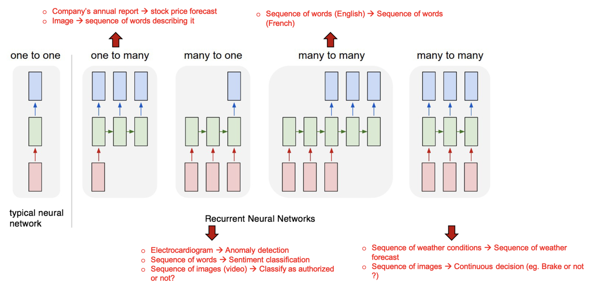

# Recurrent Neural Nets

### Reminders

1. CNN : Convolutional Neural Networks

    ```python
    from tensorflow.keras.models import Sequential
    from tensorflow.keras.layers import Conv2D, MaxPooling2D, Flatten, Dense

    model = Sequential()

    model.add(Conv2D(32, (5, 5),
                     padding='same',
                     strides = (1,1),
                     input_shape=(32, 32, 3),
                     activation='relu'))

    model.add(MaxPooling2D(pool_size=(2, 2)))

    model.add(Conv2D(32, (3, 3), activation='relu'))
    model.add(MaxPooling2D(pool_size=(2, 2)))

    model.add(Conv2D(64, (3, 3), padding='same', activation='relu'))
    model.add(MaxPooling2D(pool_size=(2, 2)))

    model.add(Flatten())
    model.add(Dense(40, activation='relu'))
    model.add(Dense(10, activation='softmax'))
    ```

2. Transfer Learning
    - extract features from images that are not task-specific
    - filters can be reused by loading an existing model
    - last layer has to be set according to particular task

    ```python
    from tensorflow.keras.applications import vgg16
    from tensorflow.keras.models import Sequential
    from tensorflow.keras import layers

    model = vgg16.VGG16(weights='imagenet', include_top=False, input_shape=(256, 256, 3))

    # This is optional, depending if you have time & will to update the first layers
    model.trainable = False

    flatten_layer = layers.Flatten()
    dense_layer = layers.Dense(100, activation='relu')
    prediction_layer = layers.Dense(10, activation='softmax')

    model = Sequential([
        model,
        flatten_layer,
        dense_layer,
        prediction_layer
    ])
    ```


# Intro to RNN

- specially designed to deal with **sequences** as input data:
    - observations repeated throughout time
        - predicting future stock market trends
        - video prediction
        - predicting next word
- One of the key elements is transforming a sequence of words into a sequence of mathematical inputs $x^t$

## Input Shapes

### Autoregressive

- learning from the past to predict the future thanks to the temporal regularity of the variable's progression
- **ARIMA** models **recursively** predict the next data point **one after the other**

### General DL Framework

- **training**: many pairs of observations and targets are used to learn the pattern between them
- prediction: one input → one output
- each observation can be of any type (scalar, vector, matrix)

### RNN specificity

- **training**: Input = sequence of observations
- input tensor X has one new dimension
- **X.shape = (n_SEQUENCES, n_OBSERVATIONS, n_FEATURES)**
- univariate example:
    - next day rainfall in different cities
    - X.shape = (16 cities, 100 days, 1 feature [daily rain])
    - y.shape = (16,1) rain the next day in 16 cities
- multivariate example:
    - rain, temp, pressure, wind for the next day (4 features)
- **Predicting**:
    - you can predict not just the next target value (one day), but a series (one week)
        - 1 day: `X.shape = (None, 100, 1), y.shape = (None, 1)`
        - 8 days: `X.shape = (None, 100, 1), y.shape = (None, 8)`
    - you can predict specific days in the future, not necessarily consecutive
    - prediction from multivariate input:
        - `X.shape = (None, 100, 4), y.shape = (None, 8)`
        - to multivariate outputs:`X.shape = (None, 100, 4),`

            `y.shape = (None, 8, 2)`

        - to classification: `X.shape = (None, 100, 4)y.shape = (None, )`

### Summary

- Inputs are **sequences** of repeated **observations** (uni- or multivariate)
- Output is whatever you want to predict, which is not necessarily similar to past observations of X
- In addition, each sequence can be of varying length.

---

- **D**NN: `X_batch.shape = (16, 49152)` flattened image
- **C**NN: `X_batch.shape = (16, 128, 128, 3)` images with 3 colors
- RNN: `X_batch.shape = (16, 100, 3)` 100 days of 3 atmospheric properties
    - input tensor X has one additional dimension located at `X.shape[1]`
- RNN: `X_batch.shape = (16, 100, 128, 128, 3)` 100 frames in a video
    - input tensor X has one additional dimension located at `X.shape[1]`

# Architecture

- use tanh activation in SimpleRNN layers
- compile:
    - loss = ‘mse’
    - optimize = ‘adam’ (or 'rmsprop', but you won’t be sure of params if you want to optimize it)

Ex:

- In different cities, you observed weather features for each day:
- the temperature, the wind speed, the air pollution
- You are trying to predict the amount of air pollution the **NEXT DAY**

```python
import numpy as np
from tensorflow.keras.models import Sequential
from tensorflow.keras import layers
```

```python
# --- SEQUENCE A (Paris)

day_1 = [10, 25, 50]  # OBSERVATION 1 [Temp, speed, pollution]
day_2 = [13, 10, 70]  # OBSERVATION 2 [Temp, speed, pollution]
day_3 = [ 9,  5, 90]
day_4 = [ 7,  0, 95]

sequence_a = [day_1, day_2, day_3, day_4]

y_a = 110 # Pollution day 5

# --- SEQUENCE B (Berlin)
sequence_b = [[25, 20, 30], [26, 24, 50], [28, 20, 80], [22, 3, 110]]
y_b = 125

# --- SEQUENCE C (London)
sequence_c = [[15, 10, 60], [25, 20, 65], [35, 10, 75], [36, 15, 70]]
y_c = 30

X = np.array([sequence_a, sequence_b, sequence_c]).astype(np.float32)
y = np.array([y_a, y_b, y_c]).astype(np.float32)

print(X.shape, y.shape)
#>> (3, 4, 3), (3,)
```

```python
X.shape # (n_SEQUENCES, n_OBSERVATIONS, n_FEATURES)
X.shape # (3 cities, 4 days, 3 features)

y.shape # (3 cities, 1 output per city)
```

```python
model = Sequential()
model.add(layers.SimpleRNN(units=2, activation='tanh', input_shape=(4,3)))
model.add(layers.Dense(1, activation="linear"))

# The compilation
model.compile(loss='mse',
              optimizer='rmsprop')  # Recommended optimizer for RNNs
# The fit
model.fit(X, y,
         batch_size=16,
         epochs=10, verbose=0)

# The prediction (one per sequence/city)
model.predict(X)
```

## Under the Hood

```python
# ---- NEW CITY ----
x = [[10, 25, 50],  # x1
     [13, 10, 70],  # x2
     [ 9,  5, 90],  # x3
     [ 7,  0, 95]]  # x4

y4 = # Pollution day 4+1 = 5
```

- The RNN is fed **one observation at a time** (forward in time).
- It maintains an **internal state** hthat is updated at each time step:
- first step:
    - t=1
    - $x^1$ → $h_1$ → $h_2, y^1$
    - internal state = $h_1$
- $x^t$ & $h^{t-1}$ are **concatenated** and fed into a **dense layer** to output the new state $h^t$
- We can *count* the number of weights of the dense network above as:
    - $n_h(n_h +n_x +1)$
    - $n_h$ : number of rnn units in RNN layer
    - $n_x$ : number of features per time-step (temp, humidity…)

### Compute Weights

```python
X.shape
```

`(3, 4, 3)`

```python
n_x = 3 # 3 features per time-step (Temp, Humidity, Rain)
n_h = 2 # 2 memory units in our architecture

# How many weights are in our rnn layer?
n_h*n_x + n_h*n_h + n_h
```

`12`

```python
# Here are the 12 weights of our RNN layer
[w.numpy().shape for w in model.layers[0].weights]
```

`[(3, 2), (2, 2), (2,)]`

### Output Layer

- $y_n = h_n$

### Impact of number of RNN units h?

```python
# Take this model with 10 RNN units
model_10 = Sequential()
model_10.add(layers.SimpleRNN(units=10))
model_10.add(layers.Dense(1, activation="linear"))

model_10.compile(loss='mse', optimizer='rmsprop')
model_10.fit(X, y, batch_size=16, epochs=10, verbose=0)
model_10.summary()
```

`simple_rnn_1`      `Param #` : `140`

`Total params: 151`

# Predict entire sequence

- output $y^t$  at each time step: return_sequences=True

```python
model_2.add(layers.SimpleRNN(units=2, return_sequences=True, activation='tanh'))
```

```python
# --- SEQUENCE A (Paris)

sequence_a = [[10, 25, 50],  # OBS day 1
              [13, 10, 70],  # OBS day 2
              [ 9,  5, 90],  # OBS day 3
              [ 7,  0, 95]]  # OBS day 4

y_a = [70,   # flu cases day 1
       90,   # flu cases day 2
       95,   # flu cases day 3
       110,] # flu cases day 4

# --- SEQUENCE B (Berlin)
sequence_b = [[25, 20, 30], [26, 24, 50], [28, 20, 80], [22, 3, 110]]
y_b = [50, 80, 110, 125]

# --- SEQUENCE C (London)
sequence_c = [[15, 10, 60], [25, 20, 65], [35, 10, 75], [36, 15, 70]]
y_c = [65, 75, 70, 30]

X = np.array([sequence_a, sequence_b, sequence_c]).astype(np.float32)
y = np.array([y_a, y_b, y_c]).astype(np.float32)

print(X.shape, y.shape)
```

`(3, 4, 3), (3, 4)`

`X.shape` = 3 cities, 4 days, 3 features

`y.shape` = 3 cities 4 days, 1 prediction per day

```python
model_2 = Sequential()

model_2.add(layers.SimpleRNN(units=2, return_sequences=True)) # input shape?
model_2.add(layers.Dense(1, activation='relu'))

model_2.compile(loss='mse', optimizer='rmsprop', )
model_2.fit(X, y, verbose=0)
```

```python
print("y_pred shape:", model_2.predict(X).shape)
```

`y_pred shape: (3, 4, 1)`

# Stacking RNNs

- We usually don't see RNN models deeper than 3 or 4 layers

```python
model_stacked = Sequential()

model_stacked.add(layers.SimpleRNN(10, return_sequences=True, input_shape=((4, 3))))
model_stacked.add(layers.SimpleRNN(3, return_sequences=False))
model_stacked.add(Dense(1, activation='relu'))

model_stacked.summary()
```

# RNN Zoology

- suffer from vanishing gradient through time
    - solution: backpropagation
        - gradient vanishes to 0 as time step decreases (short memory)

### Corrective Architecture:

- RNN (SimpleRNN in keras)
- LSTM (Long Short Term Memory): prevents vanishing gradient
- GRU (Gated Recurrent Units)
    - reduces number of params compared to LSTMs, faster training with less data

```python
from tensorflow.keras.layers import SimpleRNN, LSTM, GRU

###  Simple RNN  ###
model = Sequential()
model.add(SimpleRNN(units=10)) # activation='tanh' is default

###  LSTM   ###
model = Sequential()
model.add(LSTM(10))

###  GRU ###
model = Sequential()
model.add(GRU(10))

# Compile with 'rmsprop' rather than 'adam' (recommended)
model.compile(loss='mse',
              optimizer='rmsprop')
```

# Variations



# Input sequences of different lengths

`ValueError: Data cardinality is ambiguous:`

`Make sure all arrays contain the same number of samples`

### Solution?

## Padding

```python
from tensorflow.keras.preprocessing.sequence import pad_sequences

X_pad = pad_sequences(X, dtype='float32') # int32 by default
```

- **Avoid padding with existing values**
    - In the initial dataset there are real 0's, and we can't differentiate them from the 0's used for padding:
        - pad with values that are not in the initial dataset (i.e. -1000)
- **Pad at the end instead of the beginning**
    - beginning may influence internal RNN state
    - end is safe if you stop prediction at last real value

```python
X_pad = pad_sequences(X, dtype='float32', padding='post', value=-1000)
```

### Masking layer (ignore padded values on passes)

- mask_value corresponds to value you want to ignore

```python
from tensorflow.keras.layers import Masking

# –– Data
X = pad_sequences(X, dtype='float32', padding='post', value=-1000)
# X.shape == (3,4,3)

# –– Model
model = Sequential()
model.add(layers.Masking(mask_value=-1000, input_shape=(4,3)))
model.add(layers.SimpleRNN(units=2, activation='tanh'))
model.add(layers.Dense(10, activation='relu'))
model.add(layers.Dense(1, activation='linear'))

# –– Compilation
model.compile(loss='mse',
              optimizer='rmsprop') # Use `rmsprop`

# –– Fit
model.fit(X, y);
```

# Single time series?

- split time series into different sequences of observations and targets
- have to slice, because it has to be continuous data, not random sampled

# Challenges

### 1

```python
number_of_employees = len(X)

### Choosing random employees
##### As the employees are selected randomly, feel free to re-run this cell a few times !

number_of_randomly_selected_employees = 5

random_selection = np.random.randint(0,
                                     number_of_employees,
                                     number_of_randomly_selected_employees)

### Plotting data for the selected employees

plt.title('Salary')
for r in random_selection:
    plt.plot(X[r, :, 0],label=f"Employee number {r}",linestyle=":",marker="o")
    plt.legend(loc='upper left')
plt.show()

plt.title('# People responsibile for')
for r in random_selection:
    plt.plot(X[r, :, 1],label=f"Employee number {r}",linestyle=":",marker="o")
    plt.legend(loc='upper left')
plt.show()

plt.title('Company sizes')
for r in random_selection:
    plt.plot(X[r, :, 2],label=f"Employee number {r}",linestyle=":",marker="o")
    plt.legend(loc='upper left')
plt.show()
```

```python
plt.title("Salaries on the 10th year")
sns.histplot(X[:, -1, 0].flatten()) # all the employees, last year, feature #0 = salaries
plt.show()

plt.title("# of people under someone's responsibility")
sns.histplot(X[:, :, 1].flatten()) # all the employees, all the years, feature #1 = responsabilities
plt.show()

plt.title("Company size")
sns.histplot(X[:, :, 2].flatten()) # all the employees, all the years, feature #2 = company size
plt.show()
```

```python
from tensorflow.keras.layers import Normalization
from tensorflow.keras.models import Sequential
from tensorflow.keras.layers import Dense, SimpleRNN, Flatten, LSTM
from tensorflow.keras.callbacks import EarlyStopping
```

```python
normalization_layer = Normalization()
normalization_layer.adapt(X_train)

model = Sequential()

model.add(normalization_layer)
model.add(SimpleRNN(20))
model.add(Dense(10, activation='relu'))
model.add(Dense(1, activation='linear'))
```

```python
model.compile(loss='mse',
              optimizer='rmsprop',
              metrics=['mae'])
```

```python
es = EarlyStopping(patience=5)

model.fit(X_train, y_train, validation_split=0.2,
          batch_size=32, epochs=50, verbose=1, callbacks=[es])
```

```python
from sklearn.metrics import mean_absolute_error as mae
X.shape
y_base = X[:, 9, 0]
base_score = mae(y, y_base)
score = model.evaluate(X_test, y_test)[1]
print(base_score, score)
```

0.5951943998979569 0.27372321486473083

```python
normalization_layer = Normalization()
normalization_layer.adapt(X_train)

model = Sequential()

model.add(normalization_layer)
model.add(LSTM(20))
model.add(Dense(10, activation='relu'))
model.add(Dense(1, activation='linear'))

model.evaluate(X_test, y_test)
```

[0.5449981689453125, 0.26185333728790283]

### 2

```python
import matplotlib.pyplot as plt
from matplotlib.cm import get_cmap

# ------------------------- #
#      Some colormaps       #
# ------------------------- #

name = "tab20c"
cmap = get_cmap(name)  # type: matplotlib.colors.ListedColormap
colors_list = cmap.colors

# ------------------------- #
#      Some ECG             #
# ------------------------- #

fix, axs = plt.subplots(5,5, figsize=(15,10))

for i in range(5): # Five examples per category
    for j in range(5): # Iterating over the 5 categories
        idx_C = np.argwhere(np.array(y) == j)  # Collecting the indexes of all the heartbeats of category j
        axs[i,j].plot(X[idx_C[i][0]], label=f'Category {j}', c=colors_list[j+3]) # Plotting the ECG
        # Some cosmetic tricks down below
        if i == 0:
            axs[i,j].legend(loc='upper center')
            if j ==0:
                axs[i,j].set_xlabel('Time')
                axs[i,j].set_ylabel('ECG Amplitude')
```

```python
lengths = [len(ecg) for ecg in X]
sns.histplot(lengths)
```

- **ragged tensor**: when the observations per sequence aren’t equal
    - pad_sequences

```python
from tensorflow.keras.layers import Masking
from tensorflow.keras.preprocessing.sequence import pad_sequences
from tensorflow.keras.utils import to_categorical
```

```python

X_pad = pad_sequences(X, dtype='float32', padding='post', value=-1)
X_pad = np.expand_dims(X_pad, axis=2)
X_pad.shape
```

```python
y_cat = to_categorical(y, num_classes=5)
```

```python
X_train, X_test, y_train, y_test = train_test_split(X_pad, y_cat, test_size=0.2)
```

```python
from tensorflow.keras import models, layers, regularizers
from tensorflow.keras.callbacks import EarlyStopping

# –– Model
model = models.Sequential()

model.add(layers.Masking(mask_value=-1, input_shape=(187, 1)))
model.add(layers.GRU(20, return_sequences=True))
model.add(layers.GRU(20))
model.add(layers.Dense(50, activation='relu'))
model.add(layers.Dropout(0.2))
model.add(layers.Dense(5, activation='softmax'))

model.summary()
```

```python
model.compile(loss='categorical_crossentropy',
              optimizer='adam',
              metrics=['accuracy'])

es = EarlyStopping(patience=1)

model.fit(X_train, y_train,
          validation_split=0.3,
          batch_size=128, epochs=3,
          callbacks=[es])
```

```python
model.evaluate(X_test, y_test)
```

```python
occurencies_per_heartbeat_category_train = np.sum(y_train, axis=0)
occurencies_per_heartbeat_category_train
```

```python
most_frequent_category_train = np.argmax(occurencies_per_heartbeat_category_train)
most_frequent_category_train
```

```python
occurencies_per_heartbeat_category_test = np.sum(y_test, axis=0)
occurencies_per_heartbeat_category_test
```

```python
number_of_correct_predictions = occurencies_per_heartbeat_category_test[most_frequent_category_train]
number_of_correct_predictions
```

```python
baseline_accuracy = number_of_correct_predictions/len(y_test)
print(f'Baseline accuracy = {round(baseline_accuracy,3)}')
```

```python
y_preds = model.predict(X_test)
fig, axs = plt.subplots(1,2, figsize=(10,3))
sns.histplot(y_preds, ax=axs[0], bins=100)
sns.histplot(y_test, ax=axs[1], bins=100)
```

# Recap

    /\____/\

  | >  T  <  |

     uu uu

 /\__/\

| ö  ö |

 \  T  /

     |

   \/ \/

 v o  o v

      T

     / \

    |º.º|

     \ /
