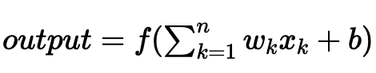

# Deep learning

# Fundamentals

### Why?

- image detection/recognition
- pose estimation
- natural language processing
- sentiment analysis
- translation
- speech to text
- detection and separation of multiple voices/sounds
- captioning (picture to text)
- generation of fake pictures, videos, and sound (deep fakes)

### What?

- multiple linear regressions stacked together
- non-linear functions: the activation functions

---

- neurons and layers make up architecture of Neural Network (NN)
- deep learning is a many-layered NN
- input layer → hidden layer → output layer

    

    - x : inputs
    - w : weights
        - θ : weights of the linear regressions that take place in neurons
    - b : bias
    - f : activation functin
    - y : output

### Activation Functions - non-linearity

- sigmoid

    $σ(x) = \frac{1}{1+e^{-x}}$

- leaky ReLU

    $max(0.1x, x)$

- tanh

    $tanh(x)$

- Maxout

    $max(w^T_1x+b_1, w^T_2x +b_2)$

- ReLU

    $max(0,x)$

- ELU

    $x \qquad \qquad  x≥ 0 \\ a(e^x - 1) \enspace \, x < 0$


## Architecture

### Create NEURON

- {linear regression, activation}

```python
# Target y (classification task 0/1, e.g. cat/dog)
y = 1

# Input X = one single observation, 4 features (x1, x2, x3, x4)
# (e.g. eyes color, ears_lenghts, ...)
X = [1., -3.1, -7.2, 2.1]
```

```python
# weighted lin reg
def linreg_1(X):
    return -3 + 2.1*X[0] - 1.2*X[1] + 0.3*X[2] + 1.3*X[3]

out_1 = linreg_1(X)
```

```python
# transform output
def activation(x):
    if x > 0:
        return x
    else:
        return 0

out_1 = activation(out_1)
```

### LAYER of neurons

```python
def linreg_2(X):
    return -5 - 0.1*X[0] + 1.2*X[1] + 4.9*X[2] - 3.1*X[3]

out_2 = activation(linreg_2(X))
```

```python
def linreg_3(X):
    return -8 + 0.4*X[0] + 2.6*X[1] +- 2.5*X[2] + 3.8*X[3]

out_3 = activation(linreg_3(X))
```

---

```python
def linreg_next_layer(X):
    return 5.1 + 1.1*X[0] - 4.1*X[1] - 0.7*X[2]

def activation_next_layer(x):
    # sigmoid activation for clasification task!
    return 1. / (1 + np.exp(-x))

def neural_net_predictor(X):

    out_1 = activation(linreg_1(X))
    out_2 = activation(linreg_2(X))
    out_3 = activation(linreg_3(X))

    outs = [out_1, out_2, out_3]

    y_pred = activation_next_layer(linreg_next_layer(outs))

    return y_pred
```

```python
# Final prediction
y_pred = neural_net_predictor(X)

print(f' Probability of being a dog: {y_pred}')
```

 `Probability of being a dog: 0.832716044461517`

## Keras

- independent library included in TensorFlow

```
pip install tensorflow
from tensorflow.keras import *
```

```python
from tensorflow.keras import Sequential
model = Sequential()
```

### define architecture

```python
from tensorflow.keras import Sequential, layers

# Basically, it will look like a sequence of layers
model = Sequential()

# First layer: 10 neurons and ReLU as the activation function
**model.add(layers.Dense(10, activation='relu'))**
```

```python
# You can go for two fully connected layers
model = Sequential()
model.add(layers.Dense(10, activation='relu'))
model.add(layers.Dense(20, activation='tanh'))
```

- **RULE 1**: first layer needs the size of your input

    ```python
    # Imagine each observation has 4 features (x1, x2, x3, x4)
    model = Sequential()
    model.add(layers.Dense(10, input_dim=4, activation='relu'))
    ```

- **RULE 2**: last layer dictated by the task
- **REGRESSION** TASKS REQUIRE **LINEAR** ACTIVATION FUNCTIONS

    ```python
    ### Regression of size 1
    model = Sequential()
    model.add(layers.Dense(10, activation='relu', input_dim=100))
    model.add(layers.Dense(1, activation='linear'))
    ```

    ```python
    ### Regression of size 13
    model.add(layers.Dense(10, activation='relu', input_dim=100))
    #model.add(...)
    model.add(layers.Dense(13, activation='linear'))
    ```

- **CLASSIFICATION** TASKS REQUIRES **SOFTMAX**/SIGMOID

    ```python
    ### Classification with 2 classes
    model = Sequential()
    model.add(layers.Dense(10, activation='relu', input_dim=100))
    #model.add(...)
    model.add(layers.Dense(1, activation='sigmoid'))
    ```

    ```python
    ### Classification with 8 classes
    model = Sequential()
    model.add(layers.Dense(10, activation='relu', input_dim=100))
    #model.add(...)
    model.add(layers.Dense(8, activation='softmax'))
    ```


### Counting parameters

```python
model = Sequential()
model.add(layers.Dense(10, input_dim=4, activation='relu'))
model.add(layers.Dense(1, activation='linear'))
model.summary()
```

`Total params: 61`

```python
model.add(layers.Dense(64, input_shape=(784,), activation='relu'))
model.add(layers.Dense(64, activation='tanh'))
model.add(layers.Dense(10, activation='softmax'))
model.summary()
```

`Total params: 55,050`

# Training: loss & optimization procedure

### define the model

```python
**model.compile(loss='mse', optimizer='adam')**
```

### fitting data

- learning phase is **iterative** and **stochastic** (remember SGD?)
- batch_size : size of the subset given to the neural network to update the parameters θ
- The entire dataset is split into different batches
- Once the algorithm has seen all the data, it counts as one epoch

```python
# Load data
from sklearn.datasets import fetch_lfw_people
faces = fetch_lfw_people(min_faces_per_person=200, resize=0.25)

# 766 images of 31 * 23 pixel black & white
print(faces.images.shape)

# 2 different target classes
np.unique(faces.target)
```

`(766, 31, 23)`

`array([0, 1])`

```python
# Flatten our 766 images
X = faces.images.reshape(766, 31*23)
X.shape
```

`(766, 713)`

```python
y = faces.target
y.shape
```

`(766,)`

```python
# Train test split
from sklearn.model_selection import train_test_split
X_train, X_test, y_train, y_test = train_test_split(X, y,
																	 test_size=0.25, random_state=3)

# Standardize
from sklearn.preprocessing import StandardScaler
scaler = StandardScaler()
X_train = scaler.fit_transform(X_train)
```

```python
# Simple model with 1 hidden layer
from tensorflow.keras.models import Sequential
from tensorflow.keras import layers

# Model definition
model = Sequential()
model.add(layers.Dense(20, activation='relu', input_dim=713))
model.add(layers.Dense(10, activation='relu'))
model.add(layers.Dense(1, activation='sigmoid'))
model.summary()
```

```python
**model.compile**(
    **optimizer**='adam',
    **loss**='binary_crossentropy',
    **metrics** = 'accuracy')

**model.fit(X_train, y_train, batch_size=16, epochs=20)**
```

```python
# evaluate
**model.evaluate(scaler.transform(X_test), y_test)**
# returns [loss, metrics]
```

`6/6 [==============================] - 0s 997us/step - loss: 0.3128 - accuracy: 0.9323`

`[0.3128136992454529, 0.9322916865348816]`

---

```python
# baseline
pd.Series(y).value_counts()
```

`1    530`

`0    236`

```python
# Baseline score
530 / (530+236)
```

`0.6919060052219321`

### predict

```python
# Predicted probabilities
model.predict(scaler.transform(X_test))
```

`array([[9.9999869e-01],` …

# Challenges

### 2

```python
from sklearn.model_selection import train_test_split

X1, y1 = make_moons(n_samples=250, noise=0.2, random_state=0)
X_train, X_test, y_train, y_test = train_test_split(X1, y1, test_size=.3)
X_train.shape
```

```python
import pandas as pd
import matplotlib.pyplot as plt
%matplotlib inline

def plot_moons(X, y):
    df = pd.DataFrame(dict(x1=X[:,0], x2=X[:,1], label=y))
    colors = {0:'red', 1:'blue'}
    fig, ax = plt.subplots()
    grouped = df.groupby('label')

    for key, group in grouped:
        group.plot(ax=ax, kind='scatter', x='x1', y='x2', label=key, color=colors[key])


    plt.title(f"{len(X)} moons")
    plt.show()

plot_moons(X, y)
```

```python
def initialize_model_2():

    #############################
    #  1 - Model architecture   #
    #############################

    model2 = models.Sequential()
    model2.add(layers.Dense(200, activation='relu', input_dim=2))
    model2.add(layers.Dense(10, activation='relu'))
    model2.add(layers.Dense(5, activation='relu'))
    model2.add(layers.Dense(1, activation='sigmoid'))

    #############################
    #  2 - Optimization Method  #
    #############################
    model2.compile(loss='binary_crossentropy', # We've already mentioned this loss function in Logistic Regression
                  optimizer='adam', # Optimizer in Deep Learning = solver in Machine Learning | Adam = our best friend
                  metrics=['accuracy']) # Let's focus on the accuracy, our dataset is balanced

    return model2

model2 = initialize_model_2()
```

```python
model2.fit(X_train, y_train, batch_size=16, epochs=500)
```

```python
def plot_history(hist_dict):
    plt.plot(hist_dict['history']['loss'])
    plt.title('Train loss')
    plt.ylabel('Loss')
    plt.xlabel('Epoch')
    plt.show()

plot_history(model2.history.__dict__)
```

```python
accuracy_deep = model2.evaluate(X_test, y_test)[1]
```

### 3

```python
from tensorflow.keras.utils import to_categorical

y_cat = to_categorical(y, num_classes=7)
y_cat.shape
```

```python
from tensorflow.keras import models, layers

def initialize_model():

    #############################
    #  1 - Model architecture   #
    #############################
    model = models.Sequential()
    model.add(layers.Dense(50, activation='relu', input_dim=8))
    model.add(layers.Dense(7, activation='softmax'))
    #############################
    #  2 - Optimization Method  #
    #############################
    model.compile(loss='categorical_crossentropy', # different from binary_crossentropy because we have multiple classes
                  optimizer='adam',
                  metrics=['accuracy'])

    return model
```

```python
def plot_history(hist_dict):
    plt.plot(hist_dict.history['loss'])
    plt.title('Train loss')
    plt.ylabel('Loss')
    plt.xlabel('Epoch')
    plt.show()
```

```python
model = initialize_model()

history = model.fit(X_train,
                    y_train,
                    validation_data = (X_test, y_test),
                    epochs = 500,
                    batch_size = 16,
                    verbose = 0)
plot_history(history)
```

```python
def plot_loss_accuracy(history):
    plt.plot(history.history['loss'])
    plt.plot(history.history['val_loss'])
    plt.title('Model loss')
    plt.ylabel('Loss')
    plt.xlabel('Epoch')
    plt.legend(['Train', 'Test'], loc='best')
    plt.show()

    plt.plot(history.history['accuracy'])
    plt.plot(history.history['val_accuracy'])
    plt.title('Model Accuracy')
    plt.ylabel('Accuracy')
    plt.xlabel('Epoch')
    plt.legend(['Train', 'Test'], loc='best')
    plt.show()
```

### 4

```python
%load_ext autoreload
%autoreload 2

# DATA MANIPULATION
import pandas as pd
pd.set_option('display.max_columns', None)
import numpy as np
from sklearn.model_selection import train_test_split
from tensorflow.keras import Sequential, layers
from sklearn.preprocessing import MinMaxScaler

# DATA VISUALISATION
import matplotlib.pyplot as plt
import seaborn as sns

# VIEWING OPTIONS IN THE NOTEBOOK
from sklearn import set_config; set_config(display='diagram')
```

```python
X_train, X_val, y_train, y_val = train_test_split(X, y,  test_size=0.3, random_state=42)
print(X_train.shape, X_val.shape, y_train.shape, y_val.shape)
```

```python
from utils.preprocessor import create_preproc

preproc = create_preproc(X_train)
preproc
```

```python
scaler = MinMaxScaler()
scaler.fit(pd.DataFrame(y_train))
y_train = scaler.transform(pd.DataFrame(y_train)).reshape(1022,)
y_val = scaler.transform(pd.DataFrame(y_val)).reshape(438,)

preproc.fit(X_train, y_train)
X_train = preproc.transform(X_train)
X_val = preproc.transform(X_val)

print(X_train.shape, X_val.shape, y_train.shape, y_val.shape)
```

```python
def initialize_model():

    #############################
    #  1 - Model architecture   #
    #############################
    model = Sequential()
    model.add(layers.Dense(10, activation='relu', input_dim=159))
    model.add(layers.Dense(6, activation='relu'))
    model.add(layers.Dense(3, activation='relu'))
    model.add(layers.Dense(1, activation='linear'))
    #############################
    #  2 - Optimization Method  #
    #############################
    model.compile(loss='msle',
                  optimizer='adam',
                  metrics=['accuracy'])

    return model
```

```python
model = initialize_model()
history = model.fit(X_train,
                    y_train,
                    validation_data = (X_val, y_val),
                    epochs = 50,
                    batch_size = 16,
                    verbose = 0)
```

```python
y_pred = model.predict(preproc.transform(X_test))
y_unscaled = scaler.inverse_transform(y_pred)

id_col = X_test.Id
results = pd.DataFrame(y_unscaled, columns=['SalePrice'])
results.insert(loc=0, column='Id', value=id_col)

results.to_csv("submission_final.csv", header = True, index = False)
```
