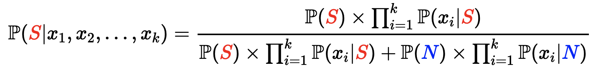

# Natural language Processing (NLP)

(through a machine learning perspective)

# What/When/Why

- incorporate **textual data** in these Machine Learning Algorithms
- translators, email filtering, chatbots, voice-to-text & reverse
- NLP libraries
- “a subfield of linguistics, computer science and artificial intelligence
concerned with the interactions between computers and human language - in particular how to program computers to process and analyze large
amounts of natural language data (***speech*** AND ***text***).”

# Text Preprocessing

### strip

- removed whitespaces (or other) at beginning and end of string

```python
[text.strip() for text in texts]
```

```python
text = "abcd Who is abcd ? That's not a real name!!! abcd"
text.strip('bdac')
#>>" Who is abcd ? That's not a real name!!! "
```

### replace

```python
text.replace("koala","panda")
```

### split

```python
text.split("/")
```

### lowercase

```python
text.lower()
```

### numbers, punctuation, symbols

```python
cleaned_text = ''.join(char for char in text if not char.isdigit())
```

```python
import string

for punctuation in string.punctuation:
    text = text.replace(punctuation, '')
```

## Combo

```python
def basic_cleaning(sentence):
    sentence = sentence.lower()
    sentence = ''.join(char for char in sentence if not char.isdigit())

    for punctuation in string.punctuation:
        sentence = sentence.replace(punctuation, '')

    sentence = sentence.strip()

    return sentence

cleaned_sentences = [basic_cleaning(sentence) for sentence in sentences]
```

### RegEx

- remove html tags

    ```python
    import re

    text = """<head><body>Hello World!</body></head>"""
    cleaned_text = re.sub('<[^<]+?>','', text)
    ```

- extract email addresses

    ```python
    import re

    txt = 'This is a random text, authored by darkvador@gmail.com \
    				and batman@outlook.com, WOW!'

    re.findall('[\w.+-]+@[\w-]+\.[\w.-]+', txt)
    #>> ['darkvador@gmail.com', 'batman@outlook.com']
    ```


### tokenizing

- cleaning with natural language toolkit (NLTK) library

```python
from nltk.tokenize import word_tokenize

word_tokens = word_tokenize(text)
```

### removing “stopwords”

- words that don’t carry info, just grammar
- useful for topic modeling
- dangerous for sentiment analysis (not is removed) and authorship attribution

```python
from nltk.corpus import stopwords

stop_words = set(stopwords.words('english'))
#stopwords_removed = [w for w in tokens if w in stop_words]
tokens_cleaned = [w for w in tokens if not w in stop_words]
```

### Lemmatizing

- find the **root** of words, in order to group them by their **meaning** rather than by their exact form
- reducing features, condensing down to similar meanings
- topic modeling, sentiment analysis

```python
from nltk.stem import WordNetLemmatizer

# v --> verbs
# n --> nouns

verb_lemmatized = [WordNetLemmatizer().lemmatize(word, pos = "v")
              for word in tokenized_sentence_no_stopword]

noun_lemmatized = [WordNetLemmatizer().lemmatize(word, pos = "n")
              for word in verb_lemmatized]
```

# Vectorizing

- converting cleaned sequence of words into numerical representation
- key params:
    - max_df/min_df
        - help us building **corpus-specific stopwords**
    - max_features (k):
        - build vocabulary that considers top k tokens ordered by term frequency across corpus
    - n_gram_range:
        - context of words (phrases)
- CV - counting
- Tfidf - weighing (length d)

## Bag-of-Words (BoW)

- how often each word appears
- rows are sentences
- count for each word becomes a feature
- CountVectorizer

    ```python
    from sklearn.feature_extraction.text import CountVectorizer
    import pandas as pd

    tests = ['...', ...]

    count_vectorizer = CountVectorizer()
    X = count_vectorizer.fit_transform(texts)
    X_arr = X.toarray()

    feats = count_vectorizer.get_feature_names_out()

    vectorized_texts = pd.DataFrame(X_arr,
                                    columns = feats,
                                    index = texts)

    vectorized_texts
    ```

    ```python
    # Instantiate the CountVectorizer with max_df = 2
    count_vectorizer = CountVectorizer(max_df = 2) # removing "cat", "is", "young"

    # Train it
    X = count_vectorizer.fit_transform(texts)
    X = pd.DataFrame(
        X.toarray(),
        columns = count_vectorizer.get_feature_names_out(),
        index = texts
    )

    X
    ```

    ```python
    # CountVectorizer with the 3 most frequent words
    count_vectorizer = CountVectorizer(max_features = 3)

    X = count_vectorizer.fit_transform(texts)
    X = pd.DataFrame(
        X.toarray(),
         columns = count_vectorizer.get_feature_names_out(),
         index = texts
    )

    X
    ```

- issues:
    - loses order of words
    - don’t take into account doc’s length (Tf-idf)
    - doesn’t capture content (N-gram)

## Tf-idf

- pros:
    - uses relative frequency rather than count → robust to doc length
    - takes into account whole corpus
- cons:
    - doesn’t capture within-doc context → N-gram
    - word order is disregarded

### Term Frequency (tf):

- The more often a word appears in a document, the more likely it is that it will be important to this document
- The frequency of a word *x* in a document *d* is called **`term frequency`**, and is denoted by *tx,d*

### Document Frequency (df):

- the most frequent words in an entire corpus (table) are actually often the least important because they refer to the corpus’s topic, nothing to be uncovered
- relative document frequency: $\frac{df_x}{N}$ (number of docs (d) containing word x divided by number of documents)
- inverse doc. frequ is the opposite
- weight of a word x in document d (sentence)

    

    - tf = number of x in d
    - df = number of d with x
    - N = number of documents

### TfidfVectorizer

```python
from sklearn.feature_extraction.text import TfidfVectorizer

texts = ['list of docs']

# Instantiating the TfidfVectorizer
tf_idf_vectorizer = TfidfVectorizer()

# Training it on the texts
weighted_words = pd.DataFrame(tf_idf_vectorizer.fit_transform(texts).toarray(),
                 columns = tf_idf_vectorizer.get_feature_names_out())

weighted_words
```

## N-grams

- “math” - 1 word, n=1, ‘unigram’
- “math problems” - 2 words, n=2, ‘bigram’
- *"*natural language processing" - ‘trigram’ (n = 3)
- n-words → ngram

---

```python
# ngram_range = (min_n, max_n)
ngram_range = (1, 1) # default (unigrams)
ngram_range = (1, 2) # uni/bi
ngram_range = (1, 3) # uni/bi/tri
ngram_range = (2, 3) # bi/tri
```

```python
actors_movie = ['i like the movie...', ...]

# Vectorize the sentences
count_vectorizer = CountVectorizer()
actors_movie_vectorized = count_vectorizer.fit_transform(actors_movie)

# Show the representations in a nice DataFrame
actors_movie_vectorized = pd.DataFrame(actors_movie_vectorized.toarray(),
                                       columns = count_vectorizer.get_feature_names_out(),
                                       index = actors_movie)

# Show the vectorized movies
actors_movie_vectorized
```

```python
# Vectorize the sentences
count_vectorizer_n_gram = CountVectorizer(ngram_range = (2,2)) # BI-GRAMS
actors_movie_vectorized_n_gram = count_vectorizer_n_gram.fit_transform(actors_movie)
amvn_array = actors_movie_vectorized_n_gram.toarray()
feats = count_vectorizer_n_gram.get_feature_names_out()

# Show the representations in a nice DataFrame
actors_movie_vectorized_n_gram = pd.DataFrame(amvn_array,
							                                columns = feats,
						                                  index = actors_movie)

# Show the vectorized movies with bigrams
actors_movie_vectorized_n_gram
```

# NLP Modeling

## Naive Bayes Classifier (multinomial)

- 0-term frequency?
    - smoothing: add smoothing param 1 (a > 0) to all features
- pros:
    - easy to use
    - not iterative (fast)
    - works well on text because it can handle lg vocab
    - not parametric model (no ß to learn, no loss function to min)
- cons:
    - assumes words in doc don’t depend on previous words

### Email problem

- classify emails based on content (Normal or Spam)
- Probability of email containing *x* words to be Spam?
    - $P(S|x_1, x_2,..., x_k)$
        - if one side is true, other is true
- bayes:
    - $P(A|B) = \frac{P(B|A)P(A)}{P(B)}$
- “independence property”: assumption that words are conditionally independent
    - $P(x_1|S)*P(x_2|S)*... =$

        

- Spam Formula:

    


**EX**

- 8 normal emails, 4 spam
    - P(S|”Dear”, “Friend”)?
    - P(N) = 8/(8+4) = 0.67
    - P(S) = 4/(8+4) = 0.33
    - P(”Dear”|N) = 8/17 = .47
    - P(”Friend”|N) = 5/17 = .29
    - P(”Dear”|S) = 2/7 = .29
    - P(”Friend”|S) = 1/7 = .14
    - P(S|”Dear”, “Friend”) = 12.9%

### Code

```python
import pandas as pd
import numpy as np

from sklearn.model_selection import cross_validate
from sklearn.pipeline import make_pipeline
from sklearn.feature_extraction.text import TfidfVectorizer
from sklearn.naive_bayes import MultinomialNB
from sklearn.metrics import recall_score
```

```python
data = pd.read_csv("data/emails.csv")
data.head()

round(data["spam"].value_counts(normalize = True),2)
```

```python
# Feature/Target
X = data["text"]
y = data["spam"]

# Pipeline vectorizer + Naive Bayes
pipeline_naive_bayes = make_pipeline(TfidfVectorizer(),
                                     MultinomialNB())

# Cross-validation
cv_results = cross_validate(pipeline_naive_bayes, X, y, cv = 5,
														scoring = ["recall"])
average_recall = cv_results["test_recall"].mean()
np.round(average_recall,2)
#>> 0.45
```

### Tuning Vectorizer and NBA simultaneously

```python
from sklearn.model_selection import GridSearchCV

# Define the grid of parameters
parameters = {
    'tfidfvectorizer__ngram_range': ((1,1), (2,2)),
    'multinomialnb__alpha': (0.1,1)
}

# Perform Grid Search
grid_search = GridSearchCV(pipeline_naive_bayes, parameters, scoring = "recall",
                           cv = 5, n_jobs=-1, verbose=1)

grid_search.fit(data.text,data.spam)

# Best score
print(f"Best Score = {grid_search.best_score_}")

# Best params
print(f"Best params = {grid_search.best_params_}")
#>> Fitting 5 folds for each of 4 candidates, totalling 20 fits
#>> Best Score = 0.9524932488436137
#>> Best params = {'multinomialnb__alpha': 0.1,
								#>>'tfidfvectorizer__ngram_range': (1, 1)}
```

# Topic Modeling

## Latent Dirichlet Allocation (LDA)

- latent: hidden topics
- Dirichlet: type of probability distribution
    - document → collection of topics
    - topic → collection of tokens/words
- inputs:
    - document-term matrix: docs to be converted using vectorizer
    - number of topics: to be discovered within docs
        - each topic consists of unordered set of words (BoW)
    - number of iterations → unsupervised iterative
- outputs:
    - topics across docs/pieces of text
        - interpreted as ‘non-linear Principal Components’ of the doc in the corpus
- params:
    - n_components = n (n of topics)
- find topics across docs:
    - randomly assign each word to topic
    - doc mixture: p(topic t | document d) → how often t occurs in d

        ```python
        document_topic_matrix_ideal
        ```

    - topic mixture: p(word w | topic t) → how often w occurs in d

        ```python
        topic_word_matrix_ideal
        ```

    - update: p(word w with topic t) = p(t | d) * p(w | t)
    - repeat until they start to make sense

## Implement

### Clean

```python
def cleaning(sentence):

    # Basic cleaning
    sentence = sentence.strip() ## remove whitespaces
    sentence = sentence.lower() ## lowercase
    sentence = ''.join(char for char in sentence if not char.isdigit()) ## remove numbers

    # Advanced cleaning
    for punctuation in string.punctuation:
        sentence = sentence.replace(punctuation, '') ## remove punctuation

    tokenized_sentence = word_tokenize(sentence) ## tokenize
    stop_words = set(stopwords.words('english')) ## define stopwords

    tokenized_sentence_cleaned = [ ## remove stopwords
        w for w in tokenized_sentence if not w in stop_words
    ]

    lemmatized = [
        WordNetLemmatizer().lemmatize(word, pos = "v")
        for word in tokenized_sentence_cleaned
    ]

    cleaned_sentence = ' '.join(word for word in lemmatized)

    return cleaned_sentence
```

```python
documents = pd.DataFrame(..., columns='documents')
cleaned_documents = documents["documents"].apply(cleaning)
```

### Vectorize

```python
vectorizer = TfidfVectorizer()
vectorized_documents = vectorizer.fit_transform(cleaned_documents)
features = vectorizer.get_feature_names_out()
vectorized_documents = pd.DataFrame(vectorized_documents.toarray(),
                                    columns = features)

vectorized_documents
```

### Find Topics

```python
**from sklearn.decomposition import LatentDirichletAllocation**

# Instantiate the LDA
n_components = 2
lda_model = LatentDirichletAllocation(n_components=**n_components**, max_iter = 100)

# Fit the LDA on the vectorized documents
lda_model.fit(vectorized_documents)

document_topic_mixture = lda_model.transform(vectorized_documents)

topic_word_mixture = pd.DataFrame(lda_model.**components_**, columns = features)
```

### Find 3 most relevant words/topic

```python
def print_topics(lda_model, vectorizer, top_words):
    # 1. TOPIC MIXTURE OF WORDS FOR EACH TOPIC
    topic_mixture = pd.DataFrame(lda_model.components_,
                                 columns = features)

    # 2. FINDING THE TOP WORDS FOR EACH TOPIC
    ## Number of topics
    n_components = topic_mixture.shape[0]
    ## Top words for each topic
    for topic in range(n_components):
        print("-"*10)
        print(f"For topic {topic}, here are the the top {top_words} words with weights:")
        topic_df = topic_mixture.iloc[topic].sort_values(ascending = False).head(top_words)

        print(round(topic_df,3))

print_topics(lda_model, vectorizer, 3)
```

# Challenges

### 1

```python
import string
import nltk
import pandas as pd
import numpy as np
from nltk.corpus import stopwords
from nltk.stem import WordNetLemmatizer
from sklearn.feature_extraction.text import CountVectorizer
from sklearn.model_selection import cross_validate
from sklearn.naive_bayes import MultinomialNB
```

```python
def basic_cleaning(sentence):
    sentence = sentence.lower()
    sentence = ''.join(char for char in sentence if not char.isdigit())

    for punctuation in string.punctuation:
        sentence = sentence.replace(punctuation, '')

    sentence = sentence.strip()

    return sentence

basic = [basic_cleaning(sentence) for sentence in df['text']]
```

```python
stop_words = set(stopwords.words('english'))

df['clean_text'] = [w for w in basic if not w in stop_words]
df.head()
```

```python
def lemmatize(corpus):

    verb_lemmatized = [WordNetLemmatizer().lemmatize(word, pos = "v")
            for word in corpus]

    noun_lemmatized = [WordNetLemmatizer().lemmatize(word, pos = "n")
            for word in verb_lemmatized]

    return noun_lemmatized

df['clean_text'] = lemmatize(df['clean_text'])
```

```python
texts = df['clean_text']
count_vectorizer = CountVectorizer()
X = count_vectorizer.fit_transform(texts)
X_ray = X.toarray()
features = count_vectorizer.get_feature_names_out()

X_bow = pd.DataFrame(X_ray,
                     columns = features,
                     index = texts.index)
```

```python
nbmodel = MultinomialNB()

cv_results = cross_validate(nbmodel, X_bow, df['spam'], cv = 5, scoring = ["accuracy"])
average_accuracy = cv_results["test_accuracy"].mean()
np.round(average_accuracy,2)
```

### 2

```python
import pandas as pd
import string
import numpy as np
from nltk import word_tokenize
from nltk.stem import WordNetLemmatizer
from sklearn.preprocessing import LabelEncoder
from sklearn.model_selection import cross_validate
from sklearn.naive_bayes import MultinomialNB
from sklearn.feature_extraction.text import CountVectorizer
```

```python
data = ...
```

```python
def preprocessing(sentence):

    sentence = sentence.strip()
    sentence = sentence.lower()
    sentence = ''.join(char for char in sentence if not char.isdigit())

    for punctuation in string.punctuation:
        sentence = sentence.replace(punctuation, '')

    tokenized_sentence = word_tokenize(sentence)

    lemmatized = [WordNetLemmatizer().lemmatize(word, pos = "v")
                for word in tokenized_sentence]

    cleaned_sentence = ' '.join(word for word in lemmatized)

    return cleaned_sentence

data['cleaned_reviews'] = data["reviews"].apply(preprocessing)
```

```python
l_encoder = LabelEncoder().fit(data['target'])
data['target_encoded'] = l_encoder.transform(data['target'])
```

```python
nbmodel = MultinomialNB()
vectorizer = CountVectorizer()
X_bow = vectorizer.fit_transform(data.cleaned_reviews)

cv_results = cross_validate(nbmodel, X_bow, data['target'], cv = 5, scoring = ["accuracy"])
average_accuracy = cv_results["test_accuracy"].mean()
np.round(average_accuracy,2)
```

```python
ng_vectorizer = CountVectorizer(ngram_range = (2,2))

X_bow = ng_vectorizer.fit_transform(data.cleaned_reviews)

cv_nb = cross_validate(
    nbmodel,
    X_bow,
    data.target_encoded,
    scoring = "accuracy"
)

round(cv_nb['test_score'].mean(),2)
```

### 3

```python
import pandas as pd
import string
from nltk.corpus import stopwords
from nltk import word_tokenize
from nltk.stem import WordNetLemmatizer
from sklearn.model_selection import GridSearchCV
from sklearn.pipeline import make_pipeline
from sklearn.feature_extraction.text import TfidfVectorizer
from sklearn.naive_bayes import MultinomialNB
from sklearn import set_config; set_config("diagram")
```

```python
data = ...
le = preprocessing.LabelEncoder()
data["target_encoded"] =  le.fit_transform(data.target)
```

```python
def preprocessing(sentence):

    # Basic cleaning
    sentence = sentence.strip() ## remove whitespaces
    sentence = sentence.lower() ## lowercase
    sentence = ''.join(char for char in sentence if not char.isdigit()) ## remove numbers

    # Advanced cleaning
    for punctuation in string.punctuation:
        sentence = sentence.replace(punctuation, '') ## remove punctuation

    tokenized_sentence = word_tokenize(sentence) ## tokenize
    stop_words = set(stopwords.words('english')) ## define stopwords

    tokenized_sentence_cleaned = [ ## remove stopwords
        w for w in tokenized_sentence if not w in stop_words
    ]

    lemmatized = [
        WordNetLemmatizer().lemmatize(word, pos = "v")
        for word in tokenized_sentence_cleaned
    ]

    cleaned_sentence = ' '.join(word for word in lemmatized)

    return cleaned_sentence

data['cleaned_reviews'] = data["reviews"].apply(preprocessing)
```

```python
vectorizer = TfidfVectorizer()
nbmodel = MultinomialNB()

X = data["cleaned_reviews"]
y = data["target_encoded"]

# Create Pipeline
pipe = make_pipeline(vectorizer, nbmodel)
pipe.get_params()
# Set parameters to search
grid = {'tfidfvectorizer__ngram_range': ((1,1), (2,2)),
        'multinomialnb__alpha': (0.1,1)}

#Perform grid search on pipeline
grid_search = GridSearchCV(
    pipe,
    param_grid=grid,
    cv=5,
    scoring="recall", n_jobs=-1)

grid_search.fit(X, y)
grid_search.best_params_
grid_search.best_score_
```

### 4

```python

```
