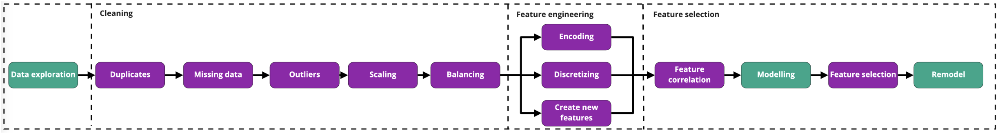

# Data Prep

# ML recap

- sklearn modelling workflow

    ```python
    from sklearn.some_module import SomeModel

    mdl = SomeModel()
    mdl.fit(X_train,y_train)
    mdl.score(X_test,y_test)
    mdl.predict(X_new)
    ```

- holdout method (70/30%)

    ```python
    from sklearn.model_selection import train_test_split

    X_train, X_test, y_train, y_test = train_test_split(X, y, test_size=0.3, random_state=88)
    ```

- cross-validation (cv=5/10)

    ```python
    from sklearn.model_selection import cross_validate

    cross_validate(model, X, y, cv = 5) # returns test_score, fit_time and score_time
    ```

    - high bias (underfitting) - low scores for both training and test sets
    - high variance (overfitting) - high training & low test sets

# Data Processing and Wrangling



- preprocessing: ‘’dirty and noisy data,” alg constraints on input data, transformations can improve model performance

### Duplicates

- data leakage: data in test set is shown during training

```python
data.duplicated()
data.duplicated().sum()
data = data.drop_duplicates()
```

### Missing Data

- causes: programming error, failure of measurement, random events
- representations: NaN, large negatives (-999), ?, infinity, empty string (””)
- handling: causes? representative of a narrative? replaceable? can I afford to just delete problem columns/rows?
    - >30% values missing: drop
    - <30% values missing: impute median/mean/mode
        - creates ‘noise’ from human bias, may lose relationships between columns (only fixes data at single-column level)
1. **find** % or count

    ```python
    data.isnull().sum().sort_values(ascending=False) #NaN count for each column
    data.isnull().sum().sort_values(ascending=False)/len(data) #NaN percentage for each column
    ```

2. **drop**

    ```python
    data.drop(columns='WallMat', inplace=True) # Drop WallMat column
    ```

3. **replace** with documentation explanation

    ```python
    data.Alley.replace(np.nan, "NoAlley", inplace=True) #Replace NaN by "NoAlley"
    data.Alley.value_counts()#Check count of each category
    ```

4. **replace** with mean

    ```python
    data.Pesos.replace(np.nan, data.Pesos.mean()) # Option 2: Replace missing Pesos values with mean
    ```

- OR just use **SimpleImputer**

    ```python
    from sklearn.impute import SimpleImputer

    imputer = SimpleImputer(strategy='mean')

    imputer.fit(data[['Pesos']]) # computes strategy & stores value
    data['Pesos'] = imputer.transform(data[['Pesos']]) # ids NaNs, replaces
    imputer.statistics_ # mean stored in transformer's memory
    ```


### Outliers

- causes: data entry errors, measurement errors, preprocessing errors, novelties
- affects: distributions and patterns, mean & SD (central tendency metrics), ML model performance
- **detecting**:

    ```python
    data[['GrLivArea']].boxplot();
    data['GrLivArea'].min()
    or
    data['GrLivArea'].argmin() # gives index of lowest value
    ```

- **dropping**

    ```python
    index_false = data['GrLivArea'].argmin()
    data.drop(index_false).reset_index(drop=True)
    ```

- automated dropping with **boolean filtering**:

    ```python
    data = data[(data['GrLivArea'] > 0) & (data['GrLivArea'] <= 5000)]
    # will only keep houses where 0 < GrLivArea <= 5000
    ```


### Scaling

- **why/what?**
    - transform continuous features into same range
    - large mag vs small magnitude can outweigh
    - improves computational efficiency and interpretability of coeffs
- **How**?
    1. **standardizing** - safe bet for 0-centered features like lin reg and neurnet
        - z = (x - mean)/std
        - StandardScaler()
        - transforms into normal dist
        - sensitive to outliers

        ```python
        from sklearn.preprocessing import StandardScaler

        plt.hist(data['Pesos']) # Check feature distribution

        scaler = StandardScaler() # Instanciate StandarScaler

        scaler.fit(data[['Pesos']]) # Fit scaler to data
        data['Pesos'] = scaler.transform(data[['Pesos']]) # Use scaler to transform data
        ```

    2. **normalizing: minmax** - positive or sparse matrix (rgb values) and if outliers shouldn’t be removed
        - X’ = (X - Xmin)/(Xmax - Xmin)
        - MinMaxScaler()
        - doesn’t reduce outliers or change skewness
        - fixed range, preserves matrix sparsity (0 = 0)
        - ordinal or positive features
        - sparse matrix or KNN
        - [0,1]

        ```python
        from sklearn.preprocessing import MinMaxScaler
        mm_scaler = MinMaxScaler()
        mm_scaler.fit(df[['cylindernumber']])
        mm_scaler.data_max_
        df['cylindernumber'] = mm_scaler.transform(df[['cylindernumber']])
        ```

1. very skewed → feature engineering: log(feature)
    - didn’t work? **robust scaling (default)**
        - RobustScaled = (x - median)/IQR
        - RobustScaler()
        - less sensitive to outliers

    ```python
    from sklearn.preprocessing import RobustScaler

    r_scaler = RobustScaler() # Instanciate Robust Scaler

    r_scaler.fit(data[['GrLivArea']]) # Fit scaler to feature
    data['GrLivArea'] = r_scaler.transform(data[['GrLivArea']]) #Scale

    data.head()
    ```


### Balancing

- **When/Why?:**
    - in classification dataset: inequality of representation of each class
        - i.e. - disease, race, gender, e-commerce/ads
    - ML alg learn by example & predict minorities poorly
    - 30/70 split for binary classification imbalanced
- **How?**
    1. **over-sampling minority**
        - duplicate instances ONLY on training split NOT testing
    2. **under-sampling majority**
        - sampling majority to match count of minority
    3. **computation of new minority instances**
        - SMOTE (only on training set)

### Encoding

- transforming non-numerical data into numerical form
- because ML algs only process numerical data
1. **Target encoding**
    1. assign number to each category
    2. LabelEncoder()
    3. or binary:

    ```python
    from sklearn.preprocessing import OneHotEncoder

    data.Street.unique() # Check unique values for streets (2)

    ohe = OneHotEncoder(drop='if_binary', sparse = False) # Instantiate encoder for binary feature
    ohe.fit(data[['Street']]) # Fit encoder
    data['Street'] = ohe.transform(data[['Street']]) # Encode Street
    ```

2. **Feature encoding**
    1. binary column for each possible category
    2. OneHotEncoder()
    3. gets rid of hierarchy in target encoding (ML algs assume order for features)

    ```python
    data.Alley.unique()  # Check unique values for streets (3)

    ohe = OneHotEncoder(sparse = False) # Instantiate encoder
    ohe.fit(data[['Alley']]) # Fit encoder
    alley_encoded = ohe.transform(data[['Alley']]) # Encode alley

    data[ohe.categories_[0]] = alley_encoded # categories_ stores the order of encoded column names
    ```


### Discretizing

- turns continuous data into discrete data using bins
    - turns reg into classification
    - feature engineering
    - cut()

```python
data['SalePriceBinary'] = pd.cut(x = data['SalePrice'],
                       bins=[data['SalePrice'].min()-1,
                             data['SalePrice'].mean(),
                             data['SalePrice'].max()+1],
                       labels=['cheap', 'expensive'])
```

### Feature creation

- use domain knowledge to drive more signal for our models to learn
    - create additional info
    - improve model performance
- examples:
    - bedroom → total_room ratio
    - height/weight → BMI
    - delivered - dispatch → lag time
    - date → weekday & weekend columns

### Feature selection

- **Why?**
    - garbage in/out
        - poor quality induce noise, unstable model, poor output
    - curse of dimensionality
        - not observing enough data to support meaningful relationship
        - as n features grows, the amount of data needed is exponentially more
        - high variation in cat feature when HotEncoding more data required
1. **univariate** (correlation)
    1. remove one feature that’s highly correlated to another
        1. pearson correlation

    ```python
    # Heatmap
    plt.figure(figsize=(10,10))
    corr = data.corr()
    sns.heatmap(corr,
            xticklabels=corr.columns,
            yticklabels=corr.columns,
            cmap= "bwr");
    ```

    ```python
    corr_df = corr.stack().reset_index() # Unstack correlation matrix
    corr_df.columns = ['feature_1','feature_2', 'correlation'] # rename columns
    corr_df.sort_values(by="correlation",ascending=False, inplace=True) # sort by correlation
    corr_df = corr_df[corr_df['feature_1'] != corr_df['feature_2']] # Remove self correlation
    ```

    `data.drop(columns=['Pesos'], inplace=True)`

    ```python
    from sklearn.preprocessing import LabelEncoder, MinMaxScaler
    from sklearn.linear_model import LogisticRegression
    from sklearn.model_selection import cross_val_score

    target_encoder = LabelEncoder().fit(data['SalePriceBinary']) # Fit target encoder
    y = target_encoder.transform(data['SalePriceBinary']) # Encode target

    X = data.drop(columns=['Alley', 'SalePrice', 'SalePriceBinary'])# Create feature set
    X_scaled = MinMaxScaler().fit_transform(X) # Scale the features

    log_reg = LogisticRegression(max_iter=1000) # Instanciate model

    scores = cross_val_score(log_reg, X_scaled, y, cv=10) # Cross validate

    scores.mean()
    ```

2. **multivariate** (permutation)
    - evaluates the importance of each feature in predicting the target
        1. trains and records test score of base model containing all features
        2. random shuffle feature within test set
        3. record new score on shuffled test set
        4. compare new or og score
        5. repeat for each feature

    ```python
    from sklearn.inspection import permutation_importance

    log_model = LogisticRegression().fit(X, y) # Fit model

    permutation_score = permutation_importance(log_model,
    		X, y, n_repeats=10) # Perform Permutation

    importance_df = pd.DataFrame(np.vstack((X.columns,
    		permutation_score.importances_mean)).T) # Unstack results

    importance_df.columns=['feature','score decrease']

    importance_df.sort_values(by="score decrease",
    		ascending = False) # Order by importance
    ```

    - drop & check if it worked

        ```python
        X = X.drop(columns=['Street', "Pave"]) # Drops weak features

        log_reg = LogisticRegression()

        scores = cross_val_score(log_reg, X, y, cv=10)

        scores.mean()
        ```

- **Reduce Complexity:**
    - simple = best
    - more interpretable, faster to train, easier to implement/maintain production
    - don’t fit scalers or encoders a second time to test data, only transform

    ```python
    from sklearn.linear_model import LinearRegression

    scaler = RobustScaler()
    scaler.fit(X_train[['GrLivArea']]) # Fit and learn params for scaling
    X_train['GrLivArea'] = scaler.transform(X_train[['GrLivArea']])
    # Apply to training

    model = LinearRegression()
    model.fit(X_train, y_train) # Train model

    X_test['GrLivArea'] = scaler.transform(X_test[['GrLivArea']])
    # Scaling with params learned from training

    preds = model.predict(X_test)
    ```


# Challenges

### Processing Workflow

- A feature can be numerical (continuous or discrete), categorical or ordinal. But a feature can also be temporal (e.g. quarters, months, days, minutes, ...).
- Cyclical features like time need some specific preprocessing. Indeed, if you want any Machine Learning algorithm to capture this cyclicity, your cyclical features must be preprocessed in a certain way.

```python
data['sin_MoSold'] = np.sin(2 * np.pi * data['MoSold']/12.0)
data['cos_MoSold'] = np.cos(2 * np.pi * data['MoSold']/12.0)
data.drop(columns='MoSold', inplace=True)
data.head()
```

### Car prices

- stratification: keep proportions the same

```python
train_X, test_X, train_y, test_y = train_test_split(X1, y,
		random_state=i, stratify=y, test_size=0.3)
```

```python
train_test_split(X, y, test_size=0.3, stratify=X.aspiration)
```

# Flashcards

- What is the strategy to avoid data leakage when balancing a dataset?
    - In order to avoid data leakage, balancing of the classes is performed on the training set only.
- How can highly correlated features negatively affect a model?
    - Regression models assume each independent variable only has a relationship between itself and the dependent variable. If two independent variables are correlated, it would be impossible to change one without the other, which breaks the assumption of the regression model.

# Recap

```python
**.T**
# transpose: columns into rows & vice versa
```

```python
mydict = {'one': 1, 'two': 2, 'three': 3,...}
df['cylinders'] = df['cylinders'].**map**(mydict)
```

```python
df['feature'] = some_encoder.**fit_transform**(df[['feature']])
```

- transform/scale features for predicting:
    - only transform, no fit

```python
model.predict(new_car)[0]
label_encoder.inverse_transform(model.predict(new_car)[0])
```
