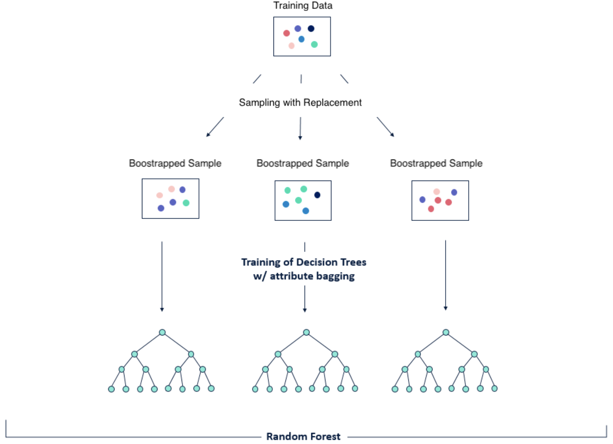

# Ensemble Methods

# Decision Trees

- binary, 1 or 2 children per node
- root node → internal nodes → leaf (no children)
- non-linear modeling

### Pros

- No scaling necessary
- Resistant to outliers
- Intuitive and easy to interpret
- Allows for feature selection (see Gini-based `[feature_importance_](https://scikit-learn.org/stable/modules/generated/sklearn.tree.DecisionTreeClassifier.html#sklearn.tree.DecisionTreeClassifier.feature_importances_)`)
- Non-linear modeling

### Cons

- High variance (i.e. a small change in the data causes a big change in the tree's structure)
- Long training time if grown up to (large) max depth, as $O(N_{obs}*m_{feat}*depth)$
- Splits data "orthogonally" to feature directions
    - use PCA upfront to "orient" data

### Decision Tree Classifier

```python
from palmerpenguins import load_penguins
import pandas as pd
from sklearn.preprocessing import LabelEncoder

palmer = load_penguins(drop_na=True).dropna().groupby('species').apply...

list(palmer.species.unique())

X = ...
y = ...

from sklearn.tree import DecisionTreeClassifier

tree_clf = DecisionTreeClassifier(max_depth=2, random_state=42)

tree_clf.fit(X, y)
```

```python
import graphviz
from sklearn.tree import export_graphviz

#export
export_graphviz(tree_clf, out_file="penguin_tree.dot",
                feature_names=data.drop(columns=['target']).columns,
                class_names=['Adelie','Chinstrap','Gentoo'],
                rounded=True, filled=True)

#import
with open("penguin_tree.dot") as f:
    dot_graph = f.read()
    display(graphviz.Source(dot_graph)
```

- filter - boolean filter
- gini - purity or impurity (percentage of falsely classified samples)
    - $Gini(node) = 1 - Σp_1^2$
        - $p_i$ - ratio between the observations in a class $i$ and the total number of obs. remaining at a given node

        ```python
        gini = 1 - (50/150)**2 - (50/150)**2 - (50/150)**2
        ```

- samples - how many are being tested
- value - how many of each class are in the filter
- class - the majority class
- true: left; false: right

### Growing a Tree

1. start root node (contains entire dataset)
2. try various feature/threshold combos to split dataset into 2 child nodes
3. compute weighted average Gini index of both child nodes (weighed by # instances)
4. select feature/thresh combo yielding lowest index (purest child nodes)
5. split dataset in two
6. repeat for both children
7. stop when no feature improves node impurity (what risk? OVER-FITTING)

### Predicting

- new point passed through tree from top to bottom until it reaches a leaf
- most represented class in leaf is the predicted class

    ```python
    tree_clf.predict(X_new)
    tree_clf.predict_proba(X_new) # ratio, not probability
    ```

- orthogonal classifier

    ```python
    plot_decision_regions(X, y, classifier=tree_clf) # flag map
    ```

- sklearn visual classifier comparison

    ```python
    import numpy as np
    import matplotlib.pyplot as plt
    from matplotlib.colors import ListedColormap
    from sklearn.model_selection import train_test_split
    from sklearn.preprocessing import StandardScaler
    from sklearn.datasets import make_moons, make_circles, make_classification
    from sklearn.neural_network import MLPClassifier
    from sklearn.neighbors import KNeighborsClassifier
    from sklearn.svm import SVC
    from sklearn.gaussian_process import GaussianProcessClassifier
    from sklearn.gaussian_process.kernels import RBF
    from sklearn.tree import DecisionTreeClassifier
    from sklearn.ensemble import RandomForestClassifier, AdaBoostClassifier
    from sklearn.naive_bayes import GaussianNB
    from sklearn.discriminant_analysis import QuadraticDiscriminantAnalysis
    from sklearn.inspection import DecisionBoundaryDisplay

    names = [
        "Nearest Neighbors",
        "Linear SVM",
        "RBF SVM",
        "Gaussian Process",
        "Decision Tree",
        "Random Forest",
        "Neural Net",
        "AdaBoost",
        "Naive Bayes",
        "QDA",
    ]

    classifiers = [
        KNeighborsClassifier(3),
        SVC(kernel="linear", C=0.025),
        SVC(gamma=2, C=1),
        GaussianProcessClassifier(1.0 * RBF(1.0)),
        DecisionTreeClassifier(max_depth=5),
        RandomForestClassifier(max_depth=5, n_estimators=10, max_features=1),
        MLPClassifier(alpha=1, max_iter=1000),
        AdaBoostClassifier(),
        GaussianNB(),
        QuadraticDiscriminantAnalysis(),
    ]

    X, y = make_classification(
        n_features=2, n_redundant=0, n_informative=2, random_state=1, n_clusters_per_class=1
    )
    rng = np.random.RandomState(2)
    X += 2 * rng.uniform(size=X.shape)
    linearly_separable = (X, y)

    datasets = [
        make_moons(noise=0.3, random_state=0),
        make_circles(noise=0.2, factor=0.5, random_state=1),
        linearly_separable,
    ]

    figure = plt.figure(figsize=(27, 9))
    i = 1
    # iterate over datasets
    for ds_cnt, ds in enumerate(datasets):
        # preprocess dataset, split into training and test part
        X, y = ds
        X = StandardScaler().fit_transform(X)
        X_train, X_test, y_train, y_test = train_test_split(
            X, y, test_size=0.4, random_state=42
        )

        x_min, x_max = X[:, 0].min() - 0.5, X[:, 0].max() + 0.5
        y_min, y_max = X[:, 1].min() - 0.5, X[:, 1].max() + 0.5

        # just plot the dataset first
        cm = plt.cm.RdBu
        cm_bright = ListedColormap(["#FF0000", "#0000FF"])
        ax = plt.subplot(len(datasets), len(classifiers) + 1, i)
        if ds_cnt == 0:
            ax.set_title("Input data")
        # Plot the training points
        ax.scatter(X_train[:, 0], X_train[:, 1], c=y_train, cmap=cm_bright, edgecolors="k")
        # Plot the testing points
        ax.scatter(
            X_test[:, 0], X_test[:, 1], c=y_test, cmap=cm_bright, alpha=0.6, edgecolors="k"
        )
        ax.set_xlim(x_min, x_max)
        ax.set_ylim(y_min, y_max)
        ax.set_xticks(())
        ax.set_yticks(())
        i += 1

        # iterate over classifiers
        for name, clf in zip(names, classifiers):
            ax = plt.subplot(len(datasets), len(classifiers) + 1, i)
            clf.fit(X_train, y_train)
            score = clf.score(X_test, y_test)
            DecisionBoundaryDisplay.from_estimator(
                clf, X, cmap=cm, alpha=0.8, ax=ax, eps=0.5
            )

            # Plot the training points
            ax.scatter(
                X_train[:, 0], X_train[:, 1], c=y_train, cmap=cm_bright, edgecolors="k"
            )
            # Plot the testing points
            ax.scatter(
                X_test[:, 0],
                X_test[:, 1],
                c=y_test,
                cmap=cm_bright,
                edgecolors="k",
                alpha=0.6,
            )

            ax.set_xlim(x_min, x_max)
            ax.set_ylim(y_min, y_max)
            ax.set_xticks(())
            ax.set_yticks(())
            if ds_cnt == 0:
                ax.set_title(name)
            ax.text(
                x_max - 0.3,
                y_min + 0.3,
                ("%.2f" % score).lstrip("0"),
                size=15,
                horizontalalignment="right",
            )
            i += 1

    plt.tight_layout()
    plt.show()
    ```


### DecisionTreeRegressor

- goal of regression trees: predict a continuous value, they are "grown" differently than classification trees
    1. select threshold
    2. compute SSR between average of each side & ground truth
    3. report weighted average SSR of both sides, weighed by # data points
    4. move threshold to the right, compute #3 again
    5. the threshold that minimizes the residuals becomes the root node of the tree
        1. don’t split further on left (over-fitting)
        2. average values on left of threshold to generalize
- default params will often **overfit**
    - **min_samples_split**
        - no nodes with only 1-2 datapoints
            - specifies min number of samples required to split internal node
    - **min_samples_leaf**
        - min number of samples for node to be a leaf (smaller, more overfitting)
    - **max_depth**
        - max depth of tree (number of levels, the larger, the more overfit)

## Variance Illustrated

### Regression

```python
import pandas as pd
data = pd.read_csv('https://wagon-public-datasets.s3.amazonaws.com/flats.csv')
data.head(3)
X = data[['bedrooms','surface','floors']]
y = data['price']
```

```python
def **plot_histogram_cv_results**(cv_results):
    # Calculating the std and the mean
    std = cv_results['test_score'].std()
    mean = cv_results['test_score'].mean()

    # Getting the number of folds
    n_cv = len(cv_results['test_score'])

    # Building plot
    plt.hist(cv_results['test_score'], bins=n_cv)

    # Creating red lines
    plt.vlines(mean, 0, 3, color='red', label=f'mean = {mean:.2f}')
    plt.hlines(
        3, mean - 1/2 * std, mean + 1/2 * std,
        color='red', label=f'std = {std:.2f}', ls='dotted'
    )

    # Setting the title
    plt.title('Histogram of R2 Scores During Cross-Validation')

    # Setting the labels and xlim
    plt.xlim((-1, 1))

    plt.xlabel('r2')
    plt.ylabel('number of folds')

    # Showing the legend
    plt.legend(loc='upper left')

    plt.show()
```

```python
from sklearn.tree import DecisionTreeRegressor
from sklearn.model_selection import cross_validate

tree = DecisionTreeRegressor()

cv_results = cross_validate(tree, X, y, scoring = "r2", cv=5)

**plot_histogram_cv_results**(cv_results)
```

### Classification

```python
from sklearn.datasets import make_moons

n=600
X_moon,y_moon = make_moons(n_samples=n, noise=0.25, random_state=0)

plt.scatter(X_moon[:,0], X_moon[:,1], c=y_moon)
```

```python
from sklearn.tree import DecisionTreeClassifier
from ipywidgets import interact

#@interact(max_depth=10)
def plot_classifier(max_depth):
    clf = DecisionTreeClassifier(max_depth=max_depth)
    clf.fit(X_moon, y_moon)
    plot_decision_regions(X_moon, y_moon, classifier=clf)

plot_classifier(max_depth=10)
```

# Bagging - Bootstrap Aggregating

- agg of multiple versions of a model
- parallel ensemble method to
- goal: reduce variance
- each version of the model called ‘weak learner’
- each weak learner trained on bootstrapped samples of the dataset
- random forest

### Pros

- Reduces variance (overfitting)
- Can be applied to any model

### Cons

- Complex structure
- Long training time
- Disregards the performance of individual sub-models

## Bootstrapping

- the samples are created by randomly drawing data points, with replacement (individual samples can be chosen multiple times)
- features can be randomly filtered to increase ‘bagging diversity’
- gets rid of overfitting

### Random Forests - bagged trees



- predictions: **averaged in regression** tasks and **majority in classifications**

### Code

- regression

    ```python
    from sklearn.ensemble import RandomForestRegressor

    forest = RandomForestRegressor(n_estimators=100)

    cv_results = cross_validate(forest, X, y, scoring = "r2", cv=5)

    plot_histogram_cv_results(cv_results)
    ```

- classification

    ```python
    from sklearn.ensemble import RandomForestClassifier

    #@interact(max_depth=5)
    def plot_classifier(max_depth):
        cls = RandomForestClassifier(max_depth=max_depth)
        cls.fit(X_moon, y_moon)
        plot_decision_regions(X_moon, y_moon, classifier=cls)

    plot_classifier(max_depth=5)
    ```


## Without Trees

```python
from sklearn.ensemble import BaggingClassifier, BaggingRegressor
from sklearn.neighbors import KNeighborsClassifier

weak_learner = KNeighborsClassifier(n_neighbors=3)
bagged_model = BaggingClassifier(weak_learner, n_estimators=40)

bagged_model.fit(X_moon, y_moon)
plot_decision_regions(X_moon, y_moon, classifier=bagged_model)
```

### Out-of-bag Samples

```python
from sklearn.linear_model import LinearRegression

linear_model = LinearRegression()

bagged_model = BaggingRegressor(linear_model,
                                n_estimators=50,
                                oob_score=True)

bagged_model.fit(X, y).oob_score_
```

```python
RandomForestClassifier(n_estimators=100)

BaggingClassifier(DecisionTreeClassifier(), n_estimators=100)
# similar (but slightly less optimized)

~~BaggingRegressor(RandomForestClassifier(), n_estimators=100)~~
# NO
```

# Boosting

- trains weak learners that learn from their predecessor’s mistakes
    - sequential ensemble method
    - reduces bias (underfitting)
    - focuses on observations that are harder to predict
    - best weak learners given more weight in final ‘vote’

### Pros

- Strong sub-models have more influence in final decision
- Reduces bias

### Cons

- Computationally expensive (sequential)
- Easily overfits
- Sensitive to outliers (too much time spent trying to correctly predict them)

### AdaBoost (Adaptive Boosting)

- works particularly well with trees
- can lead to overfitting

```python
from sklearn.ensemble import AdaBoostRegressor

adaboost = AdaBoostRegressor(
    DecisionTreeRegressor(max_depth=3),
    n_estimators=50)

cv_results = cross_validate(adaboost, X, y, scoring = "r2", cv=5)

**plot_histogram_cv_results**(cv_results)
```

```python
from sklearn.ensemble import AdaBoostClassifier

#@interact(n_estimators=[10, 30, 50,100], max_depth=3)
def plot_classifier(n_estimators, max_depth):
    model = AdaBoostClassifier(DecisionTreeClassifier(max_depth=max_depth),
                               n_estimators=n_estimators)
    model.fit(X_moon, y_moon)
    plot_decision_regions(X_moon, y_moon, classifier=model)

plot_classifier(n_estimators=50, max_depth=3)
```

### Gradient Boosting

- only for trees
- performs better than AdaBoost
- instead of updating weights of observations that were misclassified:
    1. recursive fit each weak learner so as to predict residuals of previous
    2. adds predictions of weak learners

        $D(x) = d_{tree1}(x) + d_{tree2}+...$

- prediction(new data point) = prediction of first tree + prediction of residual tree

```python
from sklearn.ensemble import GradientBoostingRegressor
model = GradientBoostingRegressor(
    n_estimators=100,
    learning_rate=0.1,
    max_depth=3
)
```

```python
from sklearn.ensemble import GradientBoostingClassifier
model = GradientBoostingClassifier(n_estimators=100, learning_rate=1.0,
				    max_depth=1, random_state=0).fit(X_train, y_train)
model.score(X_test, y_test)
```

- XGBOOST (extreme gt boost)
    - dedicated library, inspired by deep learning

    ```python
    from sklearn.model_selection import train_test_split

    # Split data into train, test and validation sets
    X_train, X_test, y_train, y_test = train_test_split(
        X, y, test_size = 0.3, random_state = 42  # TEST = 30%
    )

    # Use the same function above for the validation set
    X_test, X_val, y_test, y_val = train_test_split(
        X_test, y_test, test_size = 0.5, random_state = 42  # TEST = 15%
    )
    ```

    ```python
    from xgboost import XGBRegressor

    xgb_reg = XGBRegressor(max_depth=10, n_estimators=100, learning_rate=0.1)

    xgb_reg.fit(X_train, y_train,
        # evaluate loss at each iteration
        eval_set=[(X_train, y_train), (X_val, y_val)],
        # stop iterating when eval loss increases 5 times in a row
        early_stopping_rounds=5
    )

    y_pred = xgb_reg.predict(X_val)
    ```

    ```python
    from sklearn.pipeline import make_pipeline

    pipe_xgb = make_pipeline(xgb_reg)
    cv_results = cross_validate(pipe_xgb, X, y, cv=10, scoring='r2')
    ```


## Summary of Ensemble Methods

- combines several base algs (i.e. Decision Trees)

### Parallel Learners

- `RandomForestRegressors`
- `BaggingRegressors`
- models trained in parallel, predictions aggregated

### Sequential Learners

- `AdaBoostRegressor`
- `GradientBoostRegressor`
- `XGBoostRegressor`
- models trained sequentially, able to learn mistakes

# Stacking

Training **different estimators** and aggregating their predictions

- Different estimators (KNN, LogReg, etc.) capture **different structures in the data**
- Combining sometimes enhances the predictive power
- The results are aggregated either by majority ‘vote’ (classification) or mean (regression)

### Simple Aggregation

```python
from sklearn.ensemble import VotingClassifier
from sklearn.linear_model import LogisticRegression

forest = RandomForestClassifier()
logreg = LogisticRegression()

ensemble = VotingClassifier(
    estimators = [("rf", forest),("lr", logreg)],
    voting = 'soft', # to use predict_proba of each classifier before voting
    weights = [1,1] # to equally weight forest and logreg in the vote
)

ensemble.fit(X_moon, y_moon)
plot_decision_regions(X_moon, y_moon, classifier=ensemble)
```

### Multi-layer Stacking

- train final estimator on predictions of previous
- how each should be weighted

```python
from sklearn.ensemble import StackingClassifier
from sklearn.neighbors import KNeighborsClassifier

ensemble = StackingClassifier(
    estimators = [("rf", RandomForestClassifier()),
                  ("knn", KNeighborsClassifier(n_neighbors=10))],
    final_estimator = LogisticRegression())

ensemble.fit(X_moon, y_moon)
plot_decision_regions(X_moon, y_moon, classifier=ensemble)
```

# Challenge

```python
from sklearn.metrics import fbeta_score, make_scorer
from sklearn.model_selection import GridSearchCV
from sklearn.svm import LinearSVC

ftwo_scorer = make_scorer(fbeta_score, beta=2)
grid = GridSearchCV(LinearSVC(),
										param_grid={'C': [1, 10]},
                    scoring=ftwo_scorer)
```

# Flashcards

- The Boosting ensemble technique can only be applied to decision trees. True or False?
    - False - Both bagging and boosting can be applied to any algorithm!!
- Random forests solve an issue specific to decision trees. What is that issue?
    - Decision trees are very sensitive to the data they are trained on and have a high variance. Bagging decision trees (Random Forest) reduces that variance.
