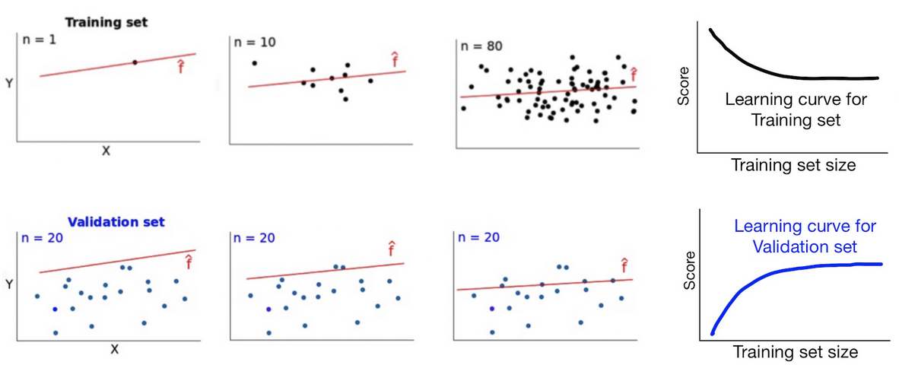

# Machine Learning

# What even is it?

- The area of computational science that focuses on analyzing and interpreting patterns and structures in data to enable learning, reasoning, and decision making outside of human interaction.


- Categories:

    

    - **supervised** learning:
        - predictive model based on both input and output data
    - **unsupervised** learning:
        - group and interpret data based only on input data
    - **regression**:
        - what is the temperature going to be tomorrow?
    - **classification**:
        - will it be hot or cold tomorrow?
    - Jargon:
        - **features**: input, X, variables
        - **target**: output, y, label, class
        - **samples**: rows, observations

    


# Scikit-learn Library

- a Machine Learning library that provides data preprocessing, modeling, and model selection tools

```
pip install -U scikit-learn
```

- modules → classes (tools)
    - linear_model → LinearRegression
- importing: “explicit better than implicit”

    ```python
    from sklearn.linear_model import LinearRegression
    model = LinearRegression()
    ```


# Linear Reg with scikit

- recap:
    - X → y
    - a: slope, b: intercept
    - residual - square of the distance from the line of best fit
- log recap:
    - “classifier”
    - sigmoid function to map change in probabilty of y

### With Sklearn:

1. import
2. instantiate
3. train
4. evaluate
5. predict

```python
import pandas as pd

data = pd.read_csv("https://wagon-public-datasets.s3.amazonaws.com/Machine%20Learning%20Datasets/ML_Houses_dataset.csv")

data.head()
```

```python
livecode_data = data[['GrLivArea','SalePrice']]

livecode_data.head()
```

```python
import matplotlib.pyplot as plt

# Plot Living area vs Sale price
plt.scatter(data['GrLivArea'], data['SalePrice'])

# Labels
plt.xlabel("Living area")
plt.ylabel("Sale price")

plt.show()
```

- Train:

    ```python
    # Import the model
    from sklearn.linear_model import LinearRegression

    # Instanciate the model (💡 in Sklearn often called "estimator")
    model = LinearRegression()

    # Define X and y
    X = data[['GrLivArea']] # can put multiple features
    y = data['SalePrice']

    # Train the model on the data
    model.fit(X, y)
    ```

- Model attributes

    ```python
    model.coef_

    model.intercept_
    ```

- Scoring
    - uses $R^2$ - the proportion of the variance of the target explained by features
    - 0 ≤ score ≥ 1
    - higher score, better model

    ```python
    model.score(X,y) # really should train on previously unseen data
    ```

- Predicting

    ```python
    model.predict([[1000]])
    #>> array([127113.39664561])
    # 1000 sqft house will have a predicted value of $127k
    ```


# Generalization

- performance of ML is evaluated based on the ability to generalize when predicting unseen data

### Holdout Method

- The Holdout Method is used to evaluate a model's ability to generalize. It consists of splitting the dataset into two sets:
    - **Training set** (~70%)
    - **Testing set** (~30%)
- limitations: size of data, random split (so you get new scores each time)

    ```python
    from sklearn.model_selection import train_test_split

    # split the data into train and test
    train_data, test_data = train_test_split(livecode_data, test_size=0.3)

    # Ready X's and y's
    X_train = train_data[['GrLivArea']]
    y_train = train_data['SalePrice']

    X_test = test_data[['GrLivArea']]
    y_test = test_data['SalePrice']
    ```

    ```python
    # Ready X and y
    X = livecode_data[['GrLivArea']]
    y = livecode_data['SalePrice']

    # Split into Train/Test
    X_train, X_test, y_train, y_test = train_test_split(X, y, test_size=0.3)
    ```

- train/score

    ```python
    # Instantiate the model
    model = LinearRegression()

    # Train the model on the Training data
    model.fit(X_train, y_train)

    # Score the model on the Test data
    model.score(X_test,y_test)
    ```

    - since it’s randomly split, average multiple iterations (cross-validation)

# Cross Validation

### K-Fold

- changes the data and then averages the scores
1. The dataset is split into K number of folds
    1. choosing K: tradeoff between trustworthy perf. eval. & comp expense
        1. more K-folds → more submodels to avg scores → more representative score BUT more computational time
        2. K = 5 or 10
2. For each split, a sub model is trained and scored
3. The average score of all sub models is the **cross-validated** score of the model

```python
from sklearn.model_selection import cross_validate

# Instantiate model
model = LinearRegression()

# 5-Fold Cross validate model
cv_results = cross_validate(model, X, y, cv=5)
# fit time, score time, test score

# Scores
cv_results['test_score']

# Mean of scores
cv_results['test_score'].mean()
```

### Bias/Variance Tradeoff

- **Under-fitting**: inability for alg to learn patterns (**high bias**)
- **Over-fitting**: alg generates overly complex pattern (**high variance**)
- Good balance: low bias, low variance

### No Free Lunch Theorem

- some models **oversimplify**, while others **over-complicate** the relationship between the features and target
- therefore, we have to **assumptions** about the data
- **there is no one-size-fits-all model**

# Learning Curves

- used to diagnose model behavior:
    1. under-fitting
    2. over-fitting
    3. sufficient data
- increasing the size of the training set can affect the training and validation scores
- It's up to us to try and improve this score while still maintaining generalization.

    

    - as the training size increases:
        1. training score decreases
        2. test score increases
        3. curves typically demonstrate convergence
            1. if they don’t: it tells us something’s wrong with the model:

### High Bias : Under-fitting

- If the model cannot determine a relationship in the training set, we cannot expect the model to score highly in the test set.
- Training and testing scores converge and **plateau at a low score**. No matter how much data is used for training, the model cannot determine a meaningful relationship.

    


### High variance : Over-fitting

- The model has paid **too much attention** to both signal and noise in the training data, leading to **high training scores**.
- **Reliance on noise** does not generalize well on unseen data, resulting in **low test scores**. More training data *might* help in this case.

    


### Code it

```python
import numpy as np
from sklearn.model_selection import learning_curve

train_sizes = [25,50,75,100,250,500,750,1000,1150]
# Get train scores (R2), train sizes, and validation scores using `learning_curve`
train_sizes, train_scores, test_scores = learning_curve(
    estimator=LinearRegression(), X=X, y=y, train_sizes=train_sizes, cv=5)

# Take the mean of cross-validated train scores and validation scores
train_scores_mean = np.mean(train_scores, axis=1)
test_scores_mean = np.mean(test_scores, axis=1)
```

```python
plt.plot(train_sizes, train_scores_mean, label = 'Training score')
plt.plot(train_sizes, test_scores_mean, label = 'Test score')
plt.ylabel('r2 score', fontsize = 14)
plt.xlabel('Training set size', fontsize = 14)
plt.title('Learning curves', fontsize = 18, y = 1.03)
plt.legend()
```

```python
fig = figure(figsize=(10,6), title='Learning Curves')
sns.lineplot(
		data=train_sizes
)
plt.ylabel('r2 score')
plt.xlabel('training set size')
plt.title('Learning curves')
```

# Challenges

#1

- ❓ Plot the evolution of **<u>total</u> computational time (fitting and scoring)** and **<u>mean</u> score** as K folds increases from 2 until 20.

```python
comps_arr = pd.DataFrame(columns=['X', 'y'])
for x in range(2, 21):
    cv_results = cross_validate(model, X=X, y=y, cv=x)
    total_comp_time = cv_results['fit_time'].sum() + cv_results['score_time'].sum()
    test_scores_mean = cv_results['test_score'].mean()
    comps_arr.loc[(x-2)] = [total_comp_time, test_scores_mean]
```

```python
k_vals = np.linspace(2, 21, 19)
plt.plot(k_vals, comps_arr['X'], label='total_comp_time')
plt.plot(k_vals, comps_arr['y'], label='test_scores_mean')
plt.xlabel('k-folds')
plt.ylabel('r2 score')
plt.title('Total Computational Time vs Mean score')
plt.legend()
```

#2

```python
from sklearn.model_selection import train_test_split

# training the model
model = LinearRegression()

X = nba_df[['mp']]
y = nba_df['win_rating']

X_train, X_test, y_train, y_test = train_test_split(X, y, test_size=0.2, random_state=1)

model.fit(X_train, y_train)

# scoring the model
lin_reg_score = model.score(X_test, y_test)
print("Model R2:", lin_reg_score)

# extracting the coefficients and regression function
regression = model.coef_[0] * nba_df['mp'] + model.intercept_

# plotting the data and learned regression function
sns.scatterplot(data=nba_df, x='mp', y='win_rating', alpha=0.5)
plt.plot(nba_df['mp'], regression, color='red', linewidth=3)
```

- it’s exponential!

```python
from sklearn.preprocessing import PolynomialFeatures

polynomial_features = PolynomialFeatures(degree=2, include_bias=False) # we don't want to add a column of 1's
X_poly = polynomial_features.fit_transform(X)

X_poly = pd.DataFrame(X_poly) # turning it back into a DataFrame for easier manipulation
X_poly.head()
```

```python
sorted_df = nba_df.sort_values('mp')

X = sorted_df[['mp']]
y = sorted_df['win_rating']

poly_features = PolynomialFeatures(degree=2, include_bias=False)
X_poly = poly_features.fit_transform(X)

model.fit(X_poly, y)

predictions = model.predict(X_poly)

sns.scatterplot(x=X['mp'], y=y, alpha=0.5)
plt.plot(X['mp'], predictions, linewidth=3, color='r')
```

- reducing training set size

```python
# Plotting the learning curves
plt.figure(figsize=(10,6))
plt.plot(train_sizes, train_scores_mean, label = 'training score')
plt.plot(train_sizes, test_scores_mean, label = 'test score')
plt.ylabel('r2 score', fontsize = 14)
plt.xlabel('Training set size', fontsize = 14)
plt.title('Learning curves', fontsize = 18, y = 1.03)

# Plotting a line where difference of train and test score becomes <1%
plt.axvline(1400, linestyle='--', c='black')
plt.annotate('Past this line:\ntrain_score - test_score <= 0.01', xy=(1450, 0.7))

# Comparing test scores at that line and at max training data (80% of data)
plt.scatter(train_sizes[14], test_scores_mean[14], c='orange', s=50)
plt.annotate(f"R2: {round(test_scores_mean[14],2)}",
             xy=(train_sizes[14] + 50, test_scores_mean[14] - 0.03),
             fontsize=12, c='orange')

plt.scatter(train_sizes[31], test_scores_mean[31], c='orange', s=50)
plt.annotate(f"R2: {round(test_scores_mean[31],2)}",
             xy=(train_sizes[31] - 200, test_scores_mean[31] - 0.03),
             fontsize=12, c='orange')

plt.legend();
```

- comparing model predictions

```python
model.fit(XX, yy)
true_val = model.predict(XX)
reg_score = mean_squared_error(yy, true_val)

model.fit(XX_poly, yy)
predicted_val = model.predict(XX_poly)
poly_score = mean_squared_error(yy, predicted_val)
```

#3 - log reg

```python
from sklearn.linear_model import LogisticRegression
from sklearn.model_selection import cross_validate

log_model = LogisticRegression()

X = df[['Pclass', 'SibSp', 'Parch', 'Fare']]
y = df['Survived']

cv_results1 = cross_validate(log_model, X, y, cv=5)
accuracy = cv_results1['test_score'].mean()
```

```python
import numpy as np
from sklearn.model_selection import learning_curve

train_sizes = np.linspace(1, 710, 10, dtype='int')
train_sizes, train_scores, test_scores = learning_curve(
    estimator=LogisticRegression(), X=X, y=y, train_sizes=train_sizes, cv=5)

train_scores_mean = np.mean(train_scores, axis=1)
test_scores_mean = np.mean(test_scores, axis=1)
```

```python
import matplotlib.pyplot as plt

plt.plot(train_sizes, train_scores_mean, label = 'Training score')
plt.plot(train_sizes, test_scores_mean, label = 'Test score')
plt.ylabel('r2 score', fontsize = 14)
plt.xlabel('Training set size', fontsize = 14)
plt.title('Learning curves', fontsize = 18, y = 1.03)
plt.legend()
```

```python
log_model = LogisticRegression()

X = df[['Pclass', 'SibSp', 'Parch', 'Fare']]
y = df['Survived']
samp = [{'Pclass': 1, 'SibSp': 0, 'Parch': 0, 'Fare': 15.0}]
samp_df = pd.DataFrame(samp)

myp = log_model.fit(X, y)
prediction = myp.predict(samp_df)

probability = myp.predict_proba(samp_df)[0][1]
probability
```

# Recap

- apply & lambda

```python
from sklearn.datasets import load_iris
import pandas as pd

data = load_iris()
df = pd.DataFrame(data['data'], columns=data['feature_names'])
df['species'] = data['target']
df['species'] = df['species'].apply(lambda x: data['target_names'][x])
```

```python
df.groupby('species').count()
df['species'].value_counts()
```

- multiclass problems:
    - 1 vs 1 (better - more accurate for pair-correlations)

    ```python
    log_model_2 = OneVsOneClassifier(estimator=LogisticRegression())

    cv_results2 = cross_validate(log_model_2, X, y, cv=5)
    accuracy = cv_results2['test_score'].mean()

    total_time2 = cv_results2['fit_time'].sum() + cv_results2['score_time'].sum()
    total_time2
    ```

    - 1 vs all

    ```python
    log_model = LogisticRegression(multi_class='ovr', max_iter=1000)

    X = df.iloc[:,:-1]
    y = df['species']

    cv_results1 = cross_validate(log_model, X, y, cv=5)
    accuracy = cv_results1['test_score'].mean()
    ```


# Flashcards

- Classification tasks don’t always have binary targets
- When reading learning curves, what are the two main signals of a performing model?
    1. The score for both training and validation curves is relatively high
    2. Both curves have converged
-
