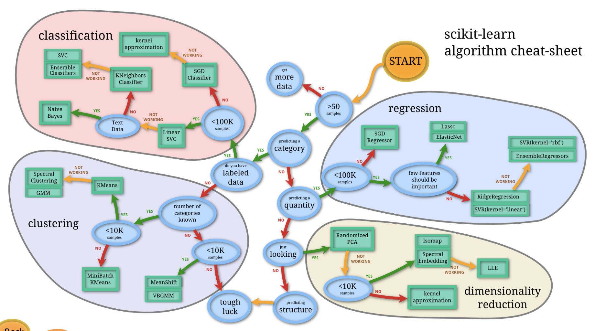
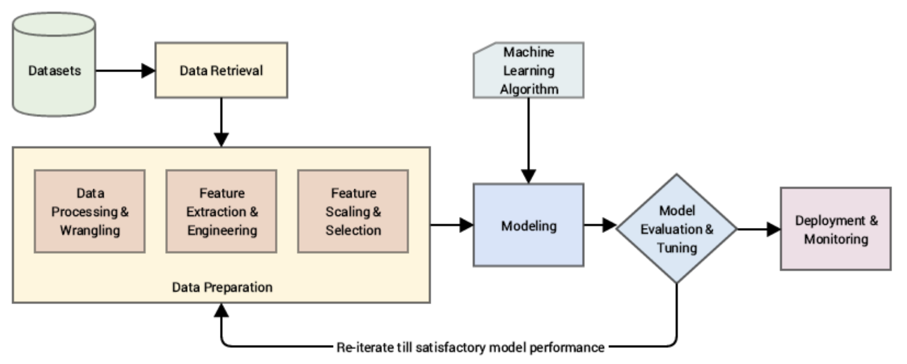
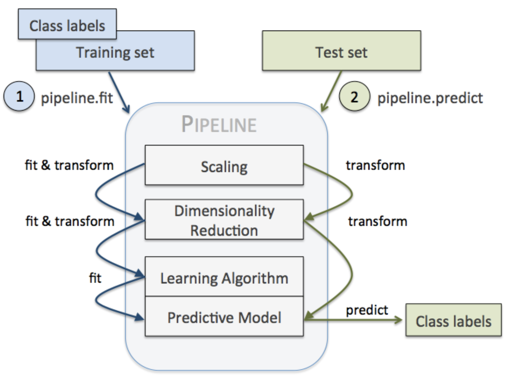

# Machine Learning Workflow

# Model Selection



### Parametric

- regression (neural network)
- $y = f_ß(X)$
- intuitive (equations)
- fast to train on large datasets (SGD)
- requires prior assumptions (f) about the structure of the data
    - may not find complex patterns unless given complex features

### Non-parametric

- KNN, kernel-SMV (Trees)
    - rbf-SMV .fit() must compute a kernel between each pair of datapoints
    - KNN .fit() stores whole dataset
- no prior assumptions are needed about data structure
- many parameters to learn (not known beforehand)
- can train complex features, harder on large datasets (overfitting)

# Pipelines



- chain of operations
- make workflow easier to read and understand
- enforce implementation and order of steps in your project
- makes your work reproducible and deployable



## Preprocessing Pipelines

- predict the **charges** of health insurance as a function of various features
- **chains** multiple steps **in sequence**

```python
X = data.drop(columns='charges')
y = data['charges']

X_train = X[:1100]
y_train = y[:1100]
X_test = X[1100:]
y_test = y[1100:]
```

### Pipeline

1. impute missing values
2. scale numerical features
3. encode categorical features
4. fine-time model/preprocessing

```python
from sklearn.pipeline import Pipeline
from sklearn.impute import SimpleImputer
from sklearn.preprocessing import StandardScaler

pipe = Pipeline(
				[('imputer', SimpleImputer()),
				 ('scaler', StandardScaler())]
				)

pipe.fit(X_train[['age']])
pipe.transform(X_train[['age']])
```

### Column Transformer

```python
from sklearn.compose import ColumnTransformer
from sklearn.preprocessing import OneHotEncoder

num_transformer = Pipeline([
		('imputer', SimpleImputer()),
		('scaler', StandardScaler())
])

cat_transformer = OneHotEncoder(drop='if_binary',
																handle_unknown='ignore')

# parallelize
preprocessor = ColumnTransformer([
		('num_tr', num_transformer, ['age', 'bmi']),
		('cat_tr', cat_transformer, ['smoker', 'region'])
])

column_names = preprocessor.get_feature_names_out()
X_train_transformed = pd.DataFrame(preprocessor.fit_transform(X_train),
											columns=column_names)
```

- visualize in HTML

    ```python
    from sklearn import set_config; set_config(display='diagram')
    preprocessor
    ```


### Custom Function Transformer

```python
from sklearn.preprocessing import FunctionTransformer
```

```python
# transformer that compresses data to 2 digits
rounder = FunctionTransformer(np.round)
rounder = FunctionTransformer(lambda array: np.round(array, decimals=2))
```

```python
num_transformer = Pipeline([
    ('imputer', SimpleImputer()),
    ('scaler', StandardScaler()),
    ('rounder', rounder)])

preprocessor = ColumnTransformer([
    ('num_tr', num_transformer, ['bmi', 'age']),
    ('cat_tr', cat_transformer, ['region', 'smoker'])],
    remainder='passthrough')
```

```python
pd.DataFrame(preprocessor.fit_transform(X_train)).head()
```

### Stateful Transformations

```python
from sklearn.base import TransformerMixin, BaseEstimator

class MyCustomTranformer(TransformerMixin, BaseEstimator):
    # BaseEstimator generates the get_params() and set_params()
			# methods that all Pipelines require
    # TransformerMixin creates the fit_transform() method from
			# fit() and transform()

    def __init__(self):
        pass

    def fit(self, X, y=None):
        # Here you store what needs to be stored during .fit(X_train)
					# as instance attributes
        # Return "self" to allow chaining .fit().transform()
        pass

    def transform(self, X, y=None):
        # Return result as a DataFrame for integration into ColumnTransformer
        pass
```

```python
my_transformer = MyCustomTranformer()
my_transformer.fit(X_train)
my_transformer.transform(X_train)
my_transformer.transform(X_test)
```

### FeatureUnion ||

- apply transformers **in parallel**, then they **concatenate** the outputs of the respective feature matrices of each transformer
- **creates entirely new features**

```python
from sklearn.pipeline import FeatureUnion

bmi_age_ratio_construct = FunctionTransformer(lambda df:
													pd.DataFrame(df['bmi'] / df['age']))

union = FeatureUnion([
    ('preprocess', preprocessor), # columns 0-8
    ('bmi_age_ratio', bmi_age_ratio_constructor) # new colum 9
])

columns_updated = column_names.append(['bmi_age_ratio'])

pd.DataFrame(union.fit_transform(X_train),
		columns=columns_updated).head()
```

### ‘make_***’ Shortcuts

```python
from sklearn.pipeline import make_pipeline
from sklearn.pipeline import make_union
from sklearn.compose import make_column_transformer
from sklearn.compose import make_column_selector
```

```python
make_pipeline(SimpleImputer(), StandardScaler())
```

```python
num_transformer = make_pipeline(SimpleImputer(), StandardScaler())
num_col = make_column_selector(dtype_include=['float64'])

cat_transformer = OneHotEncoder()
cat_col = make_column_selector(dtype_include=['object','bool'])

preproc_basic = make_column_transformer(
    (num_transformer, num_col),
    (cat_transformer, cat_col),
    remainder='passthrough'
)

preproc_full = make_union(preproc_basic, bmi_age_ratio_constructor)
```

## Full Pipeline

- model objects can be plugged into a pipeline
- pls inherit the methods of the **last** object in the sequence
- with PL predict, only the transformer’s transform method will be called using the variables in the fit

### Instantiate

```python
from sklearn.linear_model import Ridge

num_transformer = make_pipeline(SimpleImputer(), StandardScaler())
cat_transformer = OneHotEncoder()

preproc = make_column_transformer(
    (num_transformer, make_column_selector(dtype_include=['float64'])),
    (cat_transformer, make_column_selector(dtype_include=['object','bool'])),
    remainder='passthrough'
)

pipe = make_pipeline(preproc, Ridge()) # (model = Ridge())
```

### Train/Predict

```python
# Train Pipeline
pipe.fit(X_train,y_train)

# Make predictions
pipe.predict(X_test.iloc[0:2])

# Score model
pipe.score(X_test,y_test)
```

### Cross-Validate

```python
from sklearn.model_selection import cross_val_score

cross_val_score(pipe, X_train, y_train, cv=5, scoring='r2').mean()
```

### Grid Search

- check which hyper-parameters work best in any component of the PL
- sklearn syntax (`step_name__transformer_name__hyperparameter_name`)

```python
from sklearn.model_selection import GridSearchCV

pipe.get_params()
```

```python
grid_search = GridSearchCV(
    pipe,
    param_grid={
        'columntransformer__pipeline__simpleimputer__strategy':
						['mean', 'median', 'most_frequent'],
        'ridge__alpha': [0.1, 0.5, 1, 2, 5, 10]
		},
    cv=5,
		verbose = 2, # (gets how many folds/fits)
    scoring="r2")

grid_search.fit(X_train, y_train)

grid_search.best_params_
```

```python
pipe_tuned = grid_search.best_estimator_
```

### Caching

- avoid repeated computations on estimator hyper-params
- preprocessing params can be cached in PL’s memory param
- when .fit() time long and dataset is large

```python
from tempfile import mkdtemp
from shutil import rmtree

# Create a temp folder
cachedir = mkdtemp()

# Instantiate the Pipeline with the cache parameter
pipe = Pipeline(steps, memory=cachedir)

...

# Clear the cache directory after the cross-validation
rmtree(cachedir)
```

### Debug

```python
# Access the components of a Pipeline with `named_steps`
pipe.named_steps.keys()

# Check intermediate steps
pipe.named_steps["columntransformer"].fit_transform(X_train).shape
```

### Importing/Exporting model pipeline

```python
import pickle

# Load Pipeline from pickle file
my_pipeline = pickle.load(open("pipeline.pkl","rb"))

my_pipeline.score(X_test, y_test)
```

```python
# Export Pipeline as pickle file
with open("pipeline.pkl", "wb") as file:
    pickle.dump(pipe_tuned, file)
```

# Surprise = AutoML

## TPOT - Tree-based Pipeline Optimization Tool

- Doesn’t impute
- May need to install torch
- Automates:
    - feature selection, preprocessing, construction
    - model selection
    - param optimization

```python
import os
from tpot import TPOTRegressor
```

```python
X_train_preproc = preproc_basic.fit_transform(X_train)
X_test_preproc = preproc_basic.transform(X_test)

tpot = TPOTRegressor(generations=4, population_size=20,
										 random_state=42, verbosity=2, scoring='r2',
										 n_jobs=-1, cv=2)

tpot.fit(X_train_preproc, y_train)

tpot.score(X_test_preproc, y_test)
```

```python
# Export TPOT Pipeline to a Python file
tpot.export(os.path.join(os.getcwd(),'tpot_iris_pipeline.py'))
```

# Challenges

### 1

```python
import pandas as pd
from sklearn.impute import KNNImputer
from sklearn.preprocessing import MinMaxScaler
from sklearn.linear_model import LogisticRegression
from sklearn.pipeline import Pipeline
from sklearn.model_selection import GridSearchCV
from sklearn.model_selection import cross_val_score
```

```python
round(data.malignant.value_counts(normalize = True),2)
X = data.drop(columns='malignant')
y = data['malignant']
```

```python
log_model = LogisticRegression()
imputer = KNNImputer()
scaler = MinMaxScaler()

pipe = Pipeline([
    ('imputer', imputer),
    ('scaler', scaler),
    ('log_model', log_model)
])

column_names = X.columns.values

pipe.fit(X, y)
```

```python
grid_search = GridSearchCV(
    pipe,
    param_grid={'imputer__n_neighbors': [2, 5, 10]},
    cv=5,
    scoring='recall')

grid_search.fit(X, y)

grid_search.best_params_
```

```python
n_best = 5
```

```python
grid_imputer = KNNImputer(n_neighbors=n_best)

grid_pipe = Pipeline([
    ('imputer', grid_imputer),
    ('scaler', scaler),
    ('log_model', log_model)
])

cross_val_score(grid_pipe, X, y, cv=5, scoring='recall').mean()
```

```python
new_X = data.drop(columns='malignant')
new_y = data['malignant']

pipe.fit(X, y)
pipe.predict(new_X)
pipe.score(new_X, new_y)
```

### 2

```python
import seaborn as sns
import pandas as pd
import numpy as np

from sklearn import set_config; set_config(display='diagram')
from sklearn.linear_model import Ridge
from sklearn.preprocessing import FunctionTransformer
from sklearn.preprocessing import StandardScaler
from sklearn.preprocessing import OneHotEncoder
from sklearn.pipeline import make_pipeline
from sklearn.pipeline import make_union
from sklearn.compose import make_column_transformer
from sklearn.compose import make_column_selector
from sklearn.model_selection import cross_val_score
```

```python
X = data.drop(columns='days_until_delivery')
y = data['days_until_delivery']
X.isna().sum()
```

```python
num_trans = make_pipeline(StandardScaler())
num_col = make_column_selector(dtype_include=['int64'])

cat_trans = OneHotEncoder(handle_unknown='ignore')
cat_col = make_column_selector(dtype_include=['object'])

preprocessor = make_column_transformer((num_trans, num_col),
                                       (cat_trans, cat_col),
                                       remainder='passthrough')

volume_const = FunctionTransformer(lambda X: pd.DataFrame(X['product_length_cm'] *
                                    X['product_height_cm'] * X['product_width_cm']))

full_prepro = make_union(preprocessor, volume_const)

pipe = make_pipeline(full_prepro, Ridge())
```

```python
cross_val_score(pipe, X, y, cv=5, scoring='r2').mean()
pipe.fit(X, y)
prediction = pipe.predict(new_X)
```

### 3

```python
from sklearn.svm import SVC
from sklearn.pipeline import Pipeline
from sklearn.preprocessing import MinMaxScaler
from sklearn.impute import SimpleImputer

# Preprocessing pipe
preprocessor = Pipeline([
    ('imputer', SimpleImputer(strategy='mean')),
    ('scaling', MinMaxScaler())
])

# Final pipe
pipe = Pipeline([
    ('preprocessing', preprocessor),
    ('model_svm', SVC())
])

pipe
```

```python
from sklearn import set_config; set_config(display='text')
from sklearn.model_selection import RandomizedSearchCV

grid = {'preprocessing__imputer__strategy': ['mean', 'median', 'most_frequent'],
        'model_svm__kernel': ['linear', 'poly', 'sigmoid', 'rbf'],
        'model_svm__C': [0.1, 0.5, 1, 2, 5, 10]}

search = RandomizedSearchCV(
    pipe,
    grid,
    cv=5,
    scoring='precision',
    n_jobs=-1)

search.fit(X, y)
search.best_params_
best_pipe = search.best_estimator_
best_pipe
```

```python
import pickle

with open("pipeline.pkl", "wb") as file:
    pickle.dump(best_pipe, file)
```

### 4

```python
import pickle

my_pipeline = pickle.load(open("pipeline.pkl","rb"))

predicted_class = my_pipeline.predict(X_test)
```

### 5

```python
from sklearn import set_config; set_config(display='diagram')
from sklearn.preprocessing import FunctionTransformer, StandardScaler
from sklearn.pipeline import make_pipeline, make_union

standard_scaler = StandardScaler()
feature_averager = FunctionTransformer(lambda df: pd.DataFrame(1/3 * (df["A"] + df["B"] + df["C"])))

pipeline = make_union(standard_scaler, feature_averager)
pipeline
```

```python
pipeline.fit(X_train)
X_train_transformed = pd.DataFrame(pipeline.transform(X_train))
X_test_transformed = pd.DataFrame(pipeline.transform(X_test))
```

```python
from sklearn.base import TransformerMixin, BaseEstimator

class CustomStandardizer(TransformerMixin, BaseEstimator):

    def __init__(self):
        pass

    def fit(self, X, y=None):
        self.mean = np.mean(X)
        self.standard_dev = np.std(X)
        return self

    def transform(self, X, y=None):
        scaled = (X - self.mean) / self.standard_dev
        return scaled

    def inverse_transform(self, X, y=None):
        return X * self.standard_dev + self.mean
```

```python
custom_standardizer = CustomStandardizer()
custom_standardizer.fit(X_train)
X_train_transformed = custom_standardizer.transform(X_train)
X_test_transformed = custom_standardizer.transform(X_test)
```

```python
class CustomStandardizer(TransformerMixin, BaseEstimator):

    def __init__(self, shrink_factor = 1):
        self.shrink_factor = shrink_factor

    def fit(self, X, y=None):
        '''
        Stores what needs to be stored as instance attributes.
        Returns "self" to allow chaining fit and transform.
        '''
        self.means = X.mean()
        self.standard_dev = X.std(ddof=0)
        return self

    def transform(self, X, y=None):
#        self.X = X
 #       self.y = y
        scaled = (X - self.means) / self.standard_dev / self.shrink_factor
        return scaled

    def inverse_transform(self, X, y=None):
        return (X * self.shrink_factor * self.standard_dev) + self.means
```

```python
custom_scaler = CustomStandardizer(shrink_factor=2).fit(X_train)
X_train_transformed = custom_scaler.transform(X_train)
X_test_transformed = custom_scaler.transform(X_test)
```

```python
class FeatureAverager(TransformerMixin, BaseEstimator):

    def __init__(self):
        pass

    def fit(self, X, y=None):
        return self

    def transform(self, X, y=None):
        self.mysum = X['A'] + X['B'] + X['C']
        self.mymax = np.max(X, axis = "columns")
        scaled = (1/3 * self.mysum) / self.mymax
        return pd.DataFrame(scaled)
```

```python
feature_averager = FeatureAverager().fit(X_train)
X_train_transformed = feature_averager.transform(X_train)
X_test_transformed = feature_averager.transform(X_test)
```

```python
custom_standardizer = CustomStandardizer(shrink_factor=3)
custom_feature_averager = FeatureAverager()

pipeline = make_union(custom_standardizer, custom_feature_averager)
pipeline.fit(X_train)
tmp_train = pd.DataFrame(pipeline.transform(X_train))
tmp_test = pd.DataFrame(pipeline.transform(X_test))
```

# Flashcards

- Name a few potential causes for overfitting, as well as few approaches to combat it.
    - Overfitting happens when the model learns the training data too closely, almost by heart. When that happens, it is unable to generalize well unseen data. You could add more data for training, use regularization (Ridge or Lasso), tune the model parameters, or try a simpler model.
