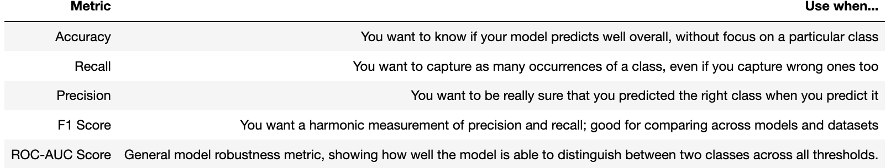

# Performance Metrics



# Recap

1. Missing data
    1. representations (other meanings)
    2. locating
    3. dropping or imputing
2. Scaling
    1. standardizing
    2. Normalizing
    3. Robust Scaling
3. Outliers
    1. detect
    2. interpret
    3. drop or preserve
4. Encoding
    1. categorical
    2. ordinal
    3. label
    4. one hot
5. Balancing
    1. over-sampling
    2. under-sampling
    3. SMOTE
    4. data-leakage
6. Discretizing
    1. continuous to categorical (binning)
    2. regression to classification
7. Feature Engineering
    1. features with domain knowledge
8. Feature Selection
    1. garbage in/out
    2. feature permutation
    3. correlation matrix

# K-nearest Neighbors (KNN)

- non-linear distance-based model that can solve both reg and classification tasks
- sklearn neighbors API
    - KNeighborsRegressor

        ```python
        from sklearn.neighbors import KNeighborsRegressor
        ```

        - How do KNN regressors make their final prediction?
            - predict the mean value of the K points that are the closest to the one it is trying to predict.
    - KNeighborsClassifier

        ```python
        from sklearn.neighbors import KNeighborsClassifier
        ```

    - NearestNeighbors (unsupervised learning)
    - KNNImputer

### calculates distance from sample

### choose hyperparameter - K closest samples for prediction

- optimal K will vary by dataset
    - lower k - overfit (less observations)
    - higher k - underfit (diluted signal)

### majority vote for classification

- different k vals may change prediction

### average value for regression

# Model Lifecycle

🔁 idea → code → release → idea → code … etc.

- evaluation metrics
    - measures how well a ml model can perform task
    - 1 side of the story, investigate efficacy from multiple angles

# Baseline Score

- When evaluating a machine learning pipeline, you need a basis for comparison. A baseline score utilizes very simple strategies for prediction:
    - classification: predicts either/or question
    - regression: predicts a ctm (central tendency measure) - mean/med/mode

### Regression Baseline

- using a dummy model allows rapid pipeline & IDs obstacles downstream quickly
- dummy regressor - mean prediction

```python
from sklearn.model_selection import train_test_split
from sklearn.dummy import DummyRegressor
from sklearn.linear_model import LinearRegression

# Prepare X and y
X = data[['age','bmi','children','smoker']]
y = data['charges']

# Holdout
X_train, X_test, y_train, y_test = \
		train_test_split(X, y, test_size = 0.3, random_state = 6)

# Baseline - Score based on consistently predicting the strategy
baseline_model = DummyRegressor(strategy="mean") # or median or mode
baseline_model.fit(X_train, y_train)
baseline_model.score(X_test, y_test)
#>> -0.00123
# (r-squared)
# how much better does it perform than the mean?
# close to zero (but not quite if you score on test data)
```

```python
model = LinearRegression().fit(X_train, y_train) # instantiate and fit model
model.score(X_test, y_test) # Score model
#>> 0.773
```

# Regression Metrics

- difference between prediction and “truth”

### Mean Squared Error (MSE)

$\frac{1}{n}\frac{\frac{n}{∑}}{i=1}(y_i - ˆy_i)^2$

- **when you want to penalize large errors**
- no sense of direction
- not expressed in the same units as target
- very sensitive to outliers
- when to use?
    - larger errors have disproportionately bigger impact (clinical trials)
    - direction and unit of error doesn’t matter
    - comparing sensitivity of different models/methods to large errors

### Root Mean squared error (RMSE)

- Use RMSE when you want the MSE to be represented in the unit of the target, making it more interpretable
- **when you need to penalize large errors, but see it in the unit of the target**

### Mean absolute error (MAE)

- **when all errors, large or small, have equal importance and you need easily interpretable results**
- The mean of the absolute differences between true values and predicted values.
    - less sensitive to outliers
    - proportional penalization (weather forecast) - linear

### Max error

- The biggest error made by the model when predicting.
    - **when you want to limit the magnitude of the errors** (temperature management for equipment that breaks at a max temperature)

### Coeff of determination - $R^2$

- proportion of the variance in the dependent variables that is explained by the independent variables
- 0 → 1
- optimal score = 1
- **when**?
    - **The unit of the error is not important**
    - **You want to compare between different datasets**

## Comparing Metrics

```python
import math
from sklearn.metrics import mean_squared_error, mean_absolute_error,
		r2_score, max_error

mse = mean_squared_error(y, y_pred)

rmse = math.sqrt(mse)

mae = mean_absolute_error(y, y_pred)

rsquared = r2_score(y, y_pred)

max_error = max_error(y, y_pred)

print('MSE =', round(mse, 2))
print('RMSE =', round(rmse, 2))
print('MAE =', round(mae, 2))
print('R2 =', round(rsquared, 2))
print('Max Error =', round(max_error, 2))
#>> MSE = 36776200.68
#>> RMSE = 6064.34
#>> MAE = 4234.0
#>> R2 = 0.75
#>> Max Error = 29184.77
```

### Cross Validation

- sklearn.metrics.SCORERS.keys()
- specify metric with scoring param of cross_validate
    - directly with alg
    - if not set, default used

```python
from sklearn.model_selection import cross_validate
# 5-Fold Cross validate model
model = LinearRegression()
cv_results = cross_validate(model, X, y, cv=5,
                            scoring=['max_error',
                                     'r2',
                                     'neg_mean_absolute_error',
                                     'neg_mean_squared_error']
                           )
pd.DataFrame(cv_results) # Cross validation output
cv_results['test_r2'].mean() # Cross validation results
```

# Classification Metrics

- correct:
    - true positive
    - true negative
- incorrect:
    - false positive
    - false negative

### Confusion Matrix

- grade and tally predictions
- pandas crosstab

```python
y_test = [0, 1, 0, 0, 1, 0, 1, 1, 0, 1] # actual truths
preds = [0, 0, 0, 0, 1, 1, 1, 1, 1, 1] # predictions

results_df = pd.DataFrame({"actual": y_test, "predicted": preds})
#Store results in a dataframe

confusion_matrix = pd.crosstab(index= results_df['actual'],
                               columns = results_df['predicted'])
#>> 3  2 (TN, FP)
#>> 1  4 (FN, TP)
```

### accuracy:

```python
from sklearn.metrics import accuracy_score
```

$accuracy = \frac{TP+TN}{TP+TN+FP+FN}$

(4+3)/(4+3+2+1) = 0.7

- **when target classes are balanced**
- **when prediction of each class is equally important**
- not helpful if dataset is imbalanced (very low positives or negatives)
    - will make accuracy seem very high

### recall:

```python
from sklearn.metrics import recall_score
```

- recall = TP/(TP+FN)
- ability of the model to detect occurrences of a class
- when?
    - **important to identify as many occurrences of a class as possible**
    - **reducing false negatives** but potentially **increasing false positives**
    - don't want to miss any positive classes
    - Detecting fraudulent transactions, cases of a novel disease or potential sales leads
- problematic when too many false alarms (smoke alarms)

### precision:

```python
from sklearn.metrics import precision_score
```

- ability of a model to avoid false alarms for a class
- confidence of model when predicting specific class
- precision = TP/(TP+FP)
- when?
    - important to be correct when identifying a class
    - **reducing false positives** but potentially **increasing false negatives**
    - Targeted advertising, food and drug safety (you'd like the model to be *really confident* when classifying a drug as safe)
- problematic when too many false negatives

### F1 score

```python
from sklearn.metrics import f1_score
```

- $F1 = 2 * \frac{precision*recall}{precision+recall}$
- Also known as the harmonic mean of precision and recall
- It will be influenced more by the lower of the two values
- A general metric to **compare across models and datasets**
- Combine the Precision/Recall tradeoff in a single metric
- **robust to class imbalance**

## Comparing Metrics

```python
from sklearn.metrics import accuracy_score, precision_score, recall_score, f1_score

y_true = [0, 1, 0, 0, 1, 0, 1, 1, 0, 1]
y_pred = [0, 0, 0, 0, 1, 1, 1, 1, 1, 1]

print('Accuracy =', round(accuracy_score(y_true, y_pred), 2))
# Accuracy

print('Precision =', round(precision_score(y_true, y_pred), 2))
# Precision

print('Recall =', round(recall_score(y_true, y_pred), 2))
# Recall

print('F1 score =', round(f1_score(y_true, y_pred), 2))
# F1 score
```

- seat belt safety:
    - prevent injury at cost of throwing away possibly fine seat belt
    - precision: prevent false positives (okay with false negatives)

## Precision-recall Tradeoff

- inverse relationship

```python
from sklearn.metrics import precision_recall_curve
```

- compare precision and recall across a variety of thresholds
- find a threshold that **guarantees a score for one metric whilst maintaining a minimum score for the other**

### Example

- at least **80%** of the expensive policy customers to be identified

```python
from sklearn.preprocessing import LabelEncoder
from sklearn.linear_model import LogisticRegression
from sklearn.model_selection import cross_val_predict
from sklearn.metrics import precision_recall_curve
import matplotlib.pyplot as plt
```

```python
le = LabelEncoder()
le.fit(data['price_range'])

# check the order of classes that will be encoded
print(le.classes_)

data['price_range_encoded'] = le.transform(data['price_range'])
data[['price_range', 'price_range_encoded']].head()
```

```python
model = LogisticRegression()

# Predict class probabilties
data['proba_cheap'], data['proba_expensive'] = \
		cross_val_predict(model,
		                  X,
		                  data['price_range_encoded'],
		                  cv=5,
		                  method='predict_proba').T

# precision recall data
precision, recall, threshold = \
		precision_recall_curve(data['price_range_encoded'],
													 data['proba_expensive'])

print(f'precision- {precision[:5]}')
print(f'recall- {recall[:5]}')
print(f'threshold- {threshold[:5]}')
```

```python
scores = pd.DataFrame({'threshold':threshold,
                       'precision': precision[:-1],
                       'recall':recall[:-1]})
scores
```

```python

#>> find point on x axis of required recall (0.8)
```

```python
# find threshold that guarantees 0.8 recall score
scores[scores['recall'] >= 0.8].threshold.max()
#>> 0.306
```

```python
# update our threshold for our model using a custom prediction wrapper
model = LogisticRegression()
model.fit(X, data['price_range_encoded'])

def custom_predict(X, custom_threshold):
    probs = model.predict_proba(X)
# Get likelihood of each sample being classified as 0 or 1
    expensive_probs = probs[:, 1]
# Only keep expensive likelihoods (1)
    return (expensive_probs > custom_threshold).astype(int)
# Boolean outcome converted to 0 or 1

# Update predictions
updated_preds = custom_predict(X=X, custom_threshold=0.305539)

# Rerun recall, precision, f1
print("Recall:", recall_score(data['price_range_encoded'], updated_preds))
print("Precision:", precision_score(data['price_range_encoded'], updated_preds))
print("F1 Score:", f1_score(data['price_range_encoded'], updated_preds))
#>> Recall: 0.807
#>> Precision: 0.929
#>> F1 Score: 0.864
```

## Reciever Operating Characteristic - Area Under Curve

- ROC-AUC
- trade-offs between two metrics across thresholds
- true positive rate = sensitivity = recall = $\frac{TN}{TP+FN}$
- false positive rate = (1 - specificity) = $\frac{FP}{FP+TN}$
- AUC - **measures overall model general performance**
    - larger, greater overall general performance
    - not dependent on chose threshold

```python
from sklearn.metrics import roc_curve
from sklearn.metrics import roc_auc_score

# Extract associated metrics and thresholds
fpr, tpr, thresholds = roc_curve(data['price_range_encoded'],
																 data['proba_expensive'])

# Compute AUC score
auc_score = roc_auc_score(y_true, y_pred)
auc_score
```

# Error Analysis

- iterative process ID common themes in model mistakes
- compare performance of specific cohorts
- one class ID is better?
- few errors so large the performance drops?
- 1 metric = 1 story

# Challenges

```python
X = data.iloc[:,:-1]
y = data['target']

cv_results1 = cross_validate(log_model,
                             X,
                             y,
                             scoring=['accuracy',
                                      'recall',
                                      'precision',
                                      'f1'],
                             cv=5)
scores = dict(zip(cv_results1.keys(), [cv_results1[x].mean() for x in cv_results1.keys()]))
```

```python
X_train, X_test, y_train, y_test = train_test_split(X, y, test_size=0.3)

model1 = log_model.fit(X_test, y_test)
predictions = model1.predict(X_test)

cm = confusion_matrix(y_test, predictions, labels=model1.classes_)
disp = ConfusionMatrixDisplay(confusion_matrix=cm,
                              display_labels=model1.classes_)
disp.plot()
plt.show()
```

```python
model3 = class_model.fit(X_test, y_test)
y_pred = class_model.predict(X_test)

target_names = ['no risk', 'risk']
print(classification_report(y_test, y_pred, target_names=target_names))
```

# Recap

```python
from sklearn.neighbors import KNeighborsRegressor

kn_model = KNeighborsRegressor()
kn_model.fit(df.drop(columns=['name', 'artists']), df.valence)

songs = kn_model.kneighbors(queen_song.drop(columns=['name', 'artists']),
		n_neighbors=11, return_distance=False)
playlist = df.iloc[songs[0][1:],:]
playlist.sort_values('tempo')
```
