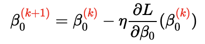
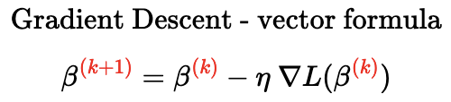
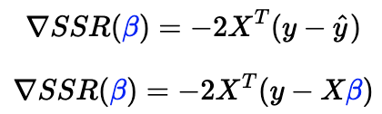

# Under the hood

### What is machine learning?

1. observations: made up of properties and variance (errors)
2. add both input and output of observations to a model
3. ML skips the knowing of complex “why” something happens while still being able to…
4. …predict outcomes from new inputs

# .fit

- Any model can be expressed as: $y = h(X, ß) + error$
    - $h$ : hypothesis function
    - $h(X, ß)$  : prediction : ŷ
    - .fit() finds $ß_0$ & $ß_1$ which minimize the $error(X,y,ß)$

### Loss function

- fit() minimizes L(error)
- $ß = arg\frac{min}{ß}L(ß,X,y,h)$

```python
# In Sklearn, these methods are called "solvers"
LogisticRegression(solver='newton-cg')
```

# Gradient Descent

### 1-D descent step-by-step

- What is it?
    - **slope (gradient) of the Loss Function** as an indicator
    - As the slope approaches zero, the Loss approaches its minimum
    - slope is equal to the **partial derivative** of the Loss Function with respect to the parameter of interest:
        - $\frac{∂\:Loss Function}{∂\:parameter}$

### One Epoch



1. initializes random parameter value $ß_0^{(0)}$ $(ß=0)$
2. calculates the derivative of the Loss Function at that point $\frac{∂SSR}{∂ß_0}(0)$
3. moves by a step in the opposite direction of the derivative
    1. step-size proportional to derivative value
    2. when a chosen $Learning Rate=η(eta)$
        1. $B_0^{(1)}=0-n\frac{∂L}{∂ß_0}(0)$
4. (repeat) : updated intercept plugged back into derv. of **loss** func (step 2)

---

- as **loss** approaches minimum, derv gets smaller, and so do the steps
- few calcs far away from min, more calcs as it approaches the minumum of the Loss Function
- When does it stop?
    - minimum step size (i.e. 0.001) : the smaller the step size, the Grad. Desc. has converged and the corresponding intercept is the optimal value
    - maximum number of steps (i.e. 1000)
- $f(g)^1 = g^1 * f^1(g)$
    - $f(x) = sin(x),\:g(x)=x^2$
    - $f(g(x)) = sin(x^2)$-

    ---

    - $f^1(x) = cos(x)$$,\:g^1(x) = 2x$
    - $f(g^1(x)) = 2x*cos(x^2)$

### Code it

```python
X = data['weight']
y = data['height']
b1 = 0.64 # b1 fixed at 0.64
eta = 0.1 # Learning rate fixed

# Hypothesis function h
def h(x,b0):
    return b0 + b1*x

# Initialize intercept at 0 for this example
b0_epoch0 = 0

# L(b0_epoch_0)
np.sum((y-h(X,b0_epoch0)) ** 2)
```

```python
# Step 1: Compute the derivative of the Loss function at b0_epoch_0
derivative = np.sum(-2*(y-h(X,b0_epoch0)))
derivative
```

```python
# Step 2: Update the intercept
b0_epoch1 = b0_epoch0 - (eta * derivative)

b0_epoch1
```

---

```python
# Step1: Compute the new derivative at b0_epoch1
derivative = np.sum(-2*(y-h(X,b0_epoch1)))

# Step2: Update the previsouly updated intercept
b0_epoch2 = b0_epoch1 - eta * derivative
b0_epoch2
```

### 2-D Descent: how to co-optimize $ß_0$ & $ß_1$

- partial derivative: assumes all other factors are constant
- would be represented in 3-d space
    - (loss function)x($ß_0$ constant)x($B_1$ coeff of $x_1+x_2$)
- “Energy Landscape”
- 2-d contour plot
- iterates same procedure for two parameters simultaneously
- 3D? $(ß_0, ß_1, ß_2)$: energy landscape would be in 4D?????

### Vectorial Formulation (N dimension)

1. random values of  $ß_0$ & $ß_1$ (epoch 0)
2. at each epoch $(k)$ update both in the direction of the downward-pointing gradient
    1. with learning rate η (eta)
3. vector of partial derivatives is called the **gradient vector ∇**

    


### Learning Rate : **η**

- converges faster when features are scaled
1. too small (too much computational length, going nowhere quickly)
    - shorter path to min
    - requires more epochs
    - can get stuck at local minimum
2. too large (too erratic, bouncing back and forth between neg/pos slopes)
    - less epochs
    - may never converge

### **Analytical gradient for OLS regression**

- **(Linear Regression + SSR Loss)**



- easy to compute, GD is very efficient for OLS regressions
- shortest path is the **orthogonal projection** of $y_{true}$ into the hyperplane (col X)

# Solvers

- GD is computationally expensive on big datasets:
    - for each epoch, all n (observations) for each p (features)

### Mini-batch Gradient Descent

- uses less than all n (obs) to compute approx. loss $(L_{approx})$
1. choose size (i.e. 16)
2. loop over n
    1. for each $X_{mini}$ : mini-batch (i.e. the first 16 observations)
    2. compute gradient : $∇L_{mini}$
    3. use gradient to update vector formula : $ß^{(k+1)} = ...$
    4. (repeat) : move to next $X_{mini}$
3. repeat epoch (once all observations have been viewed)

### Stochastic Gradient Descent (SGD)

- mini-batch of size-1
1. loop over n
    - select single, random data point
    - compute loss for single point
    - update ß
2. repeat epoch (once all ns have been viewed)
- **When?**
    - 6+ digits of n
    - get unstuck from local minimum
- **Pros**:
    - SGD is faster for huge dataframes
    - jumps out of local minima
    - reduces ram load
- **Cons**:
    - more epochs
    - never converges
    - slower for small (n) datasets with many features (p) (many columns, few rows)
- **Code for OLS**

    ```python
    b0 = 0
    eta = 0.1
    n_epoch = 5 # We have to choose when to stop

    for epoch in range(n_epoch):
        # Loop randomly over all 3 data points in our example
        for i in np.random.permutation(3):

            # Select a minibatch (of size 1)
            X_mini = X[i]

            # Compute gradient of the loss at b_0
            y_pred = h(X_mini,b0)
            y_true = y[i]
            derivative = -2*(y_true-y_pred)

            # Update b_0
            b0 = b0 - eta * derivative
            print(f'b0 epoch {epoch}:', b0)
    ```

    - less stable
    - fluctuates from epoch to epoch & doesn’t necessarily decrease
    - steps are less direct toward minimum
- **Code models:**
    - `SGDRegressor` - linear model, lin reg, minimize Loss Function (MSE)

        ```python
        from sklearn.linear_model import SGDRegressor, LinearRegression

        lin_reg = LinearRegression() # OLS solved by matrix inversion (SVD method)

        lin_reg_sgd = SGDRegressor(loss='squared_error') # OLS solved by SGD

        from sklearn.datasets import make_regression

        # Create a "fake problem" to solve
        X, y = make_regression(n_samples=10000, n_features=1000)

        %%time
        lin_reg.fit(X,y)

        %%time
        lin_reg_sgd.fit(X,y)
        ```

    - `SGDClassifier` - linear model, log reg, minimize Loss Function (Log Loss)

        ```python
        import numpy as np
        from sklearn.linear_model import SGDClassifier
        from sklearn.preprocessing import StandardScaler
        from sklearn.pipeline import make_pipeline

        X = np.array([[-1, -1], [-2, -1], [1, 1], [2, 1]])
        Y = np.array([1, 1, 2, 2])

        # Always scale the input. The most convenient way is to use a pipeline.
        clf = make_pipeline(StandardScaler(), SGDClassifier(max_iter=1000, tol=1e-3))

        clf.fit(X, Y)

        print(clf.predict([[-0.8, -1]]))
        ```


### ENHANCE

- enhanced GDs
    - gradient
    - momentum (adds inertia)
    - AdaGrad (adaptive n per feature - prioritizes weak params)
    - RMSProp (adds decay - only recent gradient matters)
    - Adam - all combined
- second-order partial deriv methods (Hessian matrix)
    - approximates $h(x)$ using quad. funct. instead of slope
        - newton’s method
        - L-BFGS (approx Hess)
    - converges with far fewer epochs
    - BUT is computationally expensive
    - easy ML problems
    - default sklearn logreg solver

# Loss Functions

```python
SGDRegressor(loss='squared_loss')
SGDRegressor(loss='huber')

SGDClassifier(loss='log')
SGDClassifier(loss='hinge')
```

### Loss ≠ Performance Metrics

- metrics computed after model is fitted
    1. Loss only one used to fit model
    2. Regression performance metrics (MSE, RMSE, R2…)
    3. Classification metrics (accuracy, precision, recall, f1…)
- sometimes loss and perf metrics may be the same (MSE)
- loss must be sub-differentiable (smooth)
- class metrics may never be used as a loss metrics

### Regression Loss Functions

- $L_1$ - Loss MAE (not great, because it’s not diff at 0)
    - less learning rate n
- $L_2$ - Loss MSE
    - more sensitive to outliers
- Huber Loss (mix of L1 & L2) - “smooth absolute loss”
    - MAE which becomes MSE when error is small, typically adjustable by hyperparameter `[epsilon](https://scikit-learn.org/stable/modules/generated/sklearn.linear_model.SGDRegressor.html#sklearn.linear_model.SGDRegressor:~:text=The%20verbosity%20level.-,epsilon,-float%2C%20default%3D0.1)`
    - Adjustable for outliers
    - Slope can be used as an indicator of reaching minima

### Classification Losses

- **log classifiers**
- predicting a binary vector [0,1]
- model it by vector ^y=[0.1,0.3,...0.8]=h(X,β)
- ?????
- **Log Loss**
    - cross-entropy loss
    - Infinitely penalize wrong predictions
    - gradient of the **log-loss** of the **sigmoid** function is simple in vectorial form
- **Support Vector Machine Classifier (SVC)**

# Summary

1. problem setting
    1. X - features
    2. y - target
    3. h - hypothesis function (Linear, Sigmoid, Neural Network...)
2. parameters of the model
    1. minimizes L(ß) - loss
3. **hyper-parameters** of the model
    1. anything that defines how the .fit works
        1. loss function (MSE, MAE, log-loss)
        2. solver (newton, sdg)
        3. model (n_neighbors)
4. “model” loosely defined
    1. sklearn models refer to hypothesis function
5. regressors

    ```python
    LinearRegressor() # OLS regression
    KNeighborsRegressor() # KNN
    SVR() # Support Vector Regressor
    SGDRegressor(loss='squared_loss') # eq. to OLS regression
    SGDRegressor(loss='huber') # non-OLS linear regression
    ```

6. classifiers

    ```python
    LogisticRegressor() # Logit regression
    KNeighborsClassifier() # KNN
    SVC() # Support Vector Classifier
    SGDClassifier(loss='log') # eq. to Logit
    SGDClassifier(loss='hinge') # eq. to SVC
    ```

7. **.fit()**

# Challenges

### 1

```python
import pandas as pd
from sklearn.preprocessing import StandardScaler
from sklearn.model_selection import cross_validate
from sklearn.linear_model import SGDRegressor

st_scaler = StandardScaler()
sgd_mse = SGDRegressor(loss='squared_error')
sgd_mae = SGDRegressor(loss='epsilon_insensitive', epsilon=0)
```

```python
X = data.iloc[:,:-1]
indices = list(X.columns.values)
X_scaled = pd.DataFrame(st_scaler.fit_transform(X).T, indices).T
X_scaled
```

```python
cv_results1 = cross_validate(sgd_mse, X_scaled, y, cv=10,
                            scoring=['max_error',
                                     'r2',
                                     'neg_mean_absolute_error',
                                     'neg_mean_squared_error']
                           )
cv_results1 = pd.DataFrame(cv_results1)
r2 = cv_results1['test_r2'].mean()
r2
```

### 2

```python
import pandas as pd
from sklearn.preprocessing import MinMaxScaler
from sklearn.linear_model import LogisticRegression, SGDClassifier
from sklearn.model_selection import cross_validate
import matplotlib.pyplot as plt
import seaborn as sns

log_reg_ncg = LogisticRegression(solver='newton-cg')
log_reg_lbf = LogisticRegression(solver='lbfgs')
log_reg_lib = LogisticRegression(solver='liblinear')
log_reg_sag = LogisticRegression(solver='sag')
log_reg_saga = LogisticRegression(solver='saga')
log_class = SGDClassifier(loss='log_loss')

mm_scaler = MinMaxScaler()
```

```python
y = df['quality rating']
ratings = {1:0, 2:0, 3:0, 4:0, 5:0, 6:1, 7:1, 8:1, 9:1, 10:1}
y_trans = y.map(ratings)
y_trans
```

```python
X = df.iloc[:,:-1]
indices = list(X.columns.values)
X_scaled = pd.DataFrame(mm_scaler.fit_transform(X).T, indices).T
X_scaled
```

```python
%%time
log_reg_ncg.fit(X_scaled,y_trans)
ncg=log_reg_ncg.score(X_scaled,y_trans)
...
```

```python
times = [2.03, 2.68, .386, .699, 1.24]
labels = ['ncg', 'lbf', 'lib', 'sag', 'saga']
scores = [ncg, lbf, lib, sag, saga]

fig, axs = plt.subplots(1,2, figsize=(10,3))

axs[0].scatter(labels, scores)
axs[0].set_title('Scores')

axs[1].scatter(labels, times)
axs[1].set_title('Times')
plt.show()
```

```python
log_class.fit(X_scaled,y_trans)
log_class.score(X_scaled,y_trans)
```

```python
pred_X = new_wine.copy()
indices = list(pred_X.columns.values)
pred_X_scaled = pd.DataFrame(mm_scaler.transform(new_wine).T, indices).T
```

```python
y_pred = best_mod.predict(pred_X_scaled)
predicted_class = y_pred[0]

y_probs = best_mod.predict_proba(pred_X_scaled)
predicted_proba_of_class = y_probs[0][0]
```

### 3

```python
import pandas as pd
import seaborn as sns
import numpy as np
import matplotlib.pyplot as plt
```

```python
def gradient_descent(X, Y, a_init=1, b_init=1, learning_rate=0.001, n_epochs=100):
    a_new = a_init
    b_new = b_init

    loss_history = []
    a_history = []
    b_history = []

    for epoch in range(n_epochs):

        def h(X,a,b):
            return a * X + b

        def loss(X,Y,a,b):
            return np.sum((Y-h(X,a,b)) ** 2)

        loss_val = loss(X,Y,a_new,b_new)

        def gradient(X,Y,a,b):
            d_a = np.sum(-2*X*(Y-h(X,a,b)))
            d_b = np.sum(-2*(Y-h(X,a,b)))
            return d_a, d_b

        d_a, d_b = gradient(X, Y, a_new, b_new)

        def steps(d_a,d_b, learning_rate = 0.01):
            step_a = (learning_rate * d_a)
            step_b = (learning_rate * d_b)
            return step_a, step_b

        step_a, step_b = steps(d_a, d_b, learning_rate)

        def update_params(a_new, b_new, step_a, step_b):
            a_new = a_new - step_a
            b_new = b_new - step_b
            return a_new , b_new

        a_new, b_new = update_params(a_new, b_new, step_a, step_b)

        loss_history.append(loss_val)
        a_history.append(a_new)
        b_history.append(b_new)

    a = a_new
    b = b_new
    history = {'loss': loss_history, 'a': a_history,
               'b': b_history}
    return a, b, history

a, b, history = gradient_descent(data_X, data_Y)
```

```python
range_a = np.linspace(-1, 1, 100)
range_b = np.linspace(-1, 1, 100)

zi = []
for i, a in enumerate(range_a):
    zj = []
    for j, b in enumerate(range_b):
        loss = np.sum((data_Y-h(data_X,a,b)) ** 2)
        zj.append(loss)
    zi.append(zj)

Z = np.array(zi)
```

```python
plt.contourf(range_a, range_b, Z)

import plotly.graph_objects as go

surface = go.Surface(x=range_a, y=range_b, z=Z)
scatter = go.Scatter3d(x=history['a'], y=history['b'], z=history['loss'], mode='markers')
fig = go.Figure(data=[surface, scatter])

#fig.update_layout(title='Loss Function', autosize=False, width=500, height=500)
fig.show()
```

# Recap

- Batch Gradient Descent: Parameters are updated after computing the gradient of error with respect to the entire training set
- Stochastic Gradient Descent: Parameters are updated after
computing the gradient of error with respect to a single training
example
