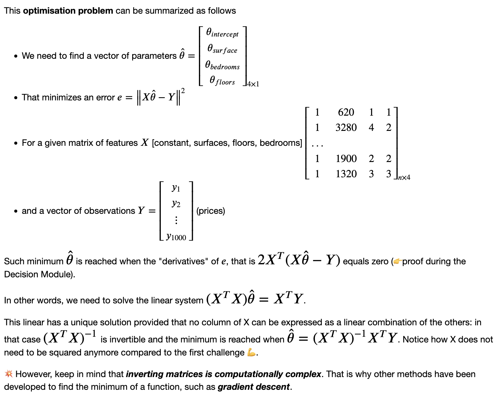

# Calculations

- coefficient(**3**x)
- term (4xy)
- constant (e, c, a, etc)
- R - all real numbers
- y = mx + b (m= slope, b=intercept of y axis)
- y=x : identity function
    - inverse of a function gets flipped across the i.f.
- f(x) inverse : g(y) or f^(-1)

```python
def square_plus_one(x):
		y = x * x + 1
		return y

x = np.linspace(lowrange, highrange, number_of_elements)

y = square_plus_one(x)

plt.plot(x, y)
```

```python
def multi_variate(x0, x1):
		y = 2 * x0 + 3 * x1 + 7
    return y
```

```python
x = np.arange(0, 4 * np.pi, 0.1) # similar to linspace, but last num is the stepsize
y = np.cos(x)
plt.plot(x, y)
plt.xlabel('x')
plt.ylabel('$\cos(x)$')
plt.show()
```

- y - x = 22 ( y = 22 + x)
- y - 2x = 10 (y = 10 + 2x)

```python
x = np.array([6, 18]) # range of x
plt.plot(x, x + 22)
plt.plot(x, 2 * x + 10)
plt.xlabel('son')
plt.ylabel('father')
plt.show()
```

- vectors - a line pointing some direction away from the central point (2 coordinates: start and end)
    - magnitude - length
    - relative direction
    - ***v***

```python
v = np.array([[2, 1]])
v.shape
## (1,2) - one row, two columns
```

```python
transpose_v = v.T (flips the axes)
transpose_v.shape
## (2,1) - one column, two rows
```

- dot product

    $a_x * b_x + a_y * b_y$

    - if two vectors reinforce or cancel each other
    - value describing the relationship between the two
    - 0 is not related cancellation), higher values describe more relation (reinforcement)
    - tells if perpendicular or not

        $|a|cos(0) * |b|$


```python
a = np.array([5, 0])
b = np.array([0, 2])

np.dot(a,b)
> 0
# cancel each other out becuase they are perpendicular (no similar components)
```

```python
a = np.array([5, 0])
b = np.array([2, 2])

np.dot(a,b)
> 10
# reinforces (going in the same direction)
```

- euclidian distance (hypotenuse) - L^2 (squared)

    $a^2 + b^2 = c^2$

- n = dimension
- estimated hypotenuse - L^1 (not squared)

    $L^1 = Σ^n_{i=1} |b_i - a_i|$


## Matrices

- anything that can go into a dataframe
- approximation can be MUCH faster

```python
A = np.array([[1, 2], [3, 4], [5, 6]])
A.shape
> (3,2)
# 3 rows, 2 columns
```

```python
A.T
> array([[1,3,5], [2,4,6]])
```

### Addition

- Make sure to look at the shapes!
    - must be the same size, but if it isn’t it won’t give you an error sometimes!
    - if it has the same amount of rows, but different columns, it will add to both columns from one

```python
A = np.array([[1, 2], [3, 4], [5, 6]])
B = np.array([[1, 4], [2, 5], [2, 3]])
C = A + B
> array([[2, 6], [5, 9], [7, 9]])
```

### Multiplication

- the **number of columns of the left matrix =** the **number of rows of the right matrix**
    - (2,3),(3,4) - compatible
    - (1,2),(1,4) - not compatible
    - Linear Transformations (transpose two vectors into a new space, but with same directions)
    - “shear”

$[a, b][x] = x[a] + y[b] = [ax+by]$

$[c, d][y] = x[c] + y[d] = [cx+dy]$

```python
A = np.array([[1, 1], [0, 1]])
B = np.array([[1], [2]])
np.dot(A,B) # or np.matmul(A, B) or A.dot(B)
> array([[3], [2]])
```

$[[a, b], [c, d]]*[[e, f], [g, h]] =$

- [0][0]*[0][0] + [0][1]*[1][0], [0][0]*[0][1] + [0][1]*[1][1],

    [1][0]*[0][0] + [1][1]*[1][0], [1][0]*[0][1] + [1][1]*[1][1]


$[[ae + bg], [af+bh],[ce + dg],[cf+dh]]$

```python
np.dot(A,B)
# is different than
np.dot(B,A)
```

```python
I3 = np.identity(3, dtype=int)
```

### Solving Linear System

- solving matrices:
    - $AX = B$
    - $A^{-1}AX = A^{-1}B$
    - $X = A^{-1}B$
- $A^{-1}$ is inverse matrix

### Determinant

- shows if you can invert a matrix
- square matrix is **not** invertible *if and only* if its determinant is 0

```python
a = np.array([[1, 2], [3, 4]])
**np.linalg.det**(a)
> -2
# invertable
```

### Get the inverse

```python
A = np.array([[1, -1], [1, -2]])
A_inv = np.**linalg.inv**(A)

B = np.array([[22], [10]])

np.dot(A_inv, B)
```

- easy way:

```python
A = np.array([[1, -1], [1, -2]])
B = np.array([[22], [10]])
X = np.linalg.solve(A, B)
```

```python
np.allclose(I, I4)
```

### Time

- O(1) - first element (very fast)
- O(n^2) — nested for loop (slow) - try to avoid

### Linear Dependence

- no solution
- 1 solution
- infinite solutions

# Calculus

- derivative: instantaneous rate of change
    - move the exponents into the coeffs, change x into coef, coef into 0
    - gradient descent algorithms (later)
        - faster way of getting estimated dot function


# From the Challenges:

### Correlations

```python
sns.pairplot(data=flats, kind="scatter")
pd.DataFrame.corr(flats)
sns.heatmap(flats)
```

### Regression Lines

```python
def plot_line(a, b, ax):
    """Plot a line from slope and intercept on the ax"""
    sns.scatterplot(
        data=flats,
        x = "surface",
        y = "price",
        ax=ax
    )
    x = np.linspace(0, 9000, 3)
    y = a*x + b
    plt.plot(x, y, color="red")
    plt.plot(x, y/2, color="green")
    plt.plot(x, y*2, color="orange")

ax = plt.gca()
plot_line(.3, 0, ax)
```

### Chall 2



### Chall 4

```python
# Build a (50*50) meshgrid
x = np.linspace(-150,150,100) # shape(100,1)
y = np.linspace(-150,150,100) # shape(100,1)
xx, yy = np.meshgrid(x,y) # x and y of shape(100,100)
zz = np.array([xx, yy]) # (2, 100, 100)

# Compute Z, a 2D-array containing g(x,y) for each (x,y) in the meshgrid
Z = g(zz)

# Plot
fig = plt.figure(figsize=(10,10))
ax = fig.add_subplot(111, projection='3d')
ax.plot_surface(xx, yy, Z, cmap='terrain')
ax.set_xlabel('x'); ax.set_ylabel('y'); ax.set_zlabel('g(x, y)'); ax.view_init(45, -45);
plt.show()
```

```python
def f(x,a,b,c):
    return a*x*x + b*x + c
curve_fit(f, x, y)
```

# Recap

```python
import scipy.fft

def plot_fft(signal, rate, freq_max):
    Y = np.abs(scipy.fft.fft(signal))
    X = np.abs(scipy.fft.fftfreq(Y.size) * rate)
    plt.xlim(0, freq_max)
    plt.plot(X, Y)

plot_fft(chord, R, 2000)
```

```python
rate, audio = wavfile.read("bird.wav")
audio.T[0][R:(R+10)]
```

```python
rate, audio = wavfile.read("bird.wav")
plt.plot(audio.T[0])
```

```python
plot_fft(audio.T[0], rate, 7500)
Audio(audio.T[0], rate=rate)
```
