# Statistical Inference

### Motivation

- confidence of a supposition
- suggestions for change
- how confident that findings will scale/generalize

### A/B Testing

1. Develop the corresponding feature
2. Create two groups (control group vs. treatment group)
3. Randomly assign users to the treatment group
4. Deploy the feature only to treatment group
5. Collect behavior statistics (e.g. sample mean)

### Stat Inf Analysis

- linear ML
- central limit theorem (quantify stat significance)
    - as the sample size increases (N), the mean will become more like a normal distribution
    - if n > 30 and standard dev is close to true sd, if n > 10 and observations are non-skewed without outliers, if the global pop is known to be normally dist, $n< 10percent  * N$
- independence - When the size of the sample represents less than 10% of the global population size.

### Central Limit Theorem (generalized)

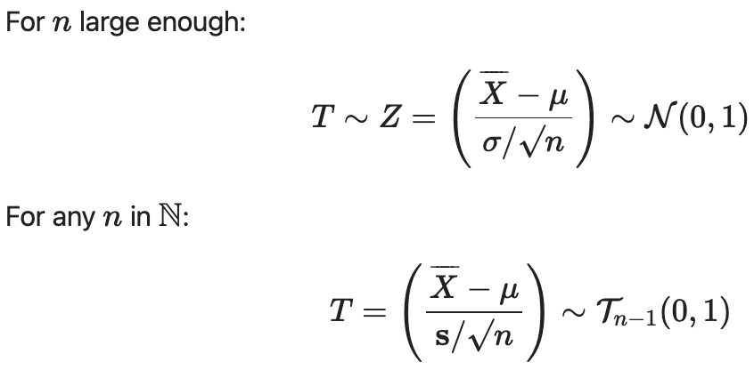

### Probability

- $P(B|A)$ : probability of B, given A
- $X$ : random variable
    - numerical outcome of a random experiment
- $X = X_k...$ : random process
- $p(X) = p(μ,σ...)$ : probability distribution
- $N(μ, σ...)$  : Gaussian distribution (normal dist): mean and standard deviation
- $z = (x-μ)/σ$  :  z-score (population): # of standard dev. by which an observation is away from the mean of a sample dist

    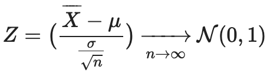


---

- $N$ : population
- $μ$ : common mean
- $σ$ : standard deviation

---

- $n$ : sample size
- x̅ (x bar) : mean of sample
- $s$ : sample standard dev

### Human Perception

- 1-sigma (68%) `"likely"`
- 90% `"very likely"`
- 2-sigma (95%) `"extremely likely"`
- 3-sigma (99.7%) `"virtually certain"`
- 5-sigma: "proof" `threshold in theoretical physics`

### Power

- prob that we will correctly reject the null hypothesis (the larger the better)
- prob of not missing a great feature in A/B testing
- prob of not missing an effective drug in clinical trial
- P(not making a type II error)

### Errors

- Type I: false positive
- Type II: false negative

# Example 1

1. average height of US citizens
    1. $n$ = 1000
    2. (x bar) = 170cm
    3. $s$ = 20cm
    4. $μ$ = 170cm
2. take multiple samples, plot the means (should form normal dist)
3. σ(xbar) = standard deviation of the means = σ/sqrt(size of the sample)

    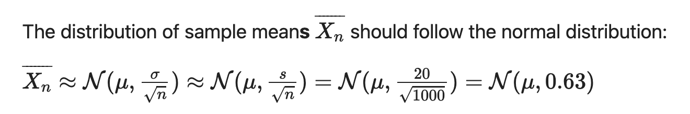

    1. 170 +or- (2*.63)
    2. 170 +or- (1.26cm)
    3. 168.7 < μ > 171.2 (95% confidence interval)
4. find confidence interval:

    ```python
    # We can check these figure using a Cumulative Density Function `cdf`
    from scipy import stats
    mu_estim = stats.norm(170, 0.63)

    # use the cdf to find the probabilities associated with height values
    print('% confidence interval = ', round(mu_estim.cdf(171.2) - mu_estim.cdf(168.7),2))
    #>> '% confidence interval = 0.95'
    ```

5. lower/upper bound of ci:

    ```python
    confidence_interval = 0.99

    sup_proba = (1 + confidence_interval)/2 # 99.5%
    inf_proba = (1 - confidence_interval)/2 # 0.5%

    mu_upper_bound = mu_estim.ppf(sup_proba)
    mu_lower_bound = mu_estim.ppf(inf_proba)

    # use the inverse of the cdf to find the heights associated with probabilities
    print('mu_upper_bound: ', mu_upper_bound)
    print('mu_lower_bound: ', mu_lower_bound)

    print('% confidence interval = ', round(mu_estim.cdf(mu_upper_bound) - mu_estim.cdf(mu_lower_bound),2))
    #>>mu_upper_bound:  171.6227724612358
    #>>mu_lower_bound:  168.3772275387642
    #>>% confidence interval =  0.99
    ```

    # Example 2

    - **Trying to prove that dark mode makes a difference**
    - N = 100 users
    - μ = 300 sec/sesh
    - σ = 50 seconds
    - n = 100 users
    - x bar = 310 seconds

        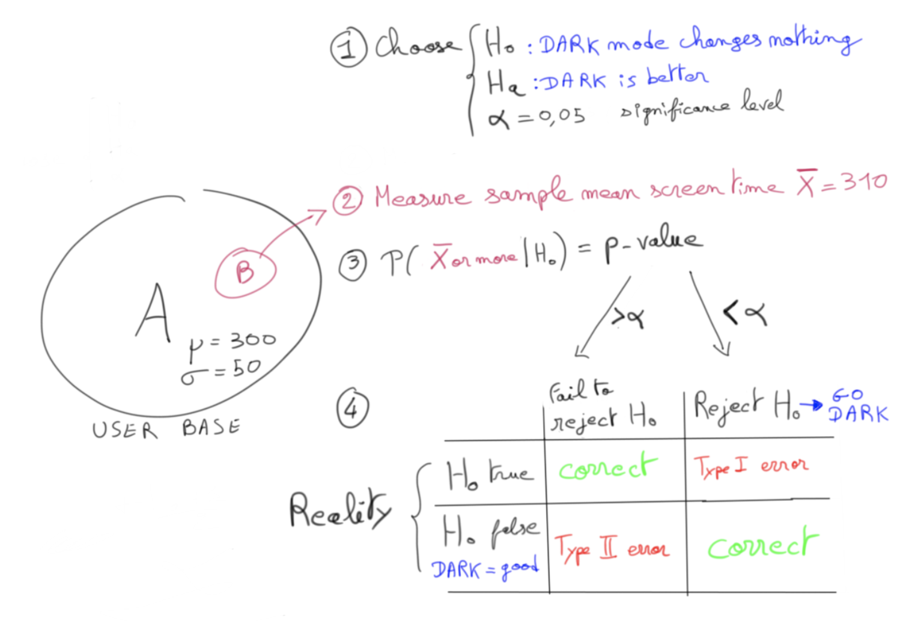

    1. **Null Hypothesis**: unchanged in dark mode
        1. $H_0$: *μ = 300*
    2. **Alt Hypothesis**: increased in dark mode
        1. $H_a$: *μ > 300*
    3. **Significance level: $α$ = 5%** (0.05)
        1. if p-val < $α$ : reject $H_0$
        2. if p-val > $α$ : fail to reject $H_0$ , but not accept it
    4. **P-value**:

        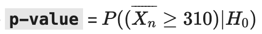

        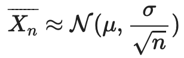

        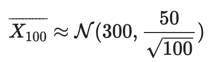

        ```python
        from scipy.stats import norm
        X = norm(300, 50/(100**0.5))
        p_value = (1 - X.cdf(310));
        round(p_value,2)
        #>> 0.02
        ```

        1. p-val < 0.05 → reject null hypothesis $(H_0)$
            - **“Dark mode is a plus”**

    # Example 3

    - **T-test: when a sample size is too small (n < 10)**

        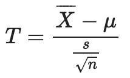

        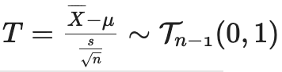

        - **degrees of freedom**: $(n - 1)$
    - scipy.stats.t

        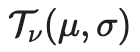

    - t-table

        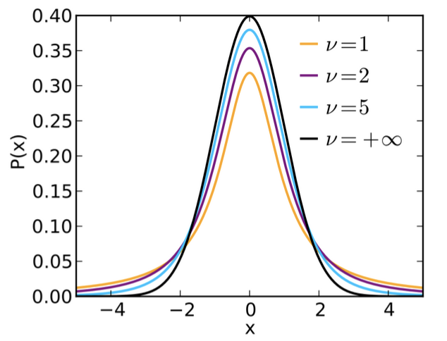

    - t-distribution: fatter tails than norm dist (more prone to producing vals further away from mean)

    # Example 4

    - **Is the coin fair?**
    - p(H) = [0,1] (prior belief) → µ = 0.5
    - n = 10 tosses

    

    - p(H) = N(0.5, sqrt(10)) → (0.5, ≈0.3)
    - find: sample mean: µ = 0.7
    - p(H | data) = ?
        - bayes
        - N(0.7, 0.1)  (posterior belief)

# Recap

```python
from olist.data import Olist
from olist.order import Order
data = Olist().get_data()
orders = Order().get_training_data()
```

```python
def promoter_score(x):
    if x== 5:
        return "pro"
    elif x == 4:
        return "pass"
    else:
        return "neg"
```

```python
orders['review_score'].map(promoter_score)
			# or
orders['review_score'].apply(promoter_score)
```

- map()
    - can give function, dictionary, or lambda

    ```python
    orders['review_score'].map({5: "pro", 4: "pass", 3: "neg"...})
    ```


```python
NPS = orders['review_score'].map({5: 1, 4: 0, 3: -1, 2: -1, 1: -1}).mean()
```

```python
averages1 = merge2.groupby('customer_state')[['review_score']].mean()
		#or
averages3 = merge2.groupby('customer_state').agg([np.mean, max, min])
```
