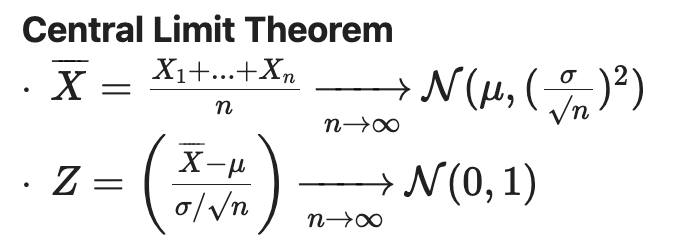

# Statistics

### Imports

```python
import numpy as np
import pandas as pd

import matplotlib.pyplot as plt
import seaborn as sns

import math
import scipy
import scipy.stats as stats
```

### What is Stats?

- collection, organization, displaying, analysis, interpretation and presentation of data
- possibility to quantify uncertainty
- categorical statements with a level of uncertainty
- **Data Analysis**: gathering, display, and summarizing data
- **probability**: laws of chance
- **inference**: conclusions from specific data

### The process

1. **Data Collection**: gather data (experiments, studies, polls, scraping, etc)

```python
male_df = pd.DataFrame([140, 145, 160, 190, 155, 165, 150, 190, 195, 138, 160, 155, 153, 145, 170, 175, 175, 170, 180, 135, 170, 157, 130, 185, 190, 155, 170, 155, 215, 150, 145, 155, 155, 150, 155, 150, 180, 160, 135, 160, 130, 155, 150, 148, 155, 150, 140, 180, 190, 145, 150, 164, 140, 142, 136, 123, 155],
    columns=['weight'])
male_df['sex'] = 'male'
female_df = pd.DataFrame([140, 120, 130, 138, 121, 116, 125, 145, 150, 112, 125, 130, 120, 130, 131, 120, 118, 125, 135, 125, 118, 122, 115, 102, 115, 150, 110, 116, 108, 95, 125, 133, 110, 150, 108],
    columns=['weight'])
female_df['sex'] = 'female'

weights_df = pd.concat([male_df, female_df], ignore_index=True)
weights_df.sample(5)
```

1. **Data Display:** plotting the data

```python
ax = sns.histplot(weights_df["weight"], bins=len(weights_df))
ax.set_xlabel("Weight (in lbs)")
plt.show()
```

2.1. manipulate the graphs to make the data easier to undertand

```python
f, (ax1, ax2, ax3) = plt.subplots(1, 3, figsize=(15, 4))
ax1.hist(weights_df["weight"], bins=[95, 105, 115, 125, 135, 145, 155, 165, 175, 185, 195, 205, 215])
ax2.hist(weights_df["weight"], bins=12)
sns.histplot(weights_df["weight"], bins=12, ax=ax3, **kde=True**)
plt.show()
```

### **Summary Stats**

- mean, variance, shape (skewness), correlation between multiple variables
    1. Population (N, μ(mu), σ(sigma))
        1. mean of a population: summation of samples divided by the population
    2. Sample of population (n)
        1. mean of a sample: summation of samples divided by the sample
    3. median: middle value
        1. the difference between the median and mean might help show the presence of outliers (the median is more robust against outliers)
    4. mode: most often repeated sample
        1. bimodal (camelback) has two modes
    5. skewness (asymmetry)
        1. positive skew (tail right)
        2. symmetrical dist
        3. negative skew (left tail)
    6. statistical dispersion
        1. variance (population or sample)
            1. $(x - u)^2 / N$
        2. standard deviation of population
            1. $sqrt((x-u)^2/N)$
        3. standard deviation of the sample
            1. $sqrt((x-u)^2/N - 1)$
    7. Interquartile range (IQR)
        1. distance between first and third quartile
        2. box-whisker plots:
            1. first quartile to third quartile, line is the median
            2. IQR * 1.5  on each side = whiskers
                1. in reality, the whiskers will stop at last value within range
            3. outliers are individual points outside the whiskers
        3. median, then medians of each side
    8. 5 number summary:
        1. minimum, lower quartile, median, upper quartile, max

    ```python
    weights_df['weight'].describe()
    sns.boxplot(x=weights_df['weight'])
    plt.show()
    ```

- datasaurus - exploratory data analysis is important
    1. correlation between two variables:
        1. pearson’s coefficient (**only linear correlations**)
            1. **the closer to 0, the less the linear correlation**
            2. 1 : positive slope correlation
            3. -1 : negative slope correlation

        $(x -x^-)(y - y^-)/(n * normalization)$


### Probabilities

1. **Sets**
    1. collection of some elements (”kind of like a list but weird”)
        1. an element can’t be repeated (can only exist once)
        2. A = {∞, £}
        3. S - the “universal set”
    2. **operations**
        1. **union**
            1. exclusive outer join
        2. **intersection**
            1. inner join
        3. **complement**
            1. everything outside of a set
        4. **subtraction**
            1. left exclusive outer join
        5. **mutually exclusive**
        6. **partition**
            1. if all sets are exclusive partitions of the whole of S
2. **Random Experiment**
    1. **observation** of something uncertain
        1. multiple observations: **trial**
    2. results in an **outcome**
    3. **sample space (*S*):** set of all outcomes
        1. i.e. coin flip: *S* = {H, T}
    4. **event**: possible outcomes
        1. E1 = {(h,h,h),(t,h,h),(h,h,t)} (getting two heads in a row)
        2. E3 = {(hhh), (ttt)} (getting three of the same outcome)
        3. union
            1. E1 U E3 = {(h,h,h),(t,h,h),(h,h,t),(t,t,t)}
        4. intersection
            1. {(hhh)}
    5. **probability**: P(A)
        1. value between 0, 1 that shows how likely an event is
        2. **of a union**: P(A) + P(B) - P(A-B)
        3. conditional: P(A) * P(B | A)
            1. B | A (also written as $P_A(B)$) : A has occurred, what is the probability of B occurring
        4. **Bayes’ Theorem**
            1. $P(A∣B)=(P(B∣A)⋅P(A))/P(B)$
            2. false positive paradox - when the probability of an event happening is already very low
3. **random variable**
    1. If we consider an entire soccer match as a random experiment, then each
    of these numerical results gives some information about the outcome of
    the random experiment. These are examples of **random variables**
        1. goals, shots, shots on target, possesion
    2. **X** = number of heads in a coin tossing sample space
    3. **Probability Mass Function**
        1. $∀x_i in Range(X), pmf_X(x_i)=P(X=x_i)$
    4. Expected Value (mean of rand. var.)
        1. $E[X]=^n∑_{i=1}x_ip(x_i)$
    5. **Bernoulli Process**
        1. A repeated sequence of binary random variables (e.g coin flipping), with a probability p of getting 1 (e.g. *Heads)*

            ```python
            np.random.binomial(n=1, p=0.3, size=10)
            # size = 10 trials or "coin flips" with a rigged coin (0.3 of heads)
            # n=1 repetition of "coin flips"
            n = 5
            np.random.binomial(n=n, p=0.3, size=10) / n # Divide by n to get the mean
            sns.distplot(np.random.binomial(n=n, p=0.3, size=10000), kde=False)
            ```

        2. gets the **Binomial Distribution:** B(n,p) with a PMF:

            ```python
            n = 5
            p = 0.3

            x = np.arange(n + 1)
            pmf = stats.binom.pmf(x, n, p)
            plt.vlines(x, 0, pmf, linewidth=4)
            ```

        3. As n increases, the mean of Bernouilli processes is **approximated**
         by a [normal distribution](https://en.wikipedia.org/wiki/Normal_distribution)

            ```python
            n = 1000
            sns.distplot(np.random.binomial(n=n, p=0.3, size=10000) / n, bins=20)
            ```

4. **Normal Distributions**
    1. Probability Density Function

        

        ```python
        def plot_normal_distribution(mu, variance):
            sigma = math.sqrt(variance)
            x = np.linspace(-10, 10, 100)
            plt.plot(x, stats.norm.pdf(x, mu, sigma), label=f"μ={mu}, σ²={variance}")

        plot_normal_distribution(0, 1)
        plot_normal_distribution(1, 2)
        plot_normal_distribution(-3, 5)
        plt.legend()
        plt.show()
        ```

        

    2. Standard deviations:
        1. 99.7% are within 3 SD
        2. 95% within 2 SD
        3. 68% within 1 SD
    3. Cumulative Distribution Function

        ```python
        def plot_cumulative_normal_distribution(mu, variance):
            sigma = math.sqrt(variance)
            x = np.linspace(-10, 10, 100)
            plt.plot(x, stats.norm.cdf(x, mu, sigma), label=f"μ={mu}, σ²={variance}")

        plot_cumulative_normal_distribution(0, 1)
        plot_cumulative_normal_distribution(1, 2)
        plot_cumulative_normal_distribution(-3, 5)
        plt.legend()
        plt.show()
        ```

5. **Central Limit Theorem**
    1. We saw that the sum/mean of a **Bernouilli process** converges towards a N distribution
    2. Actually, this holds true for **any** random process!
    3. hist of means → **mean of means**
        1. will look like a normal dist & mean will be the same as the pop
        2. standard dev will be SD of mean / square root of the sample size
    4. Z-score
        1. observation derived from a random variable
        2. value of x expressed in **number of std above/below the mean**

            


# Challenges

### No 1 - Law of Large #s

```python
random.randint(low, high=None, size=None, dtype=int)
```

```python
random.binomial(n, p, size=None)
```

## Random Variables

- number of all combinations: (amount of different options) ^ (amount of times rolled/thrown/etc)
- n! = n factorial
- [[n],[k]] = n choose k/binomial coefficient for k among n
    - k is the number of sucesses
- combination - order doesn’t matter
    - without repetitions:
        - lotteries
        - $n!/(r!(n-r)!) =$ [[n],[r]]
            - where n is the number of things, choose r of them
            - “n choose r”
            - i.e. 3 out of 16 pool balls:
                - 16!/3!(16-3)! = 16!/(3! * 13!) = (16 * 15 * 14) / (3 * 2 * 1) = 560
    - repetitions are allowed
        - ?????
- permutation - order DOES matter
    - repetition is allowed
        - $n^r$ : for r number of times, n number of things
    - no repetition is allowed
        - $n!/(n-r)!$ : for n number of things, r number of times
            - 4! = 4 * 3 * 2 * 1 = 24
            - i.e. 3 out of 16 pool balls:
                - 16!/(16-3)! = 16!/13! = 16 * 15 * 14 = 3,360

`math.factorial`(*x*)

Return *x* factorial as an integer.  Raises `[ValueError](https://docs.python.org/3/library/exceptions.html#ValueError)` if *x* is not integral or
is negative.

```python
dict(zip(range(n_toss+1), [count_possibilities(n_toss, n)/count_total_possibilities(n_toss) for n in range(n_toss+1)]))
```

# Recap

```python
daily_tip = df.groupby(by="day")[["tip"]].mean()
```

- better:

```python
daily_tip = df[["day", "tip"]].groupby(by="day").mean()
```

### Tip per person per day

```python
day_group = df.groupby(by="day")
tip_by_person = day_group.apply(lambda d: np.mean(d["tip"] / d["size"]))
```

```python
day_group = df.groupby(by="day")
tip_by_person = day_group.sum()["tip"] / day_group.sum()["size"]
```

### Central Limit Theorem

-
