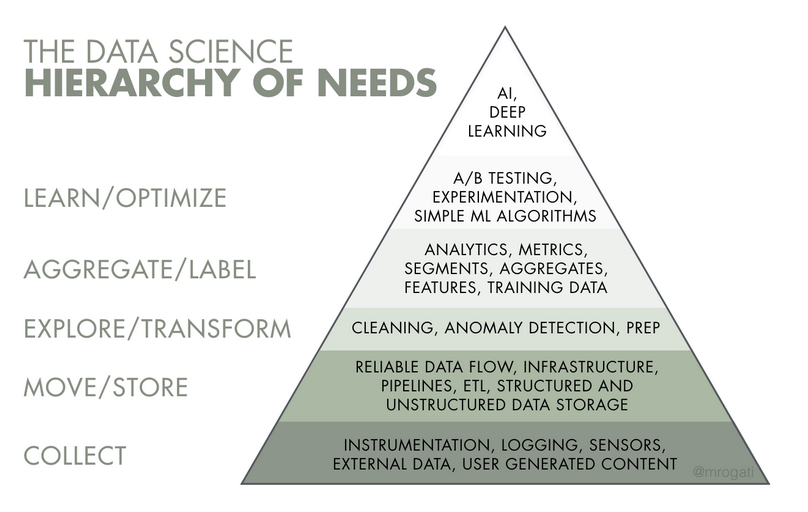
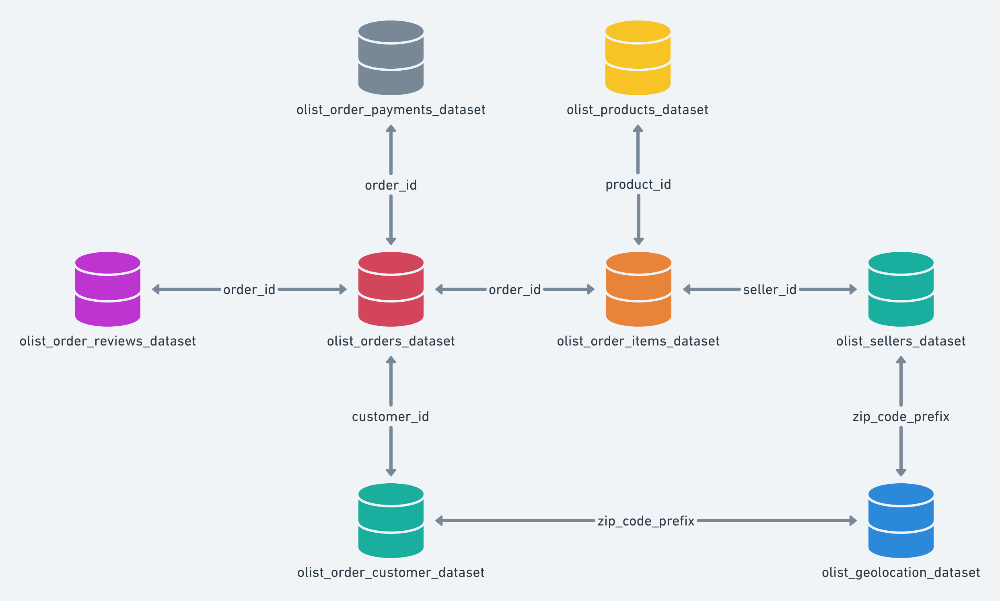
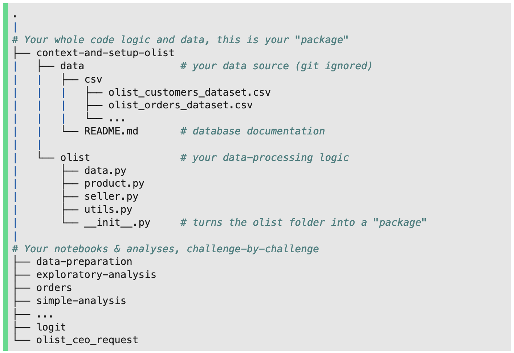

# SQL Project Setup

# Decision Science

- Business Data Consulting
- historical business analysis
- linear statistical models (lin regression & log regression)
    - correlations
    - stat inference
- communicate results
- differences between data products & decision science
    - data products:
        - mission driven, engineering collab
    - d.s.;
        - question driven
        - leadership collab
- domain knowledge: background in the area of the product
- building code that is easily scalable

    

- John Snow: father of data science
    - cholera outbreak (proponent of germ theory)
    - realized it was coming from a contaminated water pump
    - “drinking beer saved people’s lives”

### Olist



- Brazilian e-commerce platform
- connect sellers to existing marketplaces
- features:
    - translates seller catalogues to marketplaces
    - notifies seller whenever products are sold
    - gives products to third-party logistics (carriers)
- between 2016-2018 there was no barrier against reviewers who didn’t have a verified purchase
- revenues:
    - variable revenues - 10% from seller
    - fixed revenues - 80 BRL subscription fee from sellers
- costs:
    - IT costs - the more orders, the cheaper it is (square root relationship)
    - reputation costs - whenever there’s a bad review, you lose money
- ***How to increase customer satisfaction (so as to increase profit margin) while maintaining a healthy order volume?***

### Project Organization



- steps:
    - work in jn
    - encode into .py scripts
    - import scripts and instantiate classes
        - Olist, Order, Seller, Product
        - **Classes**: class + attributes → instances
            - one class per file.py

        ```python
        class Ticket:
            blurb = 'help'
        ```

        ```python
        from mills import Ticket
        ```

        ```python
        class Student:
            # **class attribute**
            school = 'mills'

            # initializer of **instance attributes** (constructor)
            def __init__(self, name, age): # Note the `self` parameter
                self.name = name.capitalize()
                self.age = age

            # **instance method**
            def says(self, something): # x.f(y) equivalent to Class.f(x,y)
                print(f'{self.name} says {something}')
        ```

        ```python
        from mills.student import Student
        ```

        ```python
        Student.school
        #> legwagon
        student1.school
        #> legwagon
        ```

        ```python
        student1 = Student("emily", 31)
        student1.name
        #>> Emily
        student1.age
        #>> 31
        Student.age
        # AttributeError
        ```

        ```python
        student1.says("good morning")
        #>> Emily says good morning
        	# **OR**
        Student.says(student1, "good morning")
        #>> Emily says good morning
        ```

    - changing class attributes will change all the class attributes for each object/instance
        - (in the shell, it won’t actually change the code)

        ### Class Method

        ```python
        from datetime import date

            @classmethod   # decorator
            def age_from_birth_year(cls, name, birth_year): # Note the `cls` parameter (class)
                return cls(name, date.today().year - birth_year)
        ```

        ```python
        Student.age_from_birth_year("Emily", 1991)
        ```

        ### Class Inheritance

        ```python
        class *Student*:
            # **class attribute**
            school = 'mills'

            # initializer of **instance attributes** (constructor)
            def **__init__**(self, name, age): # Note the `self` parameter
                self.name = name.capitalize()
                self.age = ag
        ```

        ```python
        from mills.student import Student

        class DataStudent(*Student*):
            cursus = 'datascience'

            def __init__(self, name, age, batch):
        				super**().__init__**(name, age)
                self.batch = batch
        ```

        ```python
        student1.DataStudent("emily", 31, 1014)
        student1.__dict__
        #>> {'name': 'Emily', 'age': 31, 'batch': 1014}
        ```

        ```python
        def **__init__**(self, name, age): # Note the `self` parameter
                self.name = name.capitalize()
                self.age = ag
        				print(__file__)   # refers to the relative path of module.py

        os.path.abspath(__file__) # refers to the absolute path of the file
        ```

        ```python
        path = os.path.dirname(os.path.dirname(__file__))
        ```


# Notebook Organization

- run all works (use unique variables)
- use descriptive variable names
- merge cells (Shift + M)
- un-merge when debugging (Ctrl + Shift + -)
- hide cell output (double-click [Out: _] area)

    ```python
    # install the main package
    pip install jupyter-contrib-nbextensions

    # Install the visual interface for the extensions in jupyter
    pip install jupyter_nbextensions_configurator

    # Enable it
    jupyter contrib nbextension install --user
    ```

    - `Edit` --> nbextension config
    - Enable **Table of Content**, **Collapsable Headings**
        - and many other useful extensions such as: Autotopep8, Variable-Inspector.
- dataframes:
    - .shape, .columns, .dtypes
    - methods: head(), info(), describe(), nunique(), isna().sum()
- **Use `Pandas Profiling` 🔥🔥🔥:** One-click EDA (Exploratory Data Analysis):

```python
import pandas_profiling
mpg.profile_report()
```

## Joins

```python
A.merge(B, on='color', how='inner')
```

# Recap

- clean paths
- clean file names
- zip two lists into a dict.

```python
csv_path = os.path.join('..', 'data-context-and-setup','data','csv')
file_names = [f for f in os.listdir(csv_path) if f.endswith('.csv')]
key_names = [key_name.replace('olist_','').replace('_dataset','').replace('.csv','')
		for key_name in file_names]

data = {}
for (k, f) in zip(key_names, file_names):
    data[k] = pd.read_csv(os.path.join(csv_path, f))
```

- merge

```python
weekly_sum = data["orders"].merge(data["order_payments"]
             .groupby(by="order_id").sum().reset_index(), how="inner")
```

- sort and turn into datetime

```python
weekly_sum = weekly_sum[weekly_sum["order_status"] == 'delivered']
weekly_sum['order_purchase_timestamp'] =
    pd.to_datetime(weekly_sum['order_purchase_timestamp'])
```

- resample

```python
weekly_sums = merged1.resample("W-MON",
							on='order_purchase_timestamp').sum()
```

- plot

```python
plt.plot(weekly_sums["payment_value"], color="green")
```
