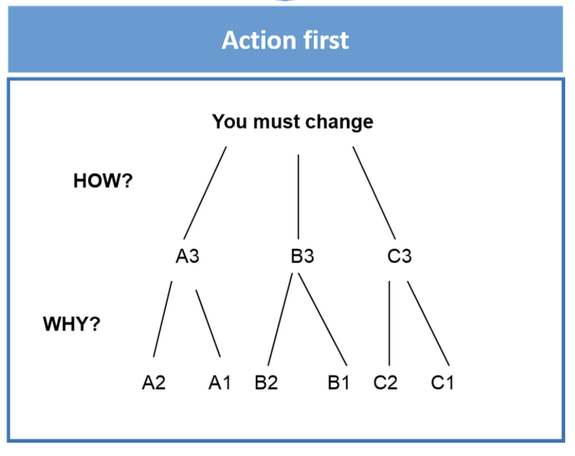

# Communication

# Data Cleaning

- job interview question:
    - “Tell me about a project where you *actually*
     changed the course of action of your business because of your data."
- Influence! `Data Science as U-turn`.
- Collaborate
- Replicate
- inductive logic: pyramid principle

    

- insist on trade-offs:

# Example

- params:
    - Your **`Product Manager (PM)`** comes up with an idea to **increase the conversion rate** on a website.
    - This website has ~100K visitors per month
    - A visit provides on average a ~20 BRL benefit (100K * 20 BRL = 2.000.000 BRL)
    - You have a team of 3 engineers who cost 500 BRL/day each.
    - You don't know **how long** it will take to code this feature
    - You don't know the **lift** (increase) this potential feature could have on the conversion rate.
- Model Benefits

    ```python
    lift = np.arange(0.01, 0.05, 0.01)

    benefits = pd.DataFrame(
        {'lift': lift, 'benefit': 100000 * 20 * lift}
    )
    # We estimate the potential lifts between +1% and +4%
    # lift = rates
    ```

- Model Costs

    ```python
    workdays = np.arange(20, 60, 10)
    cost_per_day = 500*3
    costs = pd.DataFrame(
        {'workdays': workdays, 'cost': workdays * cost_per_day}
    )
    # f(number of workdays) = est. between 20-50 days
    ```

- Sensitivity matrix (Cartesian product)

    ```python
    revenue['ones'] = 1
    benefits['ones'] = 1
    sensitivity = benefits.merge(costs, on="ones").drop('ones', axs=1)
    sensitivity['roi'] = sensitivity['benefit'] - sensitivity['cost']
    sensitivity.round(0)
    # roi = return_on_investment (or net_profit)
    ```

- Pivot matrix

    ```python
    pivot = sensitivity.pivot(index='lift', columns='days', values='roi')
    pivot.round(0)
    # turns lift into index, days into index for columns, columns are distinct days
    ```

- Make it look nice

    ```python
    pivot.set_index(['lift', 'workdays']).unstack()
    _.style.applymap(lambda x: 'color:red' if x<0 else 'color:black'
    # make everything that's a loss have red text
    ```


# Communication through code & docs

- ‘Write the Docs’ - community-dedicated to art/science in technical documentation
- Good technical documentation (readability)
    - your code will belong to someone else in 6-mo
    - your code helps others
    - detail methodology with comments
- args/kwargs

    ```python
    def foo(required, *args, **kwargs):
    		print(required)
    		if args:
    				print(args)
    		if kwargs:
    				print(kwargs)
    # * puts additional parameters into a tuple
    # ** puts keyword args into a dict
    ```

    ```python
    # Student class with allowed optional attributes
    class Student:
        school = 'mills'

    		def __init__(self, name, age, **kwargs):
            self.name = name
            self.age = age

            self.__dict__.update(**kwargs)

    alice = Student('alice', 20, nationality='french')
    alice.__dict__
    #>> {'name':'alice', 'age':20, 'nationality':'french'}
    ```

    ```python
    # DataStudent child class with abstract arguments
    class DataStudent(Student):
        course = 'data'

        # CAREFUL: the batch parameter should
        # not be passed to the parent class!
        def __init__(self, name, age, batch, **kwargs):
            super().__init__(name, age, **kwargs)
            self.batch = batch

    DataStudent('Emily', 31, 1014, nationality='USA').__dict__
    #>> {'name':'Emily', 'age': 31,'batch': 1014, 'nationality': 'USA'}
    ```

- nice way of adding row to dict

    ```python
    d = {'a': 1, 'b': 2}
    d.update(c=3)
    #>> {'a': 1, 'b': 2, 'c': 3}
    ```

- explicitly specify datatypes needed for functions
    - takes a string and outputs a string (readability, not transformation)

        ```python
        def say_hi(name: str) -> str:
            return name + ' says Hi!'

        say_hi('alice')
        ```

    - takes a series and outputs an int

        ```python
        def cost_of_reviews(s: pd.Series) -> int:
            return s.map({
                    1: 100,
                    2: 50,
                    3: 40,
                    4: 0,
                    5: 0
                }).sum()

        cost_of_reviews(pd.Series([1,1,5,4]))
        ```


# Interactive Tools

- [https://www.youtube.com/embed/8QiPFmIMxFc?t=388](https://www.youtube.com/embed/8QiPFmIMxFc?t=388)

- `@my_decorator` is just an easier way of **wrapping** features around existing methods
- Easy to add (does not depend on your function name)
- Easy to remove (your function name does not stay modified after removal)

### Decorators

```python
from ipywidgets import interact, interact_manual, IntSlider, Layout

@interact
def plot_polynom(a=[0,1,2,3], b=2):
    x = np.arange(-10, 10, 0.1)
    y = a*x**3+ b*x**2
    plt.plot(x,y); plt.xlim(xmin=-10, xmax=10); plt.ylim(ymin=-100, ymax=100)
```

```python
def my_decorator(func):
    def wrapper():
        print("I'm before the method call")
        func()
        print("I'm after the method call")

    return wrapper

@my_decorator
def say():
    print("hi!")
'''
>>I'm before the method call
>>hi!
>>I'm after the method call
'''
```

### Plotly Express

```python
import plotly.express as px

df = px.data.iris()
fig = px.scatter(df, x="sepal_width", y="sepal_length", color="species")

fig.show()
```

### D-tale

- visualize dataframes dynamically

```
# Install Dtale without dependencies as it breaks scikit-learn > 1.0
**!**pip install --no-deps dtale
```

```python
import seaborn as sns
import dtale

mpg = sns.load_dataset("mpg")
dtale.show(mpg)
```

### Notebooks

1. Prepare clean nb
    1. enable selection of cell slide type (view→cell toolbar→slideshow)
    2. select slide type of each cell
        - Slide = main chapters
        - Sub-Slide = new slide below the main slide chapter
        - Fragment = subset of the slide directly above, appears when pressing down arrow
        - - = display immediately after cell above
        - Skip = does not display (e.g. hides import code logic)
        - Notes = does not display, for private notes
2. Convert static slide-based html doc with jn nbconvert

    ```
    jupyter nbconvert --to slides --post serve <your_notebook.ipynb>
    ```

3. make it nice:
    1. markdown (m/y)
    2. html
    3. LaTeX
    4. emojis (ctrl + cmd + space)
    5. collapsible headings
    6. table of content
    7. executable from top to bottom
    8. all variables unique
    9. dummy names (tmp, _)
    10. clear code and merge cells (shift + m)
    11. hide cell outputs to gain space

# Flashcards

- How can you insert an image in a markdown cell?
    - Using markdown syntax: ``
    - Using an HTML tag to have more control over how the image appears:
    - ``
-
