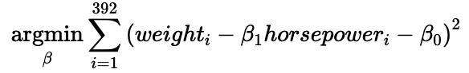
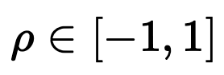
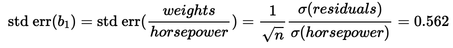
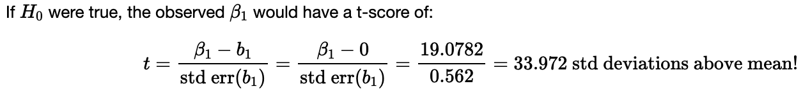
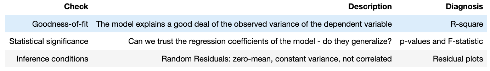

# Linear Regression

### Statistical Inference

- sampling dist mean - µ
- 95% confidence interval
- hypothesis testing
    - p-val
    - sig level - a=0.05
- central limit theorem
    - ztest - normal N
    - ttest - student Tv
- Bayes
    - posterior → prior * likelihood
    - MLE - max likelihood est
    - MAP - max a post est
- R-squared : closer to one, the better

# Visual Lin Reg with seaborn

```python
import pandas as pd
import matplotlib.pyplot as plt
import seaborn as sns

mpg = sns.load_dataset("mpg").dropna()
mpg.head()
```

```python
mpg.describe().applymap(lambda x: round(x))
```

```python
sns.scatterplot(x='horsepower', y='weight', data=mpg)
```

- reg line: $ˆy = (B_0 + B_1horsepower)$
- $B_0$ - intercept
- $B_1$ - slope
- Ordinary Least Square (OLS) regression
    - $L_2$ - euclidian distance
    - ß - sum of squared residuals (SSR)
        - residual is the difference between the value and the regression

        

    - what are the values of $B_0$ & $B_1$ that minimize the equation?
    - highest residual has more impact because they’re squared (very sensitive to outliers)

        ```python
        sns.regplot(x='horsepower', y='weight', data=mpg)
        ```

- interpretation:
    - **NOT** “Horsepower causes more weight” - **causation not correlation**
    - powerful cars seem heavier
        - How much? : slope $(B_1)$
    - horsepower seems to explain a large amount of the weight variations
        - How much? : correlation coefficient

            


        ```python
        mpg.corr()
        round(mpg.corr(),2)
        ```


    ```python
    ## R-squared (r2) is often preferred, from [0 to 1]
    print('R-Squared = ', (mpg.corr()['weight']['horsepower'])**2)
    #>> R-Squared =  0.7474254996898221
    ```

    ```python
    plt.figure(figsize = (7,7))
    sns.heatmap(
    		round(mpg.corr(),2),
    		cmap = "coolwarm",
    		annot = True,
    		annot_kws = {"size":12}
    )
    ```

- confidence intervals and p-values with hypothesis testing

    ```python
    plt.figure(figsize=(15,10))
    plt.subplot(2,2,1)
    sns.regplot(x='horsepower', y='weight', data=mpg, ci=95)
    plt.subplot(2,2,2)
    sns.regplot(x='horsepower', y='weight',
    		data=mpg.sample(10, random_state=6), # random_state: draws random numbers,but always the same random points
    		ci=95
    )
    ```

    - second graph uses less data points, and the confidence interval becomes much wider

# Simple Reg with statsmodel

1. standard API

    ```python
    import statsmodels.api as sm

    Y = mpg['weight']
    X = mpg['horsepower']

    model = sm.OLS(Y, X).fit() # Finds the best beta
    model.predict(X) # The Y_pred (regression-line)
    ## when predicting, use everything but the target
    ```

2. formula API

    ```python
    import statsmodels.formula.api as smf

    model = smf.ols(formula = 'weight ~ horsepower', data=data).fit() # ~ : proportionality

    model.params
    # intercept (B0) - interpretation: "a car with 0 horsepower will weigh 984kg"
    # horsepower (B1) - "for each increase of 1 HP, a cars wight increases ~19kg"

    model.rquared
    #>> 0.07474...
    # 75% of the variance of weights is explained by variance of horsepower

    model.summary()
    # OLS Regression results
    # Prob(F-statistic) : p-value
    	# closer to zero, better liklihood of being able to reject null hypothesis
    	# combined p-val of all coef.
    # P>|t| : the closer to zero, the more we can be confident about the B0 and B1 vals
    # [x, x1]
    # confidence of 95% between x and x1
    ```

    - standard error on slope (B1)

        

        ```python
        n=390 # sample size
        residuals = model.predict(mpg['horsepower'] - mpg['weight'])
        residuals.std()/mpg.horsepower.std() * 1/(n**0.5)
        #>> 0.5615...
        ```


    

    # Checking Assumptions for Inf Anal

    - random sampling
    - independent sampling (w/ replacement, or n < 10% pop)
    - residuals have normal dist and equal var
        - normal distribution of the density of a certain x value around the reg line

            ```python
            predicted_weights = model.predict(mpg['horsepower'])

            residuals = predicted_weights - mpg['weight']
            # or
            residuals = model.resid
            sns.histplot(residuals, kde=True, edgecolor='w');
            # visually check (close enough)
            ```

        - equal variance?

            ```python
            sns.scatterplot(x=predicted_weights, y=residuals)
            plt.xlabel('Predicted weight')
            plt.ylabel('Residual weight');
            ```

            - heteroscedasticity - variance increases over time
            - autoregressive - looks like wave : happens when time series, but not treating it as a time series
            - **if residuals aren’t random, you can’t trust your p-vals/conf interval**
                - new features that explain patterns?
                - model transformed version of Y (log)
                - try non-linear representations

    # Multivariate Linear Regressions

    - OLS on eight, horsepower, AND cylinders
    - B0 + B1(horsepower) + B2(cylinders)

    ```python
    model2 = smf.ols(formula='weight ~ horsepower + cylinders', data=mpg).fit()
    model2.rsquared
    #>> 0.845...
    ```

    - r-squared
        - 84% of variance is explained by combined hp and cyl
        - if $R^2$ =
            - 1 - best case, 100% explained
            - 0 - same as mean
            - < 0 - worst case : predicting mean is better than linear model

        ```python
        model2.params
        # intercept : hp w/o hp or cyl
        # horsepower : each increase in HP increases weight by 8kg,
        		# cylinders being constant
        # cylinder : if we don't change HP, for each increase in cyl,
        		# weight increases by 290kg, HP being constant
        ```


    ### Partial Regression Plot

    - predict one feature using other features
    - NOT VERY USEFUL GREAT

    ```python
    import statsmodels.api as sm
    fig = plt.figure(figsize=(10,6))
    fig = sm.graphics.plot_partregress_grid(model2, fig=fig)
    ```


### Categorical Features

```python
mpg['origin'].unique()
#>> usa, japan, europe

model3 = smf.ols(formula='weight ~ C(origin)', data=mpg).fit()
model3.params
# intercept = 2433 : defaul val (European)
# japan = -212 : avg car is 212 less than european
# usa = 939 : avg car is 939 more than european
```

```python
mpg.groupby('origin').agg({'weight':'mean'}) # mean weights of all
```

```python
# Drop the intercept if you want to
model3 = smf.ols(formula='weight ~ C(origin) -1', data=mpg).fit()
model3.params
#>> europe = 2433 (means)
...
```

```python
features = ['review_score', 'wait_time', 'delay_vs_expected',
            'number_of_products', 'distance_seller_customer']
pred_score = model4.predict(scaled[features])
residuals = pred_score - scaled['review_score']

rmse = (residuals ** 2).mean()**0.5
```

### Cheat Sheet



# From Challenges

```python
model3 = smf.ols(formula='review_score ~ delay_vs_expected + wait_time', data=orders).fit()
print(model3.summary())
```

```python
scaled = (m4-m4.mean())/m4.std()
```

```python
sns.kdeplot(pred_score, color='red')
sns.kdeplot(scaled['review_score'])
```

```python
def get_review_score(self):
        """
        Returns a DataFrame with:
        'seller_id', 'share_of_five_stars', 'share_of_one_stars', 'review_score'
        """
        rdf = self.data['orders'][['order_id']].merge(
            self.data['order_reviews'][['order_id', 'review_score']],
            on='order_id', how='inner'
        ).merge(self.data['order_items'][['order_id', 'seller_id']],
            on='order_id', how='inner'
        )

        def get_five_shares(reviews):
            return reviews[reviews==5].size

        def get_one_shares(reviews):
            return reviews[reviews==1].size

        rs_df = rdf.groupby('seller_id')[['review_score']].mean()

        rs_df['share_of_five_stars'] = rdf.groupby('seller_id')['review_score']\
            .apply(get_five_shares)

        rs_df['share_of_one_stars'] = rdf.groupby('seller_id')\
            ['review_score'].apply(get_one_shares)

        return rs_df.reset_index()
```

```python
sns.kdeplot(sellers['n_orders'])
plt.scatter(x=sellers['n_orders'].median(), y=.0018, color='red')
plt.show()
```

# Cards

- What are the assumptions for inferential analysis?
    - Linearity
    - Independence
    - Homoscedasticity
    - Normality
-
