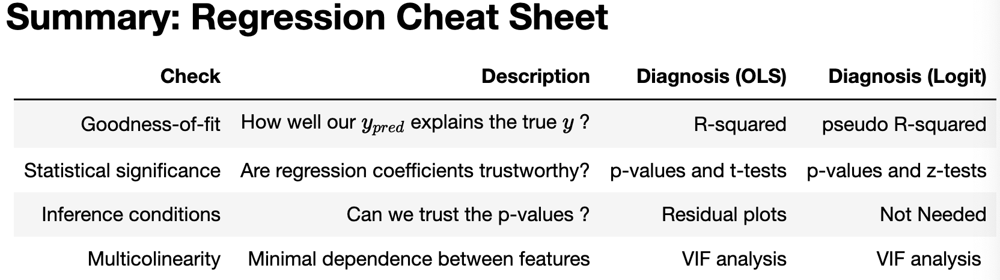
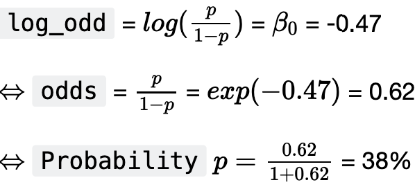
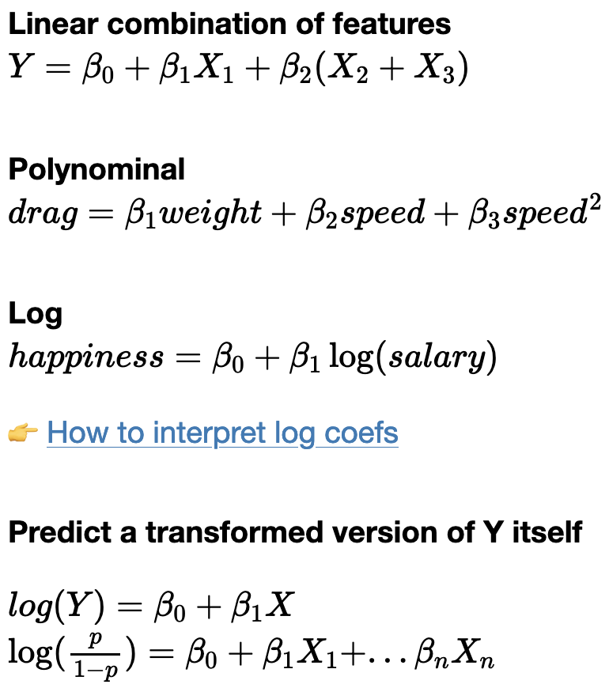

# Logistic Regression



# Binary Outcome

- p=.5, yes, Bernouilli distribution
- sigmoid function

    $ŷ = sigmoid(x) = 1/(1+e^{-(ß_0+ß_1x)})$

    ```python
    def sigmoid(x):
    		return 1/(1+e**-(ß0+ß1*x))
    ```

    - Varying ß0 will change x axis position
    - varying ß1 will change slope to be more or less harsh
    - ŷ : predicted values
    - classification threshold (usually 50% by default)
        - objects under are predicted as 0, over, as 1
    - L(ß) - likelihood of observing y, given the predicted probabilities (ŷ)

        $L(ß) = 0.9*0.8*(1-0.1)*...*(1-0.2)$ → 1 (0.999…)

    - no SSR
    - on average, for 100 observations the are predicted to have ŷ in [0.89-0.91]
        - ≈ 90% will be true ($y_1$) = 1
        - model will classify them correctly ≈ 90% of the time
    - **calibrated classifiers**

        $p = sigmoid(X) = 1/(1+e^{-(ß_0+ß_1X_1+...+ß_nX_n)})$

        $log(p/(1-p)) = ß_0...$

        $Logit(p) = Linear Regression(X,ß)$


    ```python
    # Odds cruve
    p = np.arange(0.01,1,0.005)
    odds = p / (1-p)
    plt.plot(p, odds); plt.ylabel("Odds"); plt.xlabel("p");
    ```

    ```python
    # log-odds = LOGIT
    plt.plot(p, np.log(odds)); plt.grid()
    plt.title('Logit Function'); plt.minorticks_on()
    plt.grid(which='minor', linestyle=':', linewidth='0.5', color='black')
    plt.grid(which='major', linestyle='-', linewidth='0.5', color='black')
    plt.xlabel('proba'); plt.ylabel('logit')
    plt.scatter(0.9, np.log(0.9/(1-0.9)), c='black')
    ```

    - logit function maps a probability p **∈** [0,1] to its log-odds **∈** [-∞, +∞]

# Interpretation

- titanic dataset: survival outcomes (0,1) for ~900 passengers

```python
titanic = sns.load_dataset("titanic")
titanic.head(3)
```

### Chances of Surviving?

- $Survived_i = ß_0$

```python
model1 = smf.logit(formula='survived ~ 1', data=titanic).fit();
model1.params
#>> current function vallue: 0.665...
#>> iterations 4
#>> intercept -0.473...
# the log-odds of surviving were -0.47
```



- the chance of surviving = 38%

```python
# check it
cross_tab = pd.DataFrame({
    'count': titanic['survived'].value_counts(),
    'percentage': titanic['survived'].value_counts(normalize=True)
    })

round(cross_tab,2)
#>> count    percent
#>> 549      0.62
#>> 342      0.38
```

### Chances of surviving with a continuous feature?

- Fare
- $Survived = ß_0 + ß_{fare}Fare$

```python
model3 = smf.logit(formula='survived ~ fare', data=titanic).fit()
model3.params
#>>intercept: -0.941..
#>>fare: 0.015...
```

- interpret fare:
    - increasing fare by $1 increases the log odds of surviving by 0.015

    ```python
    beta0 = -0.941
    beta1 = 0.015
    odds = np.exp(beta1)
    prob = odds/(1+odds)
    plot_me(x, beta0, beta1)
    ```

    - exp(0.015) = 1 → for each $1 spent on fare, the odds of surviving increase by 1%
- interpreting intercept:
    - log-odd of surviving for a passenger who paid nothing is -0.94
    - exp(-0.94) = 0.39 →
- calculate sigmoid for certain position

    ```python
    h = 140
    logit_p = beta0 + beta1*h
    odds1 = np.exp(logit_p)
    prob1 = odds1/(1+odds1)
    ```


### With 1 categorical feature?

- $Survived = ß_0 + ß_{class}*pclass$
- pclass = (1,2,3)

```python
model2 = smf.logit(formula='survived ~ C(pclass)', data=titanic).fit()
model2.params
#>> inter: 0.531
#>> C(pclass)[T.2]: -0.639
#>> C(pclass)[T.3]: -1.67
```

- 0.53 log-odd of surviving as a 1st class pass
- -0.63 is the decrease in the log-odd of survival for a 2nd class pass relative to 1st class
    - exp(-0.63) = odds of surviving in 2nd class is divided by 1.87 compared to 1st

### Multiple Features

```python
model2 = smf.logit(formula='survived ~ fare + C(sex) + age', data=titanic).fit()
model2.params
#>>Intercept         0.934841
#>>C(sex)[T.male]   -2.347599
#>>fare              0.012773
#>>age              -0.010570
```

- Holding *fare* and *age* constant, being a male in Titanic reduces your log-odds of survival by 2.34 compared to a female passenger

# Performance Eval

```python
model4 = smf.logit(formula='survived ~ fare + C(sex) + age', data=titanic).fit()
model4.summary()
```

- p-values - similar to lin reg
- z-score - (instead of t-score), std() of sample mean is known:
    - $σ = p(1-p)$
- random sampling, independent sampling (sample w/ replacement, n <10% pop)
- residuals & equal variance not needed

### Good-fit ($R^2$ equiv?)

- **log-likelihood (LL)**
    - [-infinity, 0]
    - the closer to 0 the better
    - 1 - LL(predict)/LL(mean)
        - y = [1,1,0,…,1]
        - y(mean) = [0.7…]
            - LL(mean) = log(y(mean))
        - y(pred) = [0.9, 0.8, 0.1,…,0.8]]
            - LL(pred) = log(y(pred))
        - can compare models predicting from same data (X)
        - is not as descriptive as $R^2$, once the class thresh is applied
            - 0.49 vs 0.51 yield opposite class preds

# Multi-colinearity issues in Linear Models

- if a feature $(X_k)$ is a linear combo of other features and you can’t hold other features constant while varying the ‘k’ feature $(X_8 = X_1 + X_3)$
    - p-values above 0.05

### Strict Multicolinearity

- what feature matrix is best suited for regression?
- arrays where the third column is a linear combo of first two columns

```python
print(' rank(array1):', np.linalg.matrix_rank(array1), '\n',
      'rank(array2):', np.linalg.matrix_rank(array2))
#>> rank(array1): 2
#>> rank(array2): 3
```

- rank of 1st is the dimension of the vector space generated by it’s columns
- feature matrix must be “full rank” to run lin/log model

```python
mpg = sns.load_dataset('mpg').dropna().drop(columns=['origin', 'name', 'displacement'])
mpg.corr().style.background_gradient(cmap='coolwarm')
```

```python
mpg['lin_comb'] = 10 * mpg['cylinders'] - 0.3 * mpg['horsepower']
mpg.head(3)
```

```python
# Matrix is not full-rank!
print(mpg.shape)
np.linalg.matrix_rank(mpg)
```

```python
smf.ols(formula='weight ~ cylinders + horsepower + lin_comb', data=mpg).fit().params
```

```python
# Now, change just a bit one single observation by 1% just on one feature
mpg.loc[0,'horsepower'] = mpg.loc[0,'horsepower']*1.01
smf.ols(formula='weight ~ cylinders + horsepower + lin_comb', data=mpg).fit().params
```

```python
# Statsmodels gives us a clear WARNING [2]
smf.ols(formula='weight ~ cylinders + horsepower + lin_comb', data=mpg).fit().summary()
#>> covariance type: not robust
```

### Warnings

- Standard Errors: assume covariance matrix of errors is correctly specified
- Condition number large (5.8e+04) → possibly strong multicolinearity or numerical issues

### VIF: Variance Inflation Factor

- scale:

```python
mpg_scaled = mpg.copy()

for feature in mpg_scaled.columns:
    mu = mpg[feature].mean()
    sigma = mpg[feature].std()
    mpg_scaled[feature] = mpg_scaled[feature].apply(lambda x: (x-mu)/sigma)

mpg_scaled
```

- compute VIF factor for feature index 0

```python
from statsmodels.stats.outliers_influence import variance_inflation_factor as vif

vif(mpg_scaled.values, 0)
```

- calc:

```python
df = pd.DataFrame()

df["features"] = mpg_scaled.columns

df["vif_index"] = [vif(mpg_scaled.values, i) for i in range(mpg_scaled.shape[1])]

round(df.sort_values(by="vif_index", ascending = False),2)
```

- if VIF ≥ 10 → cause for concern

# Transformation of features



# Flashcards

- X being the matrix of features, when is ß **uniquely determined**?
    - when X is invertible
- Given the following linear regression formula, what is the size of the residuals vector u?
    - The residual vector u is of size n, n being the **number of observations.** You can think of it as the difference between the actual value for each observation and the value given by the linear regression.
- Why is the logit transformation interpretable?
    - odd ratios: log(odd1) - log(odd2) = log(odd1/odd2)
- How many solutions to OLS are there if two features are colinear?
    - There is **no single solution** to OLS if two features are colinear. You should find and remove them.
    - There can also be an infinite number of solutions for a non-full-rank matrix of features
