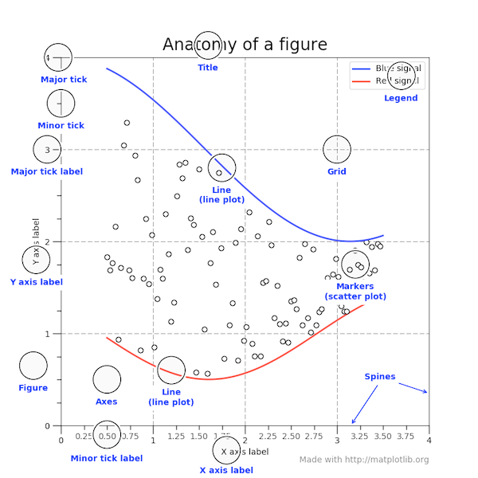

# Visualization

# MatPlotLib

- [https://matplotlib.org/stable/gallery/index.html](https://matplotlib.org/stable/gallery/index.html)
- [https://matplotlib.org/stable/tutorials/index.html](https://matplotlib.org/stable/tutorials/index.html)



## Intro

```python
mkdir dataviz-101 && cd $_
touch carbon.py
# touch: creating a file
```

```python
import matplotlib.pyplot as plt
```

```python
years_x = [1975, 1980, 1985, 1990, 1995, 2000, 2005, 2010, 2015]
total_y = [1243, 1543, 1619, 1831, 1960, 2310, 2415, 2270, 1918]

plt.plot(years_x, total_y) # just adds data to the figure
plt.show() # adds all plot information into a single object/visualization
# Will open a graph window.
# Wait for it to be closed to continue script execution
```

- **show empties out the backend! nothing after it will happen**

```python
plt.savefig('carbon.png')
plt.show()
```

```python
python carbon.py # run it
```

---

- .plot only writes a series of data, doesn’t collect all into a single plot (like .show)

```python
plt.plot(years_x, total_y);
```

---

# Arguments

```python
plt.title("USA - CO2 emissions from electricity production")
plt.xlabel("Year")
plt.ylabel("CO2 - M of tons")
plt.xticks([1975, 1995, 2015], ['start', 1995, 'end'])
plt.yticks([0, 5000])
```

```python
plt.xlim(left, right)
#or
plt.xlim(left=3)

plt.ylim(bottom, top)
#or
plt.ylim(top=10)
```

```python
plt.figure(figsize=(10,5)) #in inches (but really just controls the resolution)
```

---

### Legend

```python
plt.plot(years_x, total_y, label="Total")
plt.plot(years_x, coal_y, label="Coal")
plt.plot(years_x, gas_y, label="Natural Gas")
```

```python
plt.legend(loc="best") # adds a legend
# loc (location) best is default
```

---

### Grid

```python
plt.grid(axis="y", linewidth=0.5)
```

---

### Styles

`['Solarize_Light2', '_classic_test_patch', 'bmh', 'classic', 'dark_background', 'fast', 'fivethirtyeight', 'ggplot', 'grayscale', 'seaborn', 'seaborn-bright', 'seaborn-colorblind', 'seaborn-dark', 'seaborn-dark-palette', 'seaborn-darkgrid', 'seaborn-deep', 'seaborn-muted', 'seaborn-notebook', 'seaborn-paper', 'seaborn-pastel', 'seaborn-poster', 'seaborn-talk', 'seaborn-ticks', 'seaborn-white', 'seaborn-whitegrid', 'tableau-colorblind10']`

```python
plt.style.use('seaborn')
with plt.style.context('seaborn'):
    # [...]
    plt.show()
```

```python
sns.set_style("dark")
# Seaborn has five different themes: (1)"darkgrid", (2)"whitegrid",
# (3)"dark", (4)"white", and (5)"ticks"
```

---

### Lines

- `[color](https://matplotlib.org/api/colors_api.html)` (cycled, see `plt.rcParams['axes.prop_cycle']`)
- `[marker](https://matplotlib.org/gallery/lines_bars_and_markers/marker_reference.html)` (default: `None`)
- `[linestyle](https://matplotlib.org/gallery/lines_bars_and_markers/line_styles_reference.html)` (default: `"-"`)
- `linewidth` (default: `1.5`)

```python
plt.plot(years_x, total_y, color="#999999", linestyle=':', marker='s')
plt.plot(years_x, coal_y, linewidth=3)
```

---

### Axes/Axis

- axes: area of the plot
    - For finetuning / customizing
    - When creating multiple subplots
    - For integration with other libraries (Pandas etc...)
- axis: dimensional reference

```python
ax = plt.gca()
matplotlib.axes.Axes.set_title
```

- a spine is the actual lines containing the

```python
ax.spines['right'].set_color(None)
ax.spines['bottom'].set_position(('axes', 0.5)) # half of y-axis
# or
ax.spines['bottom'].set_position(('data', 750)) # 750 on y-axis
```

### Plot Types

- scatter

```python
plt.scatter(data['views'], data['likes'], edgecolor='#333333', alpha=0.75)
```

- bar

```python
plt.bar(years_x, total_y);
```

- histogram: distribution

```python
x = np.random.normal(size=10_000) # Randomly pick 10_000 numbers
plt.hist(data=x, bins=100);
# Horizontal axis are the frequencies of each bin (how big the bars are)
```

- line

```python
x_vals = np.array([4, 20])
y_vals = np.array([0, 4])
plt.plot(x_vals, y_vals)
```

### Plot Types (with Pandas)

```python
df.plot(kind='bar');
```

---

## Subplots

(2,2,4): 2 rows, 2 columns, location of subplot

```python
fig = plt.figure()
ax1 = fig.add_subplot(1,2,1)
ax2 = fig.add_subplot(1,2,2)
```

- Destructuring Assignment: assigning two things at a time

```python
fig, (ax1, ax2) = plt.subplots(nrows=1, ncols=2)
```

## Pandas

```python
df = pd.DataFrame({ 'coal': coal_y, 'gas': gas_y }, index=years_x)
df.plot()
# object is and <AxesSubplot>
```

```python
ax = df.plot()
ax.set_title('CO2 Emission from Electricity Production (US)')
```

```python
type(ax)
type(ax).__bases__
```

- there are two plot methods:

```python
pd.DataFrame.plot
# returns axes object
mpl.pyplot.plot
# returns line2D object
```

---

## Examples

```python
# this is the blank graph, with dimensions
plt.figure(figsize=(10,5))

# 3 lines plot
plt.plot(years_x, total_y, label='total', c="grey", ls=':', marker='s')
plt.plot(years_x, coal_y, label='coal')
plt.plot(years_x, gas_y, label='gas')

# Decoration
plt.legend()
plt.title('CO2 emissions from electricity production - US')
plt.ylim((0,3000))
plt.ylabel('MtCO2/yr')
plt.grid(lw=0.5)

plt.show()
```

### Subplotting Interfaces

- State-based

```python
# Start a figure
plt.figure(figsize=(10,3))

# First subplot
plt.**subplot**(1,2,1)
plt.plot(years_x, coal_y, label="coal")
plt.plot(years_x, gas_y, label = "gas")
plt.title('coal vs. gas')
plt.legend()

# Second subplot
plt.subplot(1,2,2)
plt.plot(years_x, total_y, label="total", c='black')
plt.title("all energies")

# Global figure methods
plt.**suptitle**('US electricity CO2 emissions') # "super" title
plt.show()
```

- object-oriented (better):
    - becomes portable because the commands are explicit (not reliant on line order)
    - extensible: can add to it after a show

```python
**fig =** plt.figure(figsize=(10,3)) #assign figure to an object

# First subplot
**ax1 =** fig.**add_**subplot(1,2,1)
# assign subplot to an object, specifically adding to a certain object
**ax1.plot**(years_x, coal_y, label="coal")
# plotting on a specific object's axes
ax1.plot(years_x, gas_y, label = "gas")
ax1.**set_**title('coal vs. gas')
ax1.legend()

# Second subplot
ax2 = fig.add_subplot(1,2,2)
ax2.plot(years_x, total_y, c='black')
ax2.set_title('all energies')

# Global figure methods
fig.suptitle('US electricity CO2 emissions')
plt.show()
```

- Using “Destructuring Assignments”

```python
# Destructuring initialization
**fig, axs** = plt.**subplots**(1, 2, figsize=(10,3))
# subplots creates a figure, and sets axs is a nd-array (1 row, 2 columns)

# First subplot
**axs[0]**.plot(years_x, coal_y, label="coal")
axs[0].plot(years_x, gas_y, label = "gas")
axs[0].set_title('coal vs. gas')
axs[0].legend()

# Second subplot
a**xs[1]**.plot(years_x, total_y, c='black')
axs[1].set_title('all energies')

# Global figure methods
**plt.**suptitle('US electricity CO2 emissions') #or fig.suptitle
plt.show()
```

### Gridspec

```python
fig = plt.figure(figsize=(10,6))
gs = fig.add_gridspec(3, 3)
ax1 = fig.add_subplot(gs[0:2, 0:2])
ax2 = fig.add_subplot(gs[0, 2])
ax3 = fig.add_subplot(gs[1, 2])
ax4 = fig.add_subplot(gs[2, 0])
ax5 = fig.add_subplot(gs[2, 1])
ax6 = fig.add_subplot(gs[2, 2])
```

### With Pandas

```python
df1 = pd.DataFrame({ 'coal': coal_y, 'gas': gas_y }, index=years_x)
df2 = pd.DataFrame({ 'total': total_y }, index=years_x)
fig, (ax1, ax2) = plt.subplots(1,2, figsize=(10,5))
df1.plot(ax=ax1)
df2.plot(ax=ax2)
```

---

# Exploratory DA

```python
# 10 most reviewed listings?

listings_df.**nlargest**(10, "number of reviews")
# top 10 most reviewed full rows
```

```python
# what are the NY neighborhood groups with listings?

listings_df["neighborhood group"].**unique**()
## array (["Brooklyn", "Manhattan", ...])
# shows all possible, unique values
```

```python
# how many listings per neighborhood group?

listings_df["neighborhood group"].**value_counts**()
## Manhattan     21661
## Brooklyn      20104
## ...
# sorts and counts, descending
```

```python
# top 10 neighborhoods with listings

listings_df["neighborhood"].value_counts().**head**(10)
## Williamsburg     3920
## Bedford          3714
## ...
```

```python
listings_df["neighborhood"].value_counts().head(10)**.plot**(kind="bar")
# plots a bar-chart with matplotlib
```

# Seaborn

-
- seaborn.pydata.org
- hue gives legend differences

### Initialization

```python
import pandas as pd
import seaborn as sns
from matplotlib import pyplot as plt
```

## Extracting data from files

```python
# load into DF
tips_df = sns.load_dataset('tips')
# tips_df = pd.read_csv("https://raw.githubusercontent.com/mwaskom/seaborn-data/master/tips.csv")
tips_df.shape
```

```python
tips_df.head()
# first 5 rows
tips_df.tail()
# last 5 rows
```

## Plot Cheats

```python
# LINE PLOTS
plt.plot(x=df.col1, y=df.col2, c='red', ls='--', lw='0.5')
sns.lineplot(data=df, x='col1', y='col2', hue='col3', size='col4')
# DISTRIBUTIONS
plt.hist()
sns.histplot()
sns.kdeplot()
sns.jointplot()
# SCATTER PLOTS
plt.scatter()
sns.scatterplot()
sns.regplot()
# COUNT PLOTS
sns.countplot()
# CAT PLOTS
plt.bar() # eq. plt.plot(kind=‘bar’)
sns.barplot() # eq. catplot(kind=“bar”)
sns.violinplot() # eq. catplot(kind=“violin”)
sns.boxplot() # eq. catplot(kind=“box”)
# FACET GRID
g = sns.FacetGrid(data=df, col='col1')
g.map(plt.hist, 'col2')
# DATAFRAME-LEVEL MULTI CORRELATIONS
sns.heatmap(df.corr())
sns.pairplot(hue='')
## 2D HISTOGRAMS
plt.hist2d()
plt.colorbar()
sns.jointplot(x,y, kind='kde', data=df)
## 2D PROJECTION
plt.contour(X,Y,Z) # iso lines
plt.contourf(X,Y,Z=f(X,Y)) # area colors
```

### Histogram

- kde argument: compute a kernel density estimate to smooth the distribution and show on the plot as (one or more) line(s). (line over buckets)

```python
sns.histplot(iris_data['Petal Length (cm)'])

sns.histplot(data=iris_data, x='Petal Length (cm)', hue='Species')
plt.title("Histogram of Petal Lengths, by Species")
```

```python
plt.figure(figsize=(14, 4))

plt.subplot(1, 2, 1)
plt.title('Matplotlib')
plt.hist(tips_df['total_bill'])

plt.subplot(1, 2, 2)
plt.title('Seaborn')
sns.histplot(tips_df['total_bill'], kde=True);
```

### Line Charts

```python
# Path of the file to read
spotify_filepath = "../input/spotify.csv"

# Read the file into a variable spotify_data
spotify_data = pd.read_csv(spotify_filepath, index_col="Date", parse_dates=True)

list(spotify_data.columns)
## ["blah blahhh", "blahh"...]
# prints names of columns

plt.figure(figsize=(14,6))
# width and height of the fig

plt.title("The most blah blah blahiest")
# adds title

sns.lineplot(data=spotify_data["blah blahhh"], label="blah blahhh")
sns.lineplot(data=spotify_data["blahh"], label="blahh")
# line charts showing only specific column data

plt.xlabel("Date")
# labels horixontal axis
```

### Bar graph

```python
sns.countplot(x="smoker", data=tips_df);
**# find x column in data(frame)**
```

```python
sns.countplot(x="time", hue="smoker", data=tips_df);
**# divide x by hue (time by smoker/nonsmoker)**
```

```python
listings_df = pd.**read_csv**("data/AB_NYC_2019.csv")

sns.**countplot**(**data**=listings_df, **x**="neighborhood_group")
## unordered bar graph

order = listings_df["neighborhood_group"].value_counts().index
sns.countplot(data=listings_df, x="neighborhood_group", **order**=order)
## ordered bar graph
```

```python
# relationship between neighborhood & room type?

sns.countplot(listings_df, x="neighborhood_group", **hue**="room_type")
## shows room type as sub-bar in each plot
```

### Density (wave)

```python
sns.kdeplot(data=iris_data['Petal Length (cm)'], shade=True)

sns.jointplot(x=iris_data['Petal Length (cm)'],
							y=iris_data['Sepal Width (cm)'], kind="kde")
# 2d

sns.kdeplot(data=iris_data, x='Petal Length (cm)', hue='Species', shade=True)
plt.title("Distribution of Petal Lengths, by Species")
```

### Distribution Plot

```python
sns.**distplot**(listings_df["price"])
## line graph overlaid on very fine x histogram
# not very readable because of outliers

affordable_df = listings_df[listings_df["price"] **<=** 500]
sns.distplot(affordable_df["price])
## much more readable distribution
```

### Categorical Scatter

```python
sns.catplot(x='day', y='total_bill', data=tips_df)
```

```python
sns.catplot(x='day', y='total_bill', data=tips_df, kind="box");
# kind: bar, box, violin, boxen
```

### Violin Plot (labia plot more like…)

```python
# distribution of prices based on neighborhood group

plt.figure(figsize=(15, 8))
sns.violinplot(affordable_df, x="neighborhood_group", y="price")
## larger plot, distributions in symetrical shapes
```

### Scatter plot (matplotlib)

```python
with sns.axes_style('whitegrid'):
    # sns.set(style="whitegrid") for global change
    sns.scatterplot(x="total_bill", y="tip", data=tips_df);
```

```python
plt.figure(figsize=(10, 7))
sns.scatterplot(x="total_bill", y="tip", hue='smoker', size="size",
                palette=sns.color_palette(["#2ecc71", "#e74c3c"]),
                sizes=(10, 300), data=tips_df)
```

```python
sns.scatterplot(x=insurance_data['bmi'], y=insurance_data['charges'])

sns.scatterplot(x=insurance_data['bmi'], y=insurance_data['charges'],
		hue=insurance_data['smoker'])
#color coded
```

```python
# adds regression line
sns.regplot(x=insurance_data['bmi'], y=insurance_data['charges'])

sns.lmplot(x="bmi", y="charges", hue="smoker", data=insurance_data)
# adds two regression lines
```

```python
# categorical
sns.swarmplot(x=insurance_data['smoker'],
              y=insurance_data['charges'])
```

```python
# plot houses on map

affordable_df.plot(
		kind="scatter",
		x="longitude",
		y="latitude",
		c="price",
		cmap="inferno",
		colorbar=True,
		alpha=0.8,
		figsize=(12, 8)
		)
## gorgeous map, color will equal price

import urllib
i = urllib.request.urlopen("webaddressofimage.PNG")
plt.imshow(plt.imread(i), zorder=0, extent=[-74.258, -73.7, 40.49, 40.92])
ax = plt.gca()
affordable_df.plot(
		ax=ax,
		zorder=1,
		kind="scatter",
		x="longitude",
		y="latitude",
		c="price",
		cmap="inferno",
		colorbar=True,
		alpha=0.8,
		figsize=(12, 8))
# layer actual map on top of it to see distribution
```

### Regression

```python
sns.regplot(x='total_bill', y='tip', data=tips_df)
```

### Facet Grid (graphs of your choice by groups)

```python
# Create a grid
g = sns.FacetGrid(
		tips_df, # data
		col="time", # column
		row="smoker", # row
		hue="smoker" # split row
)

# Plot a graph in each grid element
g.map(sns.histplot, "total_bill");
```

### Pair plots (auto id all correlations in a DF)

```python
sns.set(style='white')
sns.pairplot(tips_df, height=2)
plt.show()
```

# Interactivity

```python
!pip install ipywidgets
```

```python
%matplotlib widget # enable interactivity in your notebook
%matplotlib inline # get back to normal mod
```
